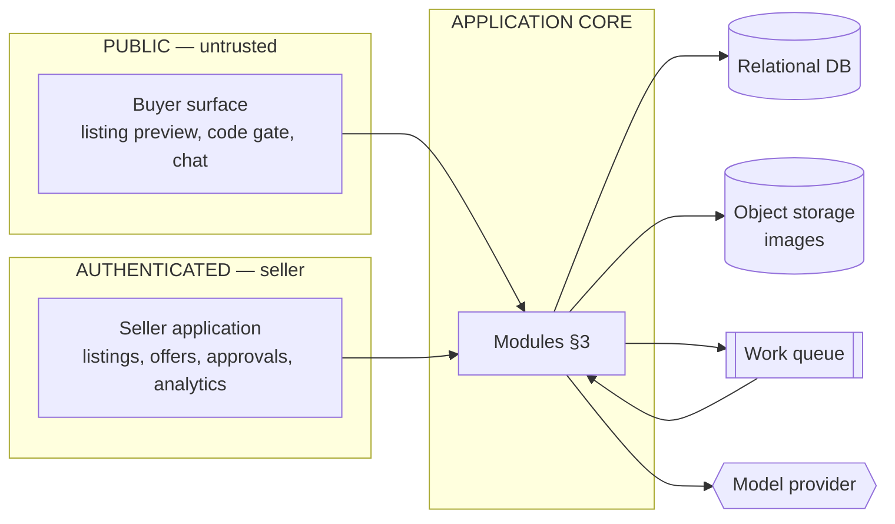
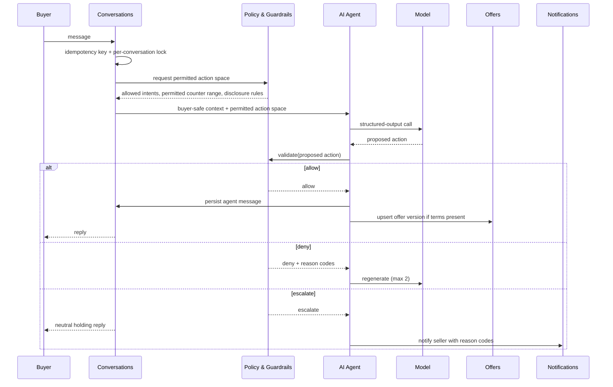
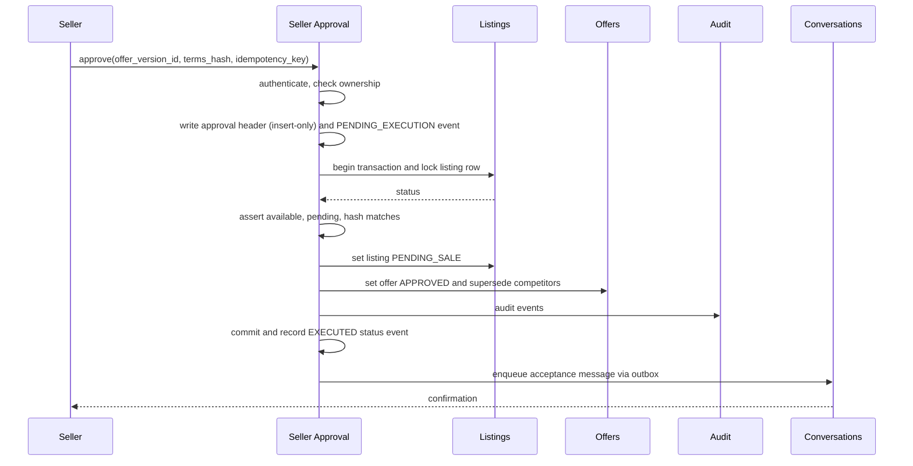
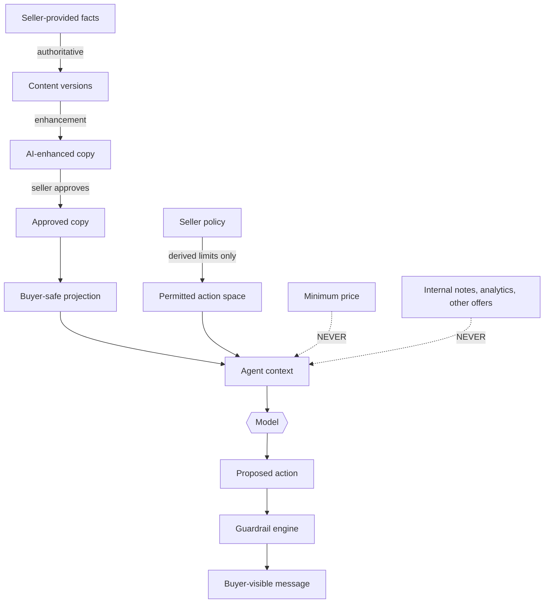

# Architecture Overview

**Status:** Canonical for module boundaries and system-level data flow.
**Technology baseline.** The backend baseline is recorded in
`decisions/DECISION_LOG.md` D-17 (Proposed; supersedes D-08 on acceptance). Nothing in
this document depends on it: the module boundaries, data flow and failure posture hold
whatever implements them. Hosting and cloud provider remain undecided (`Q-09`).

---

## 1. Shape

A **modular monolith** with one relational database and one asynchronous worker pool.

For a two-person team this is the correct default. Microservices would multiply
deployment, observability and consistency work without solving a problem the product
has. The boundaries below are real and enforced in code — module-private data, explicit
interfaces between modules, no cross-module table access — so that a module can be
extracted later if load or team size ever justifies it.

`ARCH-001` Do not introduce a second deployable, a message broker beyond a simple work
queue, or a second datastore without a recorded decision.

`ARCH-015` One container image, two entry points — `web` and `worker` — from the same
codebase (`OPS-510`, D-17). Conversation transcripts live in a dedicated schema of the
one relational database, not in object storage and not in a second datastore
(`OPS-719`). Object storage holds binary objects such as images only.

## 2. Two applications, one system



`ARCH-002` The public buyer surface and the authenticated seller application are
**separate route trees with separate middleware stacks**. No seller capability is
reachable with a buyer session, by construction rather than by permission check.

`ARCH-003` The buyer surface is the system's only untrusted-input frontier. Everything
entering through it is data, never instruction, never identity, never authority.

## 3. Modules

| # | Module | Owns | Must not |
|---|---|---|---|
| 1 | Identity & Auth | Seller credentials, sessions, tenancy context | Know anything about listings |
| 2 | Seller Accounts | Profile, plan, preferences, entitlements | Enforce policy on conversations |
| 3 | Inventory & Listings | InventoryItem, Listing, lifecycle | Call the model directly |
| 4 | Listing Content | ContentVersion, provenance, approval | Invent facts; write buyer projections |
| 5 | Product Images | Upload, validation, derivatives, serving | Derive product facts |
| 6 | Public Listing Access | The buyer-safe projection, surface enable/disable | Read protected fields |
| 7 | Access Codes | Issue, hash, validate, rotate, revoke, lock | Grant anything beyond one listing |
| 8 | Buyer Sessions | Session creation, scope, expiry, isolation | Trust client-supplied scope |
| 9 | Conversations | Threads, messages, ordering, idempotency | Decide what may be said |
| 10 | AI Agent | Context assembly, model calls, structured actions | Enforce money rules |
| 11 | Policy & Guardrails | Deterministic decisions, permitted ranges | Perform I/O |
| 12 | Negotiation | Turn orchestration, concession tracking | Bypass guardrails |
| 13 | Offers | Extraction, versions, history, status | Authorize anything |
| 14 | Seller Approval | Approval records, execution, invalidation, idempotency | Be invoked by non-seller actors |
| 15 | Deal & Handoff | Deal state, permitted logistics, transition | Disclose exact location |
| 16 | Notifications | Outbox, delivery, preferences | Send inside an open transaction |
| 17 | Sales | Completed transactions, final price | Estimate value |
| 18 | Analytics | Operational aggregates | Produce market or valuation figures |
| 19 | Audit & Events | Append-only consequential record | Store secrets |
| 20 | AI Evaluations | Fixtures, harness, scoreboard | Run against production data without redaction |
| 21 | Observability | Metrics, traces, cost attribution | Log prompts or transcripts |
| 22 | Marketplace Abstractions | Channel metadata, per-channel codes, copy blocks | Call a marketplace API |

`ARCH-004` Module 11 is a pure function with no I/O. This is what makes it exhaustively
testable and is the single most important structural property in the system.

`ARCH-005` Module 22 exists so that a future authorized integration has somewhere to
live. At MVP it holds channel labels, per-channel access codes and copy formatting only.
It performs no network calls to any marketplace.

## 4. The agent turn



`ARCH-006` The forbidden path is buyer message → model → effect. There is always a
deterministic evaluation between the model and anything a buyer or the database sees.

## 5. Approval flow



`ARCH-007` Availability is enforced by a conditional update inside the transaction, not
by a check before it. This is what makes AUTH-INV-11 true under concurrency.

## 6. Data flow and trust boundaries



`ARCH-008` The dotted edges are the ones that matter. A contract test must assert that
the agent-context type cannot structurally carry a protected field.

## 7. Marketplace boundary

```
EXTERNAL MARKETPLACE                    OUR PLATFORM
─────────────────────                   ────────────
listing discovery                       listing record and enhanced copy
buyer acquisition                       buyer AI conversation
seller's own account and reputation     negotiation within policy
marketplace's own messaging             structured offers
                                        seller approvals
                                        sales operations and history
```

`ARCH-009` No component reads from, writes to, scrapes or automates any marketplace. The
only coupling is a human seller copying text and a human buyer following a link.

## 8. Asynchrony

`ARCH-010` Model calls run in the worker pool, never inside a request handler holding a
connection open.
`ARCH-011` Notifications are emitted through a transactional outbox.
`ARCH-012` Timers — hold expiry, follow-ups, session expiry — are scheduled jobs, not
sleeping processes.
`ARCH-013` Work is idempotent and retried with backoff; exhausted work moves to a
dead-letter queue with an alert. A buyer message must still receive a holding reply.

## 9. Failure posture

| Failure | Behaviour |
|---|---|
| Model provider unavailable | Retry with backoff; a secondary provider is optional, not required (D-08, `Q-10`) and if adopted must be contracted on the same processor terms — see `security/DATA_AND_PRIVACY.md`; otherwise holding reply plus seller notification |
| Guardrail denies repeatedly | Escalate after 2 regenerations |
| Malformed model output | 2 deterministic retries, then escalate |
| Cost budget breached | Degrade model tier, then holding mode; alert seller and operator |
| Duplicate inbound delivery | Idempotency key plus unique sequence makes it a no-op |
| Simultaneous approvals | One winner by conditional update; loser told "just sold" |
| Policy changed mid-negotiation | In-flight actions validate against the version they were generated under |

`ARCH-014` The system degrades toward seller-handled conversation. It never fails closed
on a buyer and never invents its way past an error.

## 10. Scale posture

MVP targets hundreds of sellers and thousands of concurrent conversations — comfortably
within one modest database and a small worker pool. The first components likely to need
attention are model spend and image storage, not compute. Do not pre-optimise anything
else.
