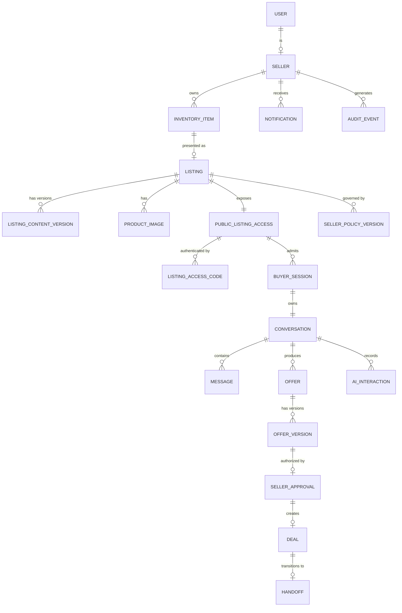

# Domain Model

**Status:** Canonical for entity responsibilities and relationships.
**Not** a database schema. Field lists are indicative; the implementing slice owns the
final schema and must record deviations in `decisions/DECISION_LOG.md`.

## 1. Entity map

## 2. Entities

### User / Seller
Identity and tenancy. `Seller` is the tenant boundary: every other entity in this model
belongs to exactly one seller, and every query is scoped by it. Holds account state,
plan, notification preferences and default agent settings.

### InventoryItem
The physical good. Separated from `Listing` so an item can be relisted, archived or
sold through a different listing without losing its history or cost basis. Holds
optional acquisition cost and acquisition date, supplied by the seller.

### Listing
The sellable presentation. Owns lifecycle status, asking price, currency, the pointer
to the current approved content version, the pointer to the current policy version, and
the pointer to its public access record. **Holds no derived valuation of any kind.**

### ListingContentVersion
Immutable snapshot of buyer-facing copy. Fields: title, summary, description, structured
detail fields, provenance (`SELLER_PROVIDED_FACT` / `AI_ENHANCED_COPY` /
`SELLER_APPROVED_COPY`), source version pointer, created-at, approved-at, approved-by.

Original seller input and enhanced output are separate versions. Restoring the original
creates a new version rather than mutating history. Exactly one version per listing is
marked approved and buyer-visible at a time.

### ProductFact
The atomic grounding record: key, value, provenance, supplied-at. The agent may state a
fact only if a `ProductFact` exists with provenance `SELLER_PROVIDED_FACT` and the
listing's approved content version covers it. Absence of a fact is a first-class state
and produces "I don't have that confirmed" behaviour, never inference.

### ProductImage
Stored object reference, dimensions, ordering, alt text, derivative pointers. Images are
presentational. No entity derives product facts from an image in this scope.

### PublicListingAccess
The buyer-facing surface for one listing. Holds the opaque public id used in URLs,
enabled/disabled state, and the buyer-safe projection of listing content. Its existence
is what makes a listing reachable by a buyer; disabling it closes the surface without
touching the listing.

### ListingAccessCode
6-digit code bound to one `PublicListingAccess`. Stores a hash, never plaintext. Holds
status (`ACTIVE`, `ROTATED`, `REVOKED`, `EXPIRED`), issue time, optional expiry, failed
attempt counters and lockout state, and a version number so rotation is traceable.

**Design note.** In the normal flow the seller publishes this code in a public
marketplace advertisement. Treat it as public. It is a routing and abuse-control
mechanism, not a secret. See `security/PUBLIC_ACCESS_SECURITY.md`.

### SellerPolicy / SellerPolicyVersion
The deterministic rule set. Indicative fields: asking price, target price, minimum
acceptable price, negotiation enabled, maximum autonomous concession, trades allowed,
delivery allowed, pickup allowed, location disclosure mode, maximum hold duration,
auto-decline threshold, agent tone.

Versioned and immutable. Changing a rule creates a new version. Every `AIInteraction`,
`OfferVersion` and `SellerApproval` records the policy version in force so a past
decision can always be explained against the rules that actually applied.

### BuyerSession
Created only after successful code validation. Pseudonymous: no name, no email, no
account required. Holds an opaque session token, the listing scope, creation time, last
activity, and optional buyer-supplied display name. **Scope is a hard boundary** — a
session may never read or write anything outside its listing and its own conversation.

### Conversation
One thread per buyer session per listing. Holds status, message count, turn count,
running summary, accumulated cost, and escalation state.

### Message
Append-only. Role (buyer, agent, system), body, redacted body for logging, sequence
number unique per conversation, timestamps, and for agent messages the model, tokens and
the guardrail decision that permitted it.

### Offer / OfferVersion
`Offer` is the continuing negotiation thread with one buyer. `OfferVersion` is an
immutable snapshot of material terms: amount, currency, pickup availability, conditions,
delivery request, included-item requests, extracting message id, confidence, created-at,
and `supersedes_version_id`.

Approval targets an `OfferVersion`. A new buyer proposal creates a new version and
supersedes the previous one, invalidating any pending approval against it.

### SellerApproval
The authorization record. Holds seller id, offer version id, a hash of material terms
captured at approval time, decision (`APPROVE`, `DECLINE`, `COUNTER`, `IGNORE`), the
authenticated session or credential reference, an idempotency key, and status
(`PENDING_EXECUTION`, `EXECUTED`, `INVALIDATED`, `EXPIRED`).

Nothing else in the system may create authorization. See `ai/POLICY_AND_AUTHORIZATION.md`.

### Deal / Handoff
`Deal` represents an approved transaction moving toward completion: listing, buyer
session, approved offer version, agreed amount, agreed logistics. `Handoff` records the
point at which the agent stopped and the seller took over, plus what the agent was
permitted to communicate.

### Notification
Outbound seller alert. Delivered through a transactional outbox so a notification is
never emitted for a transaction that rolled back.

### AuditEvent
Append-only. Event type, actor (seller, buyer session, system, model), subject entity,
policy version, before/after summary, request id, timestamp. Carries no secrets and no
unnecessary personal data.

### AIInteraction
Purpose (enhancement, answer, negotiate, extract, summarise), model id, prompt version,
input and output token counts, cost, latency, guardrail decision, retry count. Drives
metering and unit economics.

## 3. Relationship rules

| Rule | Statement |
|---|---|
| DM-01 | Every entity except `User` belongs to exactly one `Seller`. |
| DM-02 | A `BuyerSession` belongs to exactly one `PublicListingAccess` and may never be widened. |
| DM-03 | A `Conversation` has exactly one `BuyerSession`; two buyers never share a conversation. |
| DM-04 | An `Offer` belongs to exactly one `Conversation`. |
| DM-05 | A `SellerApproval` references exactly one `OfferVersion`. |
| DM-06 | Content, policy, and offer terms are versioned and immutable; changes append. |
| DM-07 | Monetary amounts are integer minor units with an explicit currency code. |
| DM-08 | Access codes are stored hashed. |
| DM-09 | A `Listing` may have at most one active `PublicListingAccess` and at most one `ACTIVE` access code. |
| DM-10 | The buyer-safe projection is computed from approved content and policy, never assembled ad hoc at the model boundary. |
