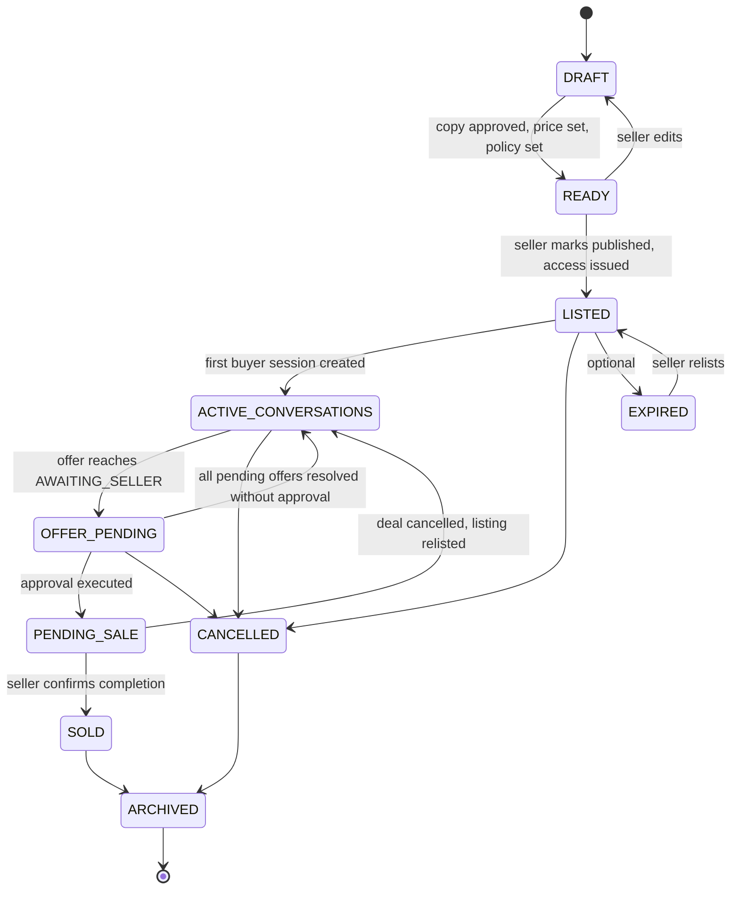
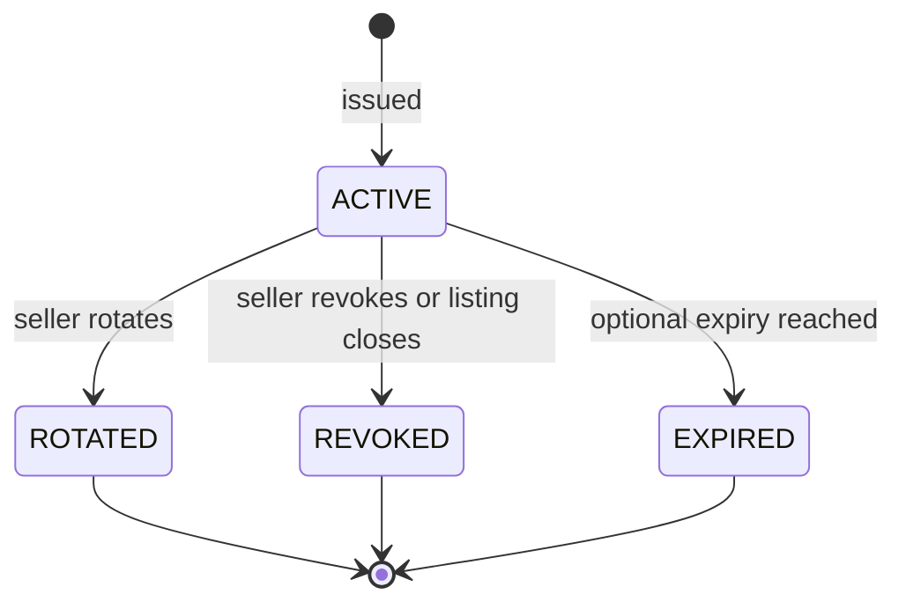
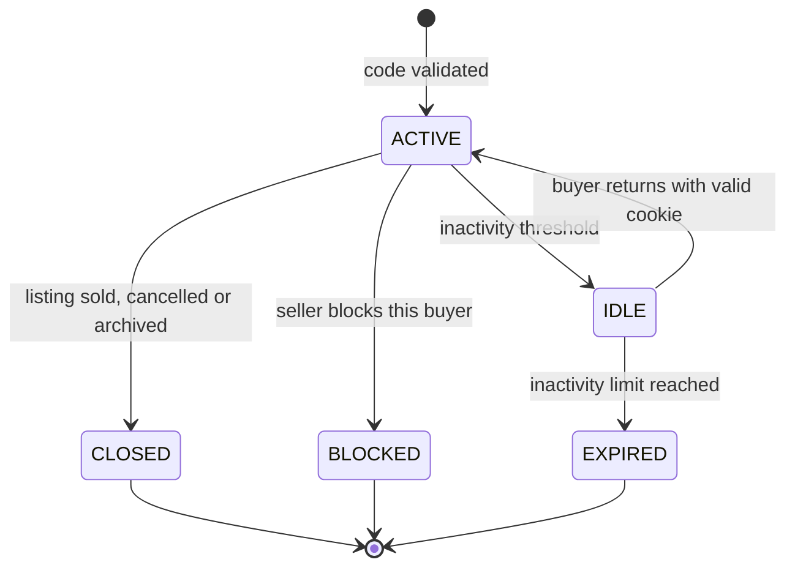
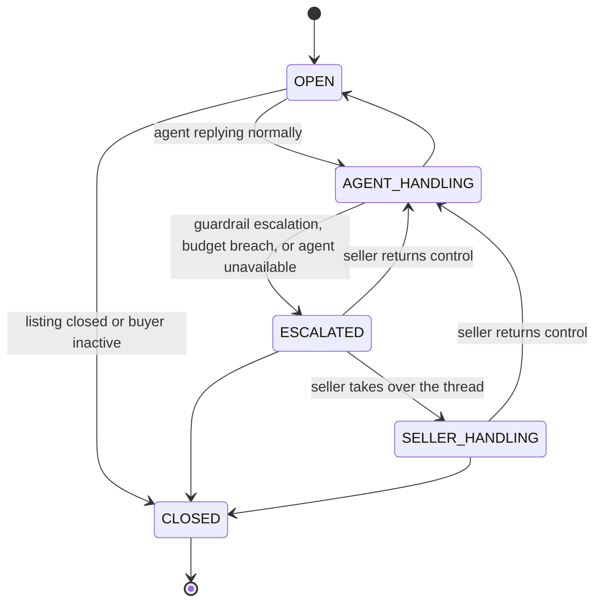
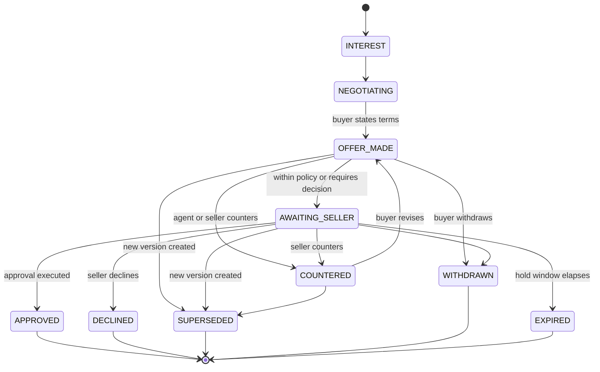
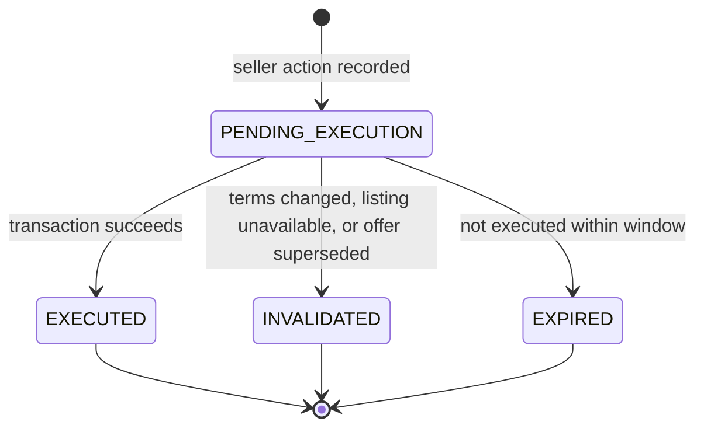
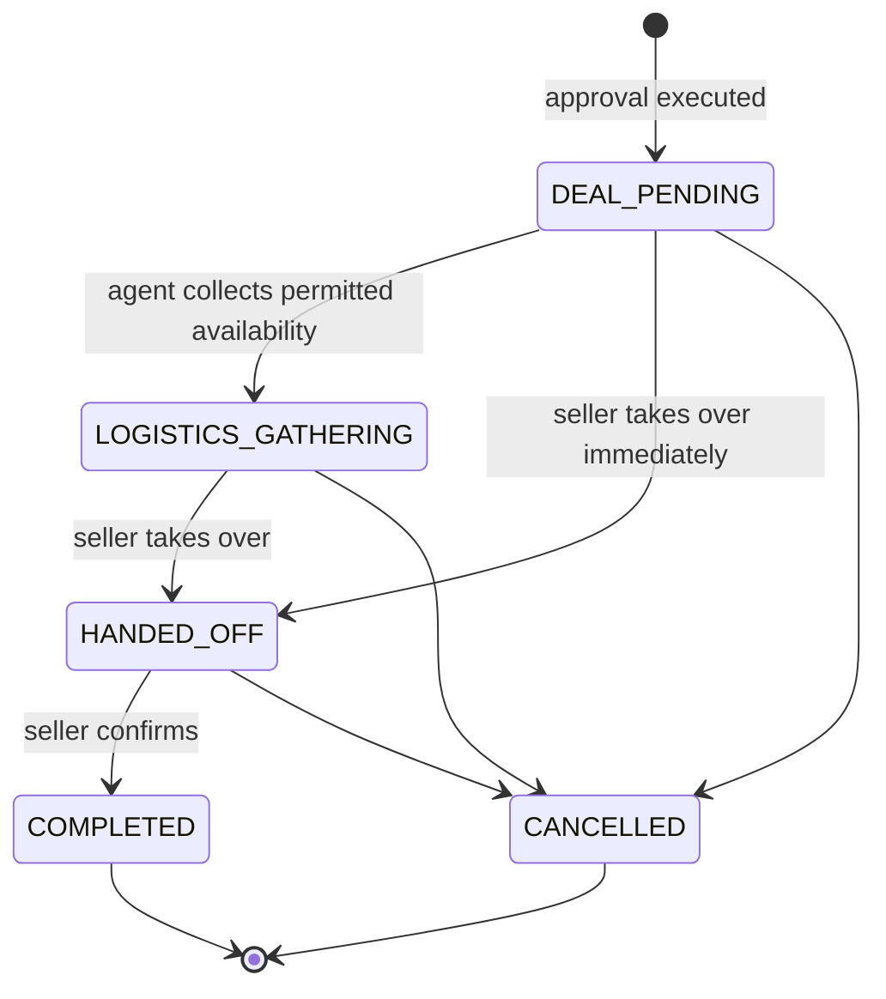
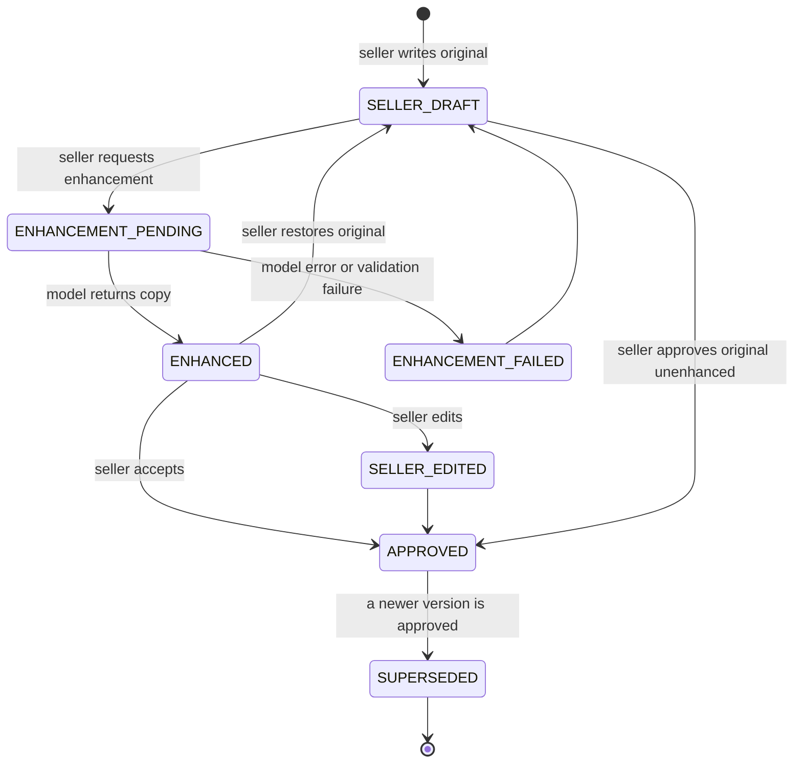

# State Machines

**Status:** Canonical for lifecycle transitions. Any transition not drawn here is
illegal and must be rejected at the data layer.

---

## 1. Listing

| Rule | Statement |
|---|---|
| SM-L-01 | A listing cannot reach `READY` without approved copy, an asking price, a minimum price and a policy version. |
| SM-L-02 | Public access is issued on entry to `LISTED` and closed on `SOLD`, `CANCELLED`, `ARCHIVED` or `EXPIRED`. |
| SM-L-03 | `PENDING_SALE` is entered only inside the approval-execution transaction. |
| SM-L-04 | Only `PENDING_SALE` may transition to `SOLD`, and only by an authenticated seller action. |
| SM-L-05 | `SOLD` and `ARCHIVED` are terminal for negotiation. No new buyer session may be created. |
| SM-L-06 | Relisting from `EXPIRED` or a cancelled deal creates a new content version and may issue a new access code. |

## 2. Access code

| Rule | Statement |
|---|---|
| SM-C-01 | At most one `ACTIVE` code exists per public listing access at any time. |
| SM-C-02 | Rotation atomically marks the old code `ROTATED` and issues a new `ACTIVE` code. |
| SM-C-03 | A non-`ACTIVE` code always produces the same generic failure as an unknown code. |
| SM-C-04 | Lockout state is tracked per client against a code, and does not change the code's own status. |

## 3. Buyer session

| Rule | Statement |
|---|---|
| SM-S-01 | A session is bound to one listing at creation and the binding is immutable. |
| SM-S-02 | `BLOCKED` and `EXPIRED` sessions produce the generic mismatch response, never an explanation. |
| SM-S-03 | Closing a session preserves its conversation for the seller's record and for dispute defence. |

## 4. Conversation

| Rule | Statement |
|---|---|
| SM-CV-01 | A buyer message is accepted in every non-`CLOSED` state. It is never dropped. |
| SM-CV-02 | In `ESCALATED` the buyer receives a neutral holding reply, not silence. |
| SM-CV-03 | Entering `ESCALATED` always creates a seller notification and an audit event. |

## 5. Offer

| Rule | Statement |
|---|---|
| SM-O-01 | Every state change writes a new `OfferVersion` or an offer event. Nothing is overwritten. |
| SM-O-02 | Creating a new version supersedes the previous one and invalidates any approval against it. |
| SM-O-03 | Only one offer per listing may be `APPROVED`. |
| SM-O-04 | `AWAITING_SELLER` is the only state from which approval may be requested. |
| SM-O-05 | An offer below the minimum price may never reach `AWAITING_SELLER` through agent action alone; it is auto-declined or escalated per policy. A seller may still choose to view and accept it explicitly. |

## 6. Approval

| Rule | Statement |
|---|---|
| SM-A-01 | The approval row is written before execution is attempted, so an interrupted execution is recoverable. |
| SM-A-02 | Execution asserts, inside one transaction: listing available, approval pending, material-terms hash unchanged. |
| SM-A-03 | Any failed assertion aborts and moves the approval to `INVALIDATED` with a reason. |
| SM-A-04 | The agent is permitted to communicate acceptance only after `EXECUTED`. |
| SM-A-05 | Execution is idempotent on the client-supplied key. A retry returns the original outcome. |

## 7. Deal and handoff

| Rule | Statement |
|---|---|
| SM-D-01 | The agent may collect availability and non-sensitive logistics only. |
| SM-D-02 | Exact location is never disclosed by the agent unless policy explicitly permits an area, and never a precise address. |
| SM-D-03 | `COMPLETED` is set only by an authenticated seller action and moves the listing to `SOLD`. |
| SM-D-04 | `CANCELLED` returns the listing to `ACTIVE_CONVERSATIONS` and reopens other offers if the seller chooses. |

## 8. Content version

| Rule | Statement |
|---|---|
| SM-CT-01 | Exactly one version per listing is `APPROVED` and buyer-visible at a time. |
| SM-CT-02 | Restoring the original creates a new version; it does not delete the enhanced one. |
| SM-CT-03 | Only `APPROVED` content is used in the buyer-safe projection and in agent context. |
| SM-CT-04 | Enhancement failure is a visible, recoverable state. It never silently returns unenhanced text as if enhanced. |
