# Positioning

**Status:** Canonical for competitive positioning and messaging guidance. Product scope is
set by `product/MASTER_PRODUCT_SPEC.md`. Commercial model is set by
`business/BUSINESS_MODEL.md`. Neither is extended here.

**Reserved requirement-ID block:** `BIZ-100` – `BIZ-199`. No other document may issue a
`BIZ-` identifier in this range.

**Standing warning on competitors.** This document names **no company and asserts no fact
about any named company's product, pricing, capability or roadmap.** Competitors are
described as generic categories. Every category description is a hypothesis about a market
shape, carries a verification status, and must not be repeated as fact in any external
material until researched (§4.1). The same discipline applies here as applies to
marketplaces in `integrations/MARKETPLACE_STRATEGY.md`.

---

## 1. The positioning statement

`BIZ-100` The positioning statement is fixed and is not open to rewriting by any
individual document, campaign or surface.

> **Your AI handles the buyers. You make the decisions that matter.**

Source: `SPEC_CONTRACT.md` "Positioning line" and `MASTER_PRODUCT_SPEC.md` §1.

`BIZ-101` Two supporting lines, both from `MASTER_PRODUCT_SPEC.md` §2:

> **We are the operational layer resellers run their business on - listings, buyer
> conversations, offers, approvals and sales history - while external marketplaces remain
> the discovery and acquisition channel.**

> **The product wins on workflow, not on any single AI feature.**

`BIZ-102` Why the statement works, clause by clause. Each half is doing specific work and
neither may be dropped for brevity.

| Clause | What it claims | What it deliberately concedes |
|---|---|---|
| "Your AI handles the buyers" | Volume of conversation is absorbed. This is the operational load reduction the seller is hiring for (`BIZ-003`). | Nothing about outcomes, prices or sales. It does not say the AI sells better. |
| "You make the decisions that matter" | The seller stays in authority. Approval is a feature, not a limitation (`D-13`, `AUTH-INV-04`). | Full autonomy. The product will never claim to close deals. |

`BIZ-103` The second clause is the differentiator, not the disclaimer. Competitors
promising autonomy are promising the thing sellers are most afraid of. Stating the
boundary plainly converts a constraint into the reason to trust the product.

## 2. Why "AI writes your marketplace description" is a weak position

`BIZ-110` The product must not be positioned on listing copy generation. That position is
weak in four independent ways, any one of which would be sufficient.

| # | Weakness | Consequence |
|---|---|---|
| 1 | Trivially copied | A copy-improvement feature is a prompt and a form. A competent developer reproduces it in days. There is no moat in a prompt. |
| 2 | Already commoditised | General-purpose assistants do this for free today, with no signup, and sellers already use them for exactly this. We would be charging monthly for something the customer can already get at zero marginal cost. |
| 3 | Plausibly native | Marketplaces have both the incentive and the data to offer listing assistance inside their own composer, where it is free, integrated and one tap away. Competing with the host platform's free built-in feature, from outside, is a losing structural position. **Status: `UNCLEAR - REQUIRES RESEARCH` per channel (§4.1).** |
| 4 | Wrong job | It solves typing. The customer's pain is conversation volume, not typing (`PROD-001`-`PROD-005`). A seller does not pay monthly to write 40 descriptions; they pay to stop answering 400 messages. |

`BIZ-111` Listing content enhancement remains **in scope and valuable** (`LIST-003`). It is
a well-executed supporting feature, a natural first-run experience, and cheap to operate
(`LISTING_ENHANCEMENT.md` §10). It is simply not the position. The distinction between
"a feature we ship" and "the reason we exist" must hold in every piece of copy.

`BIZ-112` Our enhancement is differentiated by what it refuses to do - it transforms
seller facts and never adds them (`INV-13`, `D-10`, `D-12`) - which is a **credibility**
argument, not a capability argument. It supports the position; it cannot carry it.

## 3. Where the differentiation actually is

`BIZ-120` The differentiation is the **complete workflow**, end to end, with authority
correctly placed at every step. No single stage of it is defensible alone. The sequence
is.

```mermaid
flowchart LR
  A[Seller facts<br/>seller owns the truth] --> B[Enhanced copy<br/>presentation only]
  B --> C[Manual publication<br/>seller's channel, seller's account]
  C --> D[Buyer arrives<br/>URL plus code]
  D --> E[Scoped conversation<br/>answers from approved facts only]
  E --> F[Negotiation<br/>inside deterministic policy]
  F --> G[Structured offers<br/>versioned, nothing lost]
  G --> H[Supervised authorization<br/>seller approves one exact version]
  H --> I[Handoff<br/>seller fulfils]
  I --> J[Operational record<br/>compounds over time]
  J -.-> A
```

| Stage | What a point solution gives you | What the workflow gives you |
|---|---|---|
| Copy | Better words | Words with tracked provenance the agent can safely quote later (`SELLER_APPROVED_COPY`) |
| Conversation | An auto-reply | Answers grounded in the same approved facts, with "I don't have that confirmed" as a first-class answer (`AI-002`, `G-05`) |
| Negotiation | A chatbot that discusses price | Concessions bounded by a pure function the seller configured once, with the floor never in model context (`D-04`, `G-01`-`G-03`) |
| Offers | A transcript to read | Versioned structured terms with a material-terms hash (`D-06`) |
| Approval | A notification | An authorization that binds to one exact version, revalidates availability inside the transaction, and cannot be created by buyer text or model output (`AUTH-INV-01`-`AUTH-INV-11`) |
| Record | Nothing | A durable operational history that outlives every marketplace thread (`PROD-005`, `PROD-018`) |

`BIZ-121` The compounding asset is the **seller's accumulated operational record**:
listings, approved copy with provenance, tuned negotiation policy, conversation history,
offer history, sales history and channel performance. It is created as a by-product of
using the product and cannot be transferred, exported into a competitor, or recreated by
signing up somewhere else.

`BIZ-122` Switching cost is therefore earned rather than imposed. There is no data lock-in
mechanism, no export restriction and no contract term. Doing this any other way would
contradict the trust position in `BIZ-103`.

## 4. Competitor categories

`BIZ-130` Described generically. **No named company, no asserted capability, no asserted
pricing, no asserted roadmap.**

| # | Category | What the category appears to do | Where it overlaps us | Where it does not | Threat | Status |
|---|---|---|---|---|---|---|
| C-1 | Reseller crosslisting and operations tools | Publish one item to several channels; track inventory and sales | Inventory, sales history, operational record | Appears not to handle buyer conversation, negotiation or offers. Typically depends on marketplace automation we have ruled out (`D-07`, `INT-060`). | Medium - adjacent, could extend toward us | `UNCLEAR - REQUIRES RESEARCH` |
| C-2 | AI listing tools | Turn photos or notes into listing copy | Listing enhancement | Appears not to extend past publication. Several appear to infer facts from images, which we removed deliberately (`D-11`). | Low - solves a different job (`BIZ-110`) | `UNCLEAR - REQUIRES RESEARCH` |
| C-3 | Platform-native AI features | Assistance built into the marketplace itself | Any feature they choose to ship, for free, one tap away, with data we do not have | Their incentives are the platform's, not the seller's. A native feature serves one channel. | **High - structural** (§6) | `UNCLEAR - REQUIRES RESEARCH` |
| C-4 | Browser-extension auto-reply tools | Draft or send replies inside the marketplace's own messaging surface | Buyer conversation volume | This is the category we deliberately did not build. It appears to depend on automating a surface the seller does not control, putting the seller's account at risk (`D-07` reason 1). | Medium - a genuine competitor for the same pain, on an approach we will not take | `UNCLEAR - REQUIRES RESEARCH` |
| C-5 | General-purpose AI assistants | Everything and nothing; free; already in the seller's hand | Copy, and any single message the seller pastes in | No listing record, no policy, no offer structure, no approval, no memory of the seller's business, and no way to be present when the seller is asleep | Medium for copy, low for workflow | `UNCLEAR - REQUIRES RESEARCH` |
| C-6 | Doing nothing | The actual incumbent. The seller answers messages themselves. | All of it | Costs the seller their evenings | **Highest by volume** - most prospects will keep doing this | n/a |

`BIZ-131` C-6 is the real competitor and should be treated as such in every message test.
The comparison a prospect actually makes is "this versus my current Tuesday evening", not
"this versus a named product".

### 4.1 Research required before any external claim

`BIZ-132` Every row above is `UNCLEAR - REQUIRES RESEARCH`. Before any comparative claim
appears in marketing, sales, a pitch deck or a support article, the following must be
recorded with a source and a date, using the same evidence standard as
`integrations/MARKETPLACE_STRATEGY.md` §5:

| # | Question |
|---|---|
| 1 | Which specific products occupy each category, and what do their own current published materials say they do? |
| 2 | What do they charge, per their own current published pricing? |
| 3 | Does any of them handle buyer conversation, negotiation, structured offers or supervised approval? |
| 4 | Which depend on marketplace automation, and what do they disclose about that? |
| 5 | Which marketplaces currently ship native seller AI assistance, in which surfaces, and does any of it negotiate? |
| 6 | What do sellers say in public communities about each, unprompted? |

`BIZ-133` **No competitor claim may be made from a model's recollection, a comparison
site, a competitor's own advertising, or another vendor's comparison page.** Claims come
from the competitor's current published material, with the retrieval date recorded, or
they are not made.

## 5. What copying this would actually require

`BIZ-140` A competitor who wants to reproduce the position, not the demo, must build all
of the following. The list is the moat; no item on it is individually hard.

| # | Component | Why it is not a weekend |
|---|---|---|
| 1 | A deterministic policy and guardrail engine | A pure function with no I/O, exhaustively tested, that is the sole authority over money (`ARCH-004`, target 200+ unit tests). Most teams put the rules in the prompt, and a rule in a prompt is a suggestion, not a control. |
| 2 | Structured actions instead of prose | Requires a typed action schema, a validator, regeneration handling and escalation paths (`D-05`). Changes the whole architecture, not one call site. |
| 3 | Authorization that survives concurrency | Version binding, material-terms hashing, conditional update inside the acceptance transaction, idempotency (`D-06`, `AUTH-006`, `AUTH-007`). This is the part that is quietly hard and loudly expensive to get wrong. |
| 4 | A public buyer surface designed to be public | An access code that is public by design and a security model built on that honestly (`D-03`, `SEC-001`), rather than a leaky secret-based model. |
| 5 | A fact-provenance model | Facts, enhanced copy and approved copy tracked separately, with "I don't have that" as a designed state (`D-10`, `AI-002`). Most systems will happily invent, because inventing is the default. |
| 6 | Restraint | Not shipping valuation, not shipping identification from photos, not shipping autonomous acceptance - all of which demo better than what we built (`D-09`, `D-11`, `D-13`). Copying the restraint requires understanding why, and the why is not visible from outside. |
| 7 | The seller's record | Cannot be built at all. It accrues per customer over months (`BIZ-121`). |

`BIZ-141` A prompt is copied in an afternoon. Items 1-6 are a quarter of disciplined work
by a team that already understands the problem. Item 7 cannot be copied, only outlasted.

`BIZ-142` This is not a claim of safety. It is a claim about **where** the difficulty sits:
in workflow correctness and accumulated record, not in any model capability. Anyone who
copies the demo will ship something that works until the first disputed offer.

## 6. If a marketplace ships native negotiation

`BIZ-150` This is the most serious competitive scenario and the one we have least control
over (`RISK-18`). It is not hypothetical enough to ignore: marketplaces own the messaging
surface, the traffic and the data, and negotiation is an obvious adjacency.

`BIZ-151` **Assessment of the scenario, marked as assessment, not prediction.**

| If a marketplace shipped | Effect on us |
|---|---|
| Native canned replies or FAQ automation | Minor. Reduces the easy questions, leaves negotiation, offers and approval. |
| Native price negotiation on one channel | Serious on that channel. Sellers on that channel alone would have less reason to route buyers off-platform. |
| Native negotiation across every channel a seller uses | Existential for the buyer-conversation half of the product. The operational-record half survives. |
| Native negotiation with autonomous acceptance | Unlikely to be built the way we would, because the liability position that produced `D-13` applies at least as strongly to a platform. A marketplace that accepts on a seller's behalf owns the dispute. |

`BIZ-152` Planned response, in order:

1. **Do not compete on the overlapping feature.** A native feature is free, integrated and
   default. There is no version of that fight we win.
2. **Move up to the cross-channel position.** A native feature serves one marketplace. The
   multi-channel seller (`P-02` Priya) still has three inboxes, three sets of rules and no
   single record. Our position becomes explicitly "the layer above your channels".
3. **Lean on the record and the policy.** Consistent negotiation rules applied identically
   everywhere, and a sales history that spans channels, are things a single platform
   structurally will not give.
4. **Watch the leading indicator.** Per-channel conversion (`INT-053`) will fall on the
   affected channel before any announcement is understood. That is the tripwire.
5. **Re-verify, do not speculate.** The moment this appears plausible on a channel, it
   becomes a §4.1 research item with a date and a citation, not a corridor conversation.

`BIZ-153` The response that is **not** available: matching a native feature by building
marketplace automation. `D-07` and `INT-060` hold regardless of competitive pressure. If
the only way to compete is to put customers' accounts at risk, we do not compete.

## 7. Messaging guidance

### 7.1 Claims the marketing must never make

`BIZ-160` These are **prohibitions, not preferences**. They are blocking review failures on
any customer-facing surface: website, ads, app store copy, onboarding, email, support
articles, sales decks and demo scripts.

| # | Never claim | Why | Anchor |
|---|---|---|---|
| 1 | That the product knows, estimates, suggests or checks what an item is worth | No licensed, reliable, legally usable comparable-sales data exists. An unsubstantiated value claim is a consumer-protection exposure, not just a quality problem. | `D-09`, `R-01`-`R-03` |
| 2 | That the AI closes deals, seals deals, sells for you, or completes sales | It cannot accept. Every acceptance requires an authenticated seller approval. Claiming otherwise misrepresents the agent's authority. | `D-13`, `AUTH-INV-04`, `AUTH-INV-07` |
| 3 | That the product integrates with, connects to, syncs with, posts to or is partnered with any marketplace | There is no integration of any kind. This is the claim most likely to be made carelessly and it is a straightforward misrepresentation. | `D-07`, `INT-002`, `INT-022` |
| 4 | That any named marketplace permits our links | Every channel row is `UNCLEAR - REQUIRES RESEARCH`. | `INT-022` |
| 5 | That the product identifies items, reads photos, verifies authenticity, or fills in details from an image | Removed deliberately. | `D-11`, `R-04`, `R-08` |
| 6 | That the product raises prices, increases profit, sells faster, or improves outcomes | Unsubstantiated, and it would require the valuation capability we do not have. | `D-09`, `BIZ-003` |
| 7 | That the product scores, screens, filters or flags buyers | Removed deliberately; unexplainable scoring of individuals. | `D-16`, `R-09` |
| 8 | That buyers will not notice they are talking to an AI | Disclosure is unconditional and persistent. | `D-15`, `BUYER-006` |
| 9 | Any figure for time saved, messages handled or hours returned as an established fact | Every such number is currently an assumption (`BIZ-010`). Until measured, it is illustrative and must be labelled. | `BIZ-010` |
| 10 | Any comparative claim about a named competitor | Not researched. | `BIZ-132`, `BIZ-133` |

`BIZ-161` Watch the near-miss phrasings, which are how these get shipped by accident:
"knows the market", "smart pricing", "AI-powered pricing", "closes the sale", "handles
everything", "hands-free selling", "set it and forget it", "connects to Facebook",
"works with eBay", "posts for you", "knows what your item is worth", "never miss a sale".
Each is a rewording of a prohibited claim.

### 7.2 Claims that are safe and true

`BIZ-162` Substantiated by shipped behaviour, and each traceable to a requirement.

| Claim | Anchor |
|---|---|
| "Your AI answers buyer questions from what you told it - and says so when it does not know" | `AI-001`, `AI-002`, `G-05` |
| "It negotiates inside rules you set once, the same way every time" | `AI-003`, `G-01`-`G-03`, `LIST-022` |
| "It never accepts an offer. Only you can do that." | `D-13`, `AUTH-INV-07` |
| "Messy chat becomes a structured offer you can decide on in seconds" | `PROD-014`, `D-06` |
| "A decision queue instead of an inbox" | `PROD-015` |
| "Your prices. Your rules. Your facts." | `INV-12`, `D-09`, `LIST-020`-`LIST-022` |
| "Buyers are always told they are talking to an AI acting for you" | `D-15`, `BUYER-006` |
| "You keep publishing where you already publish. Nothing changes on your marketplace account." | `D-07`, `INT-001` |
| "Your listings, conversations, offers and sales stay in one place after the thread is gone" | `PROD-005`, `PROD-018` |

### 7.3 Tone

`BIZ-163` The audience is people who sell things for a living and are sold to constantly.

| Do | Do not |
|---|---|
| Say what it does in the seller's words | Use AI-capability language: agentic, autonomous, intelligent, powered by |
| Show the decision queue and one real negotiation | Show a valuation figure, a market chart, or a photo-to-listing demo, none of which exist |
| State the approval step early and as a feature | Bury it as a limitation |
| Label every metric that is a projection | Present an illustrative figure as a result |
| Name the marketplace link question honestly (`BUYER-024`) | Imply we have solved it |

`BIZ-164` The approval step is the trust argument. Copy that apologises for it is copy that
misunderstands the product.

## 8. Open questions owned by this document

| ID | Question | Blocks |
|---|---|---|
| `BIZ-170` | Everything in §4.1, for every category | Any comparative claim |
| `BIZ-171` | Whether "AI operating system for resellers" or "the layer above your marketplaces" tests better as the top-line category descriptor | Website structure, ad copy |
| `BIZ-172` | Whether the approval step should lead the message or be the second beat | Landing page order; test, do not argue |
| `BIZ-173` | Whether the multi-channel position (`BIZ-152` step 2) should lead now rather than being held in reserve | Positioning sequencing; depends on `INT-090` |
| `BIZ-174` | `BIZ-100` cites `SPEC_CONTRACT.md`, the drafting contract also referred to in `product/PRD.md` §1, which is not in the repository. The positioning line itself is verifiable in `MASTER_PRODUCT_SPEC.md` §1 and `CLAUDE.md`. Whether the contract should be added to the repository, or the citation reduced to those two sources, is open. No file has been invented to stand in for it. | Documentation completeness only; no product or messaging decision depends on it |
