# Marketplace Strategy

**Status:** Canonical for the marketplace boundary, channel policy questions and
per-channel attribution. Where another document describes what the platform may do with
an external marketplace, this document wins.

**Reserved requirement-ID block:** `INT-001` – `INT-099`. No other document may issue an
`INT-` identifier in this range. Risks raised here are registered in
`business/RISK_REGISTER.md` (`RISK-01`, `RISK-03`, `RISK-18`).

**Standing warning.** This document contains **no verified claim about any external
marketplace**. Every channel row below is marked `UNCLEAR - REQUIRES RESEARCH`. Its
purpose is to frame the questions, define how they get answered, and stop the team from
assuming a permission it has not confirmed. Treat any statement in this file about an
external platform as a hypothesis until a dated citation replaces it.

---

## 1. The boundary

The product deliberately does not compete with marketplaces. It sits behind them.
Marketplaces do discovery and buyer acquisition. The platform does everything that
happens after a buyer becomes interested.

```mermaid
flowchart LR
  subgraph MP["EXTERNAL MARKETPLACE - not ours, not integrated"]
    D1[Listing discovery and search]
    D2[Buyer acquisition and traffic]
    D3[Seller's own account and reputation]
    D4[Marketplace's own messaging]
  end
  subgraph HUMAN["HUMAN-ONLY COUPLING"]
    H1[Seller copies and pastes the listing manually]
    H2[Seller publishes the buyer URL and access code where permitted]
    H3[Buyer chooses to follow the link]
  end
  subgraph US["OUR PLATFORM"]
    P1[Listing record and seller-approved copy]
    P2[Buyer AI conversation]
    P3[Negotiation within deterministic policy]
    P4[Structured offers and offer history]
    P5[Seller approval and authorization]
    P6[Deal handoff, sales operations, history]
  end
  MP --> HUMAN
  HUMAN --> US
  US -. no API, no scrape, no automation .-> MP
```

| Concern | Owned by the marketplace | Owned by our platform |
|---|---|---|
| Search and discovery | Yes | No |
| Buyer traffic | Yes | No |
| Seller account and reputation | Yes | No |
| Marketplace-native messaging | Yes | No |
| Listing record of truth for the seller | No | Yes |
| Copy enhancement from seller facts | No | Yes |
| Buyer question answering | No | Yes |
| Negotiation inside seller-set rules | No | Yes |
| Structured offers and versions | No | Yes |
| Seller approval and authorization | No | Yes |
| Sales history and operational record | No | Yes |
| Fulfilment | No | No - the seller does this |

`INT-001` The only coupling between a marketplace and this platform is **a human seller
copying text** and **a human buyer following a link**. There is no machine coupling of
any kind, in either direction (`ARCH-009`, `D-07`).

`INT-002` No module may read from, write to, poll, scrape, or automate any marketplace,
any marketplace messaging surface, or any marketplace account. Module 22 (Marketplace
Abstractions) exists to hold channel labels, per-channel codes and copy formatting, and
performs no network call to any marketplace (`ARCH-005`).

`INT-003` The marketplace remains the seller's channel and the seller's account. The
platform never acts as, on behalf of, or through the seller's marketplace identity.

## 2. Why there is no integration

Recorded as `D-07`. Restated here with the reasoning, because this is the decision most
likely to be reopened by someone who has not read the decision log.

| # | Reason | Consequence if ignored |
|---|---|---|
| 1 | Scraping and unofficial automation breach the terms of service of the platforms sellers depend on | The breach is committed using the **seller's** account, not ours. The account that gets suspended is the customer's livelihood, not our infrastructure. That is an unacceptable thing to build into a product. |
| 2 | Unofficial automation is structurally fragile | A DOM change, a flow change or an anti-automation control breaks the feature with no notice, no deprecation window and no support channel. Reliability cannot be promised on a surface nobody has agreed to keep stable for us. |
| 3 | Official APIs for consumer marketplace **selling** are, as far as we currently understand, either unavailable or gated behind partner programs | A two-person company is unlikely to obtain partner access. **This is an assumption and is itself listed for verification in §6.** |
| 4 | Automation of person-to-person messaging raises consent and communications-law questions | These are questions for counsel, not for engineering judgment (§9). |
| 5 | The product does not need it | The value is in what happens after the buyer arrives. Discovery is already solved by the marketplace. Integrating would add fragility to acquire a capability we do not sell. |

`INT-010` The compliant architecture is fixed and is not a matter of preference:
**the seller lists manually, the seller shares the link, the conversation happens on our
domain.**

`INT-011` The cost of this position is that buyer acquisition depends entirely on a human
choosing to follow a link. That is `ASM-01`, the highest-risk assumption in the business,
and it is accepted deliberately rather than engineered around.

## 3. Verification status vocabulary

`INT-020` Every channel-policy claim carries exactly one of these statuses. No other
value is permitted.

| Status | Meaning | Evidence required to assign it |
|---|---|---|
| `VERIFIED SUPPORTED` | A current published policy or a completed live test shows the surface is permitted | Dated citation with exact quoted text, or a dated live-test record, plus reviewer initials |
| `VERIFIED RESTRICTED` | A current published policy or a completed live test shows the surface is prohibited or removed | Same |
| `UNCLEAR - REQUIRES RESEARCH` | We do not know. **This is the default and the only status any row may hold without evidence.** | None. This is the state of ignorance. |
| `NOT REQUIRED FOR MVP` | The channel is out of scope for launch, so its policy does not gate MVP | A recorded scope decision, not an absence of research |
| `FUTURE PARTNER OR API POSSIBILITY` | Relevant only to §8, which is not approved work | A recorded decision, not an aspiration |

`INT-021` A row may only move off `UNCLEAR - REQUIRES RESEARCH` by the procedure in §5.
A status change without a dated citation is a documentation defect and must be reverted.

`INT-022` **No document, marketing asset, onboarding screen, support article or seller
communication may state or imply that any marketplace permits or forbids external links
until the corresponding row here is verified.** The seller-facing copy required by
`BUYER-024` says that rules vary and that compliance is the seller's responsibility. It
must not say more than that.

## 4. Channel capability and policy matrix

**Read the standing warning at the top of this document before using this table.**

Every cell in the "assumed contact path" column is an **unverified assumption** about how
buyers normally reach sellers on that channel. Every cell in the two "permitted" columns
is `UNKNOWN`. Nothing here may be relied on.

| Channel | Assumed buyer-contact path (ASSUMPTION - unverified) | External link permitted in listing body? | External link permitted in a direct message? | Verification status | Research priority |
|---|---|---|---|---|---|
| Facebook Marketplace | Assumed: buyer contacts the seller through the platform's own messaging | UNKNOWN - must not be assumed | UNKNOWN - must not be assumed | `UNCLEAR - REQUIRES RESEARCH` | P0 |
| eBay | Assumed: buyer purchases or messages through platform messaging | UNKNOWN - must not be assumed | UNKNOWN - must not be assumed | `UNCLEAR - REQUIRES RESEARCH` | P0 |
| Kijiji | Assumed: buyer contacts the seller through platform messaging or a reply form | UNKNOWN - must not be assumed | UNKNOWN - must not be assumed | `UNCLEAR - REQUIRES RESEARCH` | P0 |
| Craigslist | Assumed: buyer contacts the seller through a relay or a seller-published contact route | UNKNOWN - must not be assumed | UNKNOWN - must not be assumed | `UNCLEAR - REQUIRES RESEARCH` | P1 |
| OfferUp | Assumed: buyer contacts the seller through platform messaging | UNKNOWN - must not be assumed | UNKNOWN - must not be assumed | `UNCLEAR - REQUIRES RESEARCH` | P1 |
| Mercari | Assumed: buyer purchases or messages through platform messaging | UNKNOWN - must not be assumed | UNKNOWN - must not be assumed | `UNCLEAR - REQUIRES RESEARCH` | P2 |
| Poshmark | Assumed: buyer purchases or comments/messages through the platform | UNKNOWN - must not be assumed | UNKNOWN - must not be assumed | `UNCLEAR - REQUIRES RESEARCH` | P2 |
| Depop | Assumed: buyer purchases or messages through the platform | UNKNOWN - must not be assumed | UNKNOWN - must not be assumed | `UNCLEAR - REQUIRES RESEARCH` | P2 |
| VarageSale | Assumed: buyer contacts the seller through platform messaging or comments | UNKNOWN - must not be assumed | UNKNOWN - must not be assumed | `UNCLEAR - REQUIRES RESEARCH` | P2 |
| Instagram / TikTok DM | Assumed: buyer comments or sends a direct message | UNKNOWN - must not be assumed | UNKNOWN - must not be assumed | `UNCLEAR - REQUIRES RESEARCH` | P1 |
| Seller's own site or QR code | Assumed: the seller controls the surface and directs the buyer themselves | UNKNOWN - the constraint here is not a marketplace policy but whatever host or medium the seller uses, and any marketplace rule that may still apply to a buyer originally found on that marketplace | UNKNOWN - same | `UNCLEAR - REQUIRES RESEARCH` | P1 |

`INT-023` Research priority is an internal sequencing label only. It carries no
implication about what any channel permits.

`INT-024` The seller's own site and QR route is listed as a channel because it is the
only surface where the seller, not a third party, sets the rules. It is **not** therefore
exempt from verification: the hosting medium has its own terms, and a buyer who came from
a marketplace may still be governed by that marketplace's rules on off-platform
solicitation. That is a question for counsel (§9), not an engineering assumption.

### 4.1 What must be established per channel

`INT-025` For each channel, research must answer all of the following and record the
answer with the evidence required by §5. A partial answer leaves the row `UNCLEAR`.

| # | Question |
|---|---|
| Q1 | Does the current published policy address URLs, external links or off-platform contact in a listing body, title or description? What is the exact wording? |
| Q2 | Does it address the same in a direct message or reply to a buyer? |
| Q3 | Does it distinguish a link to a seller's own page from a link to a third-party commercial service? |
| Q4 | Does it distinguish a bare domain, a path-bearing URL, plain text, and an image containing a URL or QR code? |
| Q5 | Is a numeric code without a URL treated differently from a URL? |
| Q6 | What is the stated enforcement consequence - removal of the listing, warning, restriction, suspension? |
| Q7 | Does enforcement appear to be automated, reported, or manual? (Observation only; state it as observation.) |
| Q8 | Does the policy differ by region, by category, or by seller type? |
| Q9 | Where exactly is the policy published, and when was that page last updated? |
| Q10 | Is there any official API or partner program that would make §8 relevant? |

## 5. How to verify

`INT-030` A channel row is verified by all three of the following, not by any one of them.

| Step | What it is | Output |
|---|---|---|
| 1. Read the current published policy | Locate the marketplace's own current terms, community standards, prohibited-content or commerce policy page. Do not rely on a summary, a forum post, a blog, a competitor's marketing, or a model's recollection. | The page URL, the retrieval date, and the **exact quoted text**, copied verbatim, with the surrounding clause for context |
| 2. Test with real listings | Publish genuine listings of real items with the link and code placed in the specific surface under test. One placement variant per listing. Observe whether the listing is published, altered, removed, or the account warned. | A dated test record per listing: channel, surface, exact placement, outcome, elapsed time, screenshot |
| 3. Record and date everything | Write the result into this document with the citation, the quoted text, the test records, the date, and the reviewer | An updated row with a status other than `UNCLEAR`, plus a `next_recheck_date` |

`INT-031` Live testing uses **real listings for real items the tester actually owns and
will actually sell**, on accounts the company or a consenting participant controls, and
never on a customer's account. A fake listing is itself a policy breach and is not an
acceptable research method.

`INT-032` A single test result is an observation, not a policy. A listing surviving does
not prove permission; it proves that it was not removed on that day. State results as
observations with dates, never as entitlements.

`INT-033` **Re-check schedule.** Marketplace policies change without notice and without a
changelog (`RISK-03`).

| Row status | Re-check interval | Trigger for an immediate re-check |
|---|---|---|
| `VERIFIED SUPPORTED` | Every 90 days | Any unexplained drop in link-open rate for that channel; any seller report of a removed listing; any visible platform product change |
| `VERIFIED RESTRICTED` | Every 180 days | A seller reports the surface now working |
| `UNCLEAR - REQUIRES RESEARCH` | Every 90 days until resolved | n/a |
| `NOT REQUIRED FOR MVP` | On scope change only | Channel enters scope |
| `FUTURE PARTNER OR API POSSIBILITY` | Every 180 days | Any public announcement of a partner program |

`INT-034` The re-check is a recurring operational task with a named owner
(`business/RISK_REGISTER.md`, `RISK-03`), not a best-effort intention. A row whose
`next_recheck_date` has passed reverts to `UNCLEAR - REQUIRES RESEARCH` automatically.

`INT-035` Per-channel link-open and code-entry rates (`BUYER-025`, and the day-one
metrics in `BUYER_ACCESS_FLOW.md` §12) are the **detective control** for a silent policy
change. A channel's conversion collapsing to near zero is the signal that a policy or an
enforcement behaviour changed before anyone published anything about it.

## 6. Graceful degradation

`INT-040` The product must not depend on any single placement surface. If a channel is
found to disallow a link in the listing body, the following alternatives exist. **Each is
an independent surface with its own policy question and its own verification status, and
none may be used or recommended until verified by §5.**

| # | Alternative surface | How it works | Independent verification status | Notes and risks |
|---|---|---|---|---|
| A | Reply in a direct message | The seller replies to the buyer's first message with the URL and code. The listing body stays clean. | `UNCLEAR - REQUIRES RESEARCH` | Costs the seller one manual message per buyer, which erodes the time-saved value hypothesis (`business/BUSINESS_MODEL.md`). Message policies may differ from listing policies (`INT-025` Q2). |
| B | Seller's profile or bio field | The URL lives on the seller's profile; the listing references it without a link. | `UNCLEAR - REQUIRES RESEARCH` | Cannot carry a per-listing code, so it needs a landing page that asks which item, adding a step and lowering conversion. |
| C | Seller-owned landing page | The seller publishes their own page, which links onward to the buyer surface. | `UNCLEAR - REQUIRES RESEARCH` | Adds a hop and a second domain, which worsens the phishing-perception problem (`RISK-05`). Building or hosting this page is **not** in MVP scope. |
| D | QR code in a listing image | The code and URL travel as an image rather than as text. | `UNCLEAR - REQUIRES RESEARCH` | Unusable for a buyer already on a phone, since they cannot scan their own screen easily. QR generation is explicitly **not included** in MVP (`PRD` ACCESS-100). A seller may do this manually today. |
| E | Manual sharing by the seller | The seller sends the URL and code by whatever channel they already use with that buyer. | `UNCLEAR - REQUIRES RESEARCH` | The universal fallback. Always available, least scalable, and the honest baseline the product must still be worth paying for. |
| F | Code without a URL | The listing carries only the 6-digit code and the domain is spoken or typed by the buyer. | `UNCLEAR - REQUIRES RESEARCH` | Falls back to buyer URL Options A/B (`BUYER-001`), which lose the pre-gate listing preview and therefore worsen the phishing-perception problem. Last resort. |

`INT-041` The product's degradation posture mirrors `ARCH-014`: it degrades toward
seller-handled sharing rather than failing. If no surface is available on a channel, the
seller is told plainly that this channel may not work for the link flow, and the product
still holds their listing record, copy, policy and sales history.

`INT-042` The seller, not the platform, chooses the surface and carries the compliance
responsibility for the channel they publish on (`BUYER-024`). The platform's obligation
is to make that responsibility visible and to never imply a permission it has not
verified.

`INT-043` The seller-facing copy block (`BUYER-023`) offers placement variants as
formatting options. It must not label any variant as "allowed on" a named marketplace
while that row is `UNCLEAR`.

## 7. Per-channel access codes and attribution

`INT-050` A seller publishing one listing on several channels may issue a distinct
`ListingAccessCode` per channel (`BUYER-025`). All such codes resolve the same
`PublicListingAccess` and the same listing.

`INT-051` A `Channel` is a metadata record owned by Module 22 holding a stable channel
key, a display label, and the current verification status from §4. It holds no
credentials and no network configuration, because there is no network call.

`INT-052` Suggested stable channel keys, for attribution only. These are internal labels
and assert nothing about any platform:

| Channel key | Display label |
|---|---|
| `fb_marketplace` | Facebook Marketplace |
| `ebay` | eBay |
| `kijiji` | Kijiji |
| `craigslist` | Craigslist |
| `offerup` | OfferUp |
| `mercari` | Mercari |
| `poshmark` | Poshmark |
| `depop` | Depop |
| `varagesale` | VarageSale |
| `social_dm` | Instagram / TikTok DM |
| `own_site` | Seller's own site or QR |
| `other` | Other or unlabelled |

`INT-053` Each `BuyerSession` records the channel key of the code that opened it, giving
per-channel link-open, code-entry, conversation-start, offer and sale rates at no extra
instrumentation cost.

`INT-054` Attribution is a measurement feature, not a routing feature. The agent's
behaviour, the policy in force and the buyer-safe projection are identical regardless of
channel. Channel must never enter the model's context or influence a guardrail decision.

`INT-055` Per-channel codes are rotated and revoked independently (`ACCESS-010`,
`ACCESS-011`). Revoking a code because one channel removed a listing must not close the
surface for buyers arriving from another channel.

`INT-056` The channel key is a seller-entered label. It is not evidence of where the
buyer came from and must never be presented as a verified referral source.

## 8. Prohibited work

`INT-060` The following are **permanently out of scope**. They are not deferred, not
backlogged and not "phase two". Building any of them requires a superseding entry in
`decisions/DECISION_LOG.md` that overturns `D-07`, and none is anticipated.

| Prohibited | Includes |
|---|---|
| Marketplace scraping | Reading listings, prices, sold items, comparable sales, seller profiles, buyer profiles, categories or search results from any marketplace, by any means, at any frequency, for any purpose including internal analytics |
| Messenger or DM automation | Reading, intercepting, sending, auto-replying to, or relaying any marketplace or social direct message; browser extensions, headless sessions, session-cookie reuse, or accessibility-API drivers that do the same |
| Auto-posting | Creating, editing, renewing, relisting, repricing, bumping or deleting a listing on any marketplace programmatically |
| Credential handling | Asking a seller for a marketplace password, session token or cookie, or storing one, for any reason |
| Acting as the seller | Any action taken on a marketplace surface under the seller's identity |

`INT-061` This prohibition binds regardless of how a capability is packaged - a
third-party vendor, an off-the-shelf library, a "compliant" integration provider, or a
seller-installed browser extension shipped by us. If the effect is machine access to a
marketplace, it is prohibited.

`INT-062` A pull request that adds an outbound network call to a marketplace domain is a
blocking review failure. This should be enforced by an allowlist in CI, not by reviewer
memory.

`INT-063` Restated for emphasis: **the team must never build a marketplace scraper, a
Messenger automation, or an auto-poster.** The compliant architecture is that the seller
lists manually, the seller shares the link, and the conversation happens on our domain.

## 9. Legal questions for counsel

`INT-080` The following are flagged for qualified legal advice in the jurisdictions
chosen at launch (`Q-07`). **Nothing in this document is legal advice, and no engineering
or product decision may substitute for counsel on these points.**

| # | Question for counsel |
|---|---|
| L1 | What is the legal effect, if any, of a marketplace's terms of service on a seller who directs a buyer to an external service, and what exposure does a tool provider carry for facilitating it? |
| L2 | Does an AI agent conducting a negotiation on a seller's behalf create agency, misrepresentation or unfair-practice exposure, and for whom? (`D-15` sets disclosure as unconditional; this asks whether disclosure is sufficient.) |
| L3 | Do automated-message, electronic-commerce or consumer-protection rules apply to the buyer conversation, and does the answer change if the buyer arrived from a marketplace? |
| L4 | What record-retention obligations attach to transcripts of commercial negotiations? |
| L5 | Does the platform's role in transmitting a seller's listing copy create joint responsibility for misdescription? (`D-10` reduces but may not eliminate this.) |
| L6 | Is per-channel attribution data subject to any consent obligation? |

## 10. FUTURE / CONDITIONAL / NOT CURRENTLY APPROVED - authorized API integration

`INT-070` **This section is not scope. Do not architect for it, do not build interfaces
in anticipation of it, and do not reference it in any customer-facing material.** It
exists so that a future decision has a starting point, and so that the boundary between
"prohibited forever" and "conditional on authorization" is explicit.

`INT-071` The distinction that matters: §8 prohibits **unauthorized** machine access.
This section concerns **authorized** access obtained through an official program, under
an agreement, with a documented contract. The two are not the same thing, and the
prohibition in §8 is not a philosophical objection to APIs.

`INT-072` Preconditions. **All** must hold before any integration work may be proposed:

| # | Precondition |
|---|---|
| C1 | An official, publicly documented API or partner program exists for the capability in question |
| C2 | The company is accepted into it and holds a signed agreement |
| C3 | The agreement permits the specific use, in the specific jurisdictions, for the specific data |
| C4 | Counsel has reviewed the agreement (`INT-080`) |
| C5 | A superseding decision is recorded in `decisions/DECISION_LOG.md` |
| C6 | The core product is validated without it - specifically `ASM-01` has cleared its threshold, because an integration must not become the fix for an unvalidated business |
| C7 | Failure of the integration degrades to the current manual flow, never to a broken product |

`INT-073` Candidate capabilities, in the order they would create value. Status for all:
`FUTURE PARTNER OR API POSSIBILITY`.

| Candidate | What it would do | Why it is not first |
|---|---|---|
| Assisted publication | Push a seller-approved listing to a marketplace through an official write API | The manual copy block already works; this saves minutes, not the core problem |
| Listing status sync | Mark a listing sold on other channels when it sells on one | Genuinely useful for multi-channel sellers; depends on write access on every channel to be worth anything |
| Official message bridging | Receive a buyer's first marketplace message through an official channel and reply through it | Would remove the `ASM-01` link-following step entirely, which is why it is the highest-value candidate and the least likely to be available |
| Category and attribute schemas | Use official taxonomy to structure seller-entered fields | Low value; the seller already supplies the facts |

`INT-074` Even with full authorization, the invariants do not move. An integrated channel
still routes every proposed action through the guardrail engine, still requires an
authenticated seller approval before acceptance (`AUTH-INV-04`), still never receives the
minimum price in model context (`D-04`), and still treats every inbound message as
untrusted data (`ARCH-003`).

`INT-075` No pricing, valuation or comparable-sales capability becomes acceptable because
an API makes the data reachable. `D-09` is independent of this section.

## 11. Open questions owned by this document

| ID | Question | Blocks |
|---|---|---|
| `INT-090` | Every row in §4, without exception | `ASM-02`, and therefore the launch channel list |
| `INT-091` | Which channels are in scope at launch, which determines which rows are P0 | Marketing, onboarding copy, `BIZ-` acquisition planning |
| `INT-092` | Whether the copy block should offer channel-specific placement variants at all before §4 is resolved | `BUYER-023` seller-facing copy |
| `INT-093` | Who owns the recurring re-check task and where its output is recorded | `INT-033`, `INT-034` |
| `INT-094` | Whether a seller-owned landing page (`INT-040` C) is ever built by us or always by the seller | Scope; currently not MVP |
