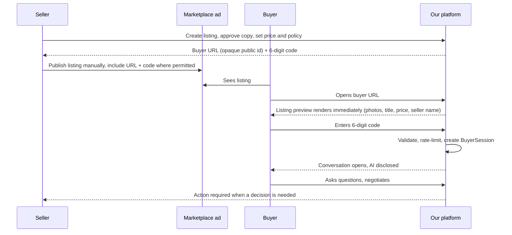

# Buyer Access Specification

**Status:** Canonical for the buyer-facing entry experience.
Security analysis lives in `security/PUBLIC_ACCESS_SECURITY.md` and is canonical where
the two touch.

---

## 1. Why this exists

The platform has no marketplace integration. The only way a buyer reaches the agent is
by voluntarily following a link the seller published and entering a code. This flow is
therefore the single highest-risk assumption in the business (`ASM-01`) and the most
important thing to get right in the product.

Two forces pull against each other:

- **Conversion.** Every step loses buyers. A stranger's link plus a code is a lot to ask.
- **Abuse resistance.** A fully open endpoint is enumerable, scrapeable and expensive.

The design below tries to spend friction only where it buys something.

## 2. Flow



## 3. URL design

Three options were considered.

| Option | Shape | Assessment |
|---|---|---|
| A | `ourplatform.com/chat` + code | Shortest to say aloud. No listing context before the gate, so the page is a bare code box — reads as phishing. Rejected as the default. |
| B | `ourplatform.com/buy` + code | Same problem as A. |
| **C** | `ourplatform.com/l/<opaque-public-id>` + 6-digit confirmation code | **Recommended.** The page can render the listing before the gate, which is what makes it look legitimate. The code confirms intent and scopes the session. |

`BUYER-001` Option C is the default. A and B remain available as a fallback if a
marketplace disallows path-bearing URLs but permits a bare domain.

`BUYER-002` The public id is opaque, non-sequential and unguessable. Never expose
internal database ids. Suggested shape: 12–16 characters of URL-safe base32 from a CSPRNG.

`BUYER-003` The URL and the code are two different things and must be independently
revocable. Rotating the code must not require reprinting the URL in the marketplace ad.

## 4. The landing page

`BUYER-004` The page renders the listing **before** any code is required: photos,
title, asking price, seller display name, and the seller-approved summary.

This is the most important design decision in the flow. A link from a stranger that
opens to an empty six-digit field is visually indistinguishable from credential
phishing, and marketplace buyers are actively trained to refuse exactly that. Showing
the item first converts the page from "suspicious gate" into "the listing I was already
looking at."

`BUYER-005` The gate is on the **conversation**, not on the page.

`BUYER-006` A persistent, plainly worded disclosure appears above the conversation:

> Questions here are answered by an AI assistant acting for *[seller name]*. It can
> answer questions and discuss price. Only *[seller name]* can accept an offer.

This is required for honesty, it sets buyer expectations that reduce frustration, and it
is the safest position under consumer-protection rules in every jurisdiction we might
launch in. See `security/DATA_AND_PRIVACY.md`.

`BUYER-007` A short privacy notice appears at the gate: who operates the service, that
an AI conducts the conversation, what is stored, for how long, that the seller can read
it, and how to request deletion. The gate is the one reliable consent surface for a
person who will never create an account.

## 5. Code entry

`BUYER-008` Six numeric digits. Mobile keyboards must open in numeric mode. Paste of a
6-digit string must fill the field.

`BUYER-009` Optional pre-fill: the seller may share `…/l/<id>?c=418302`, which fills the
field so the buyer only confirms. This raises conversion and lowers abuse resistance
slightly, because the code then travels wherever the link travels.

**This is an open decision (`Q-03`).** The recommendation is to support pre-fill but
default seller-facing copy to the two-part form, and to measure both. Note that in the
primary flow the code is published in a public advertisement anyway, so pre-fill leaks
very little that publication has not already leaked.

`BUYER-010` Errors are generic and identical in body and timing for "wrong code",
"revoked code", "expired code" and "no such listing". The UI says: *"That code doesn't
match this listing."*

`BUYER-011` After 5 failed attempts the listing's code entry locks for that client for
60 minutes and the event is recorded. The listing itself is unaffected for other buyers.

`BUYER-012` Bot controls are applied progressively: silent scoring first, an interactive
challenge only after suspicious signals. Do not put a challenge in front of every buyer.

## 6. Buyer session

`BUYER-013` A successful code entry mints a `BuyerSession` bound to exactly one
listing. The session token is opaque, stored in an httpOnly, Secure, SameSite=Lax
cookie, and is the only thing that authorises subsequent conversation requests.

`BUYER-014` No account, no email, no phone number is required to converse.

`BUYER-015` Two buyers entering the same code receive two distinct sessions and two
distinct conversations. Neither can observe the other's messages, offers, conditions,
summary or identity.

`BUYER-016` A returning buyer with a live cookie resumes their conversation without
re-entering the code. Cookie lost, cleared, or a different device means re-entering the
code and creating a new session — this is acceptable and must be explained in the UI.
Whether cross-device resume is offered is `Q-04`; any mechanism must not become a
bearer credential that leaks conversation history.

`BUYER-017` Sessions expire after a period of inactivity, and are revoked when the
listing sells, is cancelled or archived, or when the seller blocks that buyer.

## 7. What a valid code never grants

`BUYER-018` Entering a valid code grants access to **one listing's conversation surface
and nothing else**. It never grants access to:

seller account information · the seller dashboard · any private seller data · seller
policies not intended for buyers · the minimum acceptable price · internal negotiation
strategy · any other buyer's conversation · any other listing · the seller's exact
location · audit logs · analytics · any approval action.

`BUYER-019` The buyer-safe projection is computed server-side from approved content and
policy. The buyer surface must not be able to request arbitrary listing fields.

## 8. Code lifecycle

```
ACTIVE ──rotate──> ROTATED (old code dead, new ACTIVE code issued)
ACTIVE ──revoke──> REVOKED (surface closed; seller must issue a new code)
ACTIVE ──expiry──> EXPIRED (optional; off by default)
```

`ACCESS-010` Rotation is a seller action, available at any time, and is the response to
a code appearing somewhere it should not.
`ACCESS-011` Revocation closes the conversation surface for new buyers. Existing
sessions are terminated or preserved according to a seller choice, defaulting to
preserved so an in-flight negotiation is not destroyed.
`ACCESS-012` Expiry is off by default. A marketplace ad can outlive any expiry we pick,
and a dead code on a live ad is a lost sale.
`ACCESS-013` Codes are stored hashed. The plaintext is displayed to the seller once at
issue and is retrievable thereafter only by rotation.

## 9. Error and edge cases

| Situation | Behaviour |
|---|---|
| Listing sold | Page shows "no longer available" with the item still visible; no conversation opens |
| Listing paused by seller | Same, with different copy |
| Code revoked | Generic mismatch message |
| Buyer blocked by seller | Generic mismatch message; never confirm the block |
| Listing deleted | Generic not-found; no distinction from a bad id |
| Rate limited | Neutral "too many attempts, try again later"; no counter revealed |
| Agent unavailable | Conversation still opens; holding message sent; seller notified |
| Buyer sends attachment | Not supported at MVP; polite refusal |

## 10. Mobile

`BUYER-020` Mobile browser is the primary target. Assume a phone on a poor connection.
`BUYER-021` The listing preview must render before any JavaScript-dependent chat loads.
`BUYER-022` No app install, no account creation, no email verification, ever.

## 11. Seller-side of this flow

`BUYER-023` After a listing is ready the seller receives a copy block containing the
enhanced title, the description, the details, their price, and the URL plus code
formatted for pasting, with one-tap copy.
`BUYER-024` The seller is shown, in plain language, that marketplace rules on external
links vary and that they are responsible for complying with the marketplace they choose.
See `integrations/MARKETPLACE_STRATEGY.md`.
`BUYER-025` Optional per-channel codes let a seller issue different codes for different
marketplaces, which yields per-channel conversion measurement for free. Recommended, and
cheap.

## 12. What to measure from day one

Link opens · preview-to-code-entry rate · code-entry success rate · failed attempts per
listing · conversation-start rate · messages per conversation · offer rate · per-channel
breakdown. These metrics are the evidence for or against `ASM-01`, which is the
assumption the business rests on.
