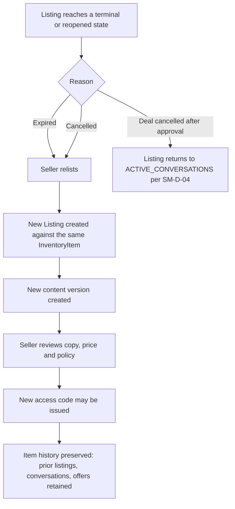
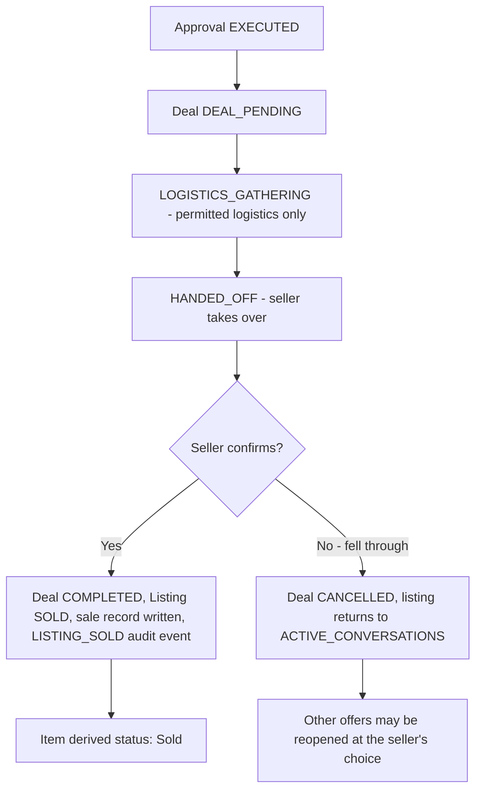

# Inventory and Sales Specification

**Status:** Canonical for the inventory record, the sales record, relisting, archiving,
bulk actions and seller-facing analytics.

**Authority.** Scope comes from `product/MASTER_PRODUCT_SPEC.md` §9.6 and §12 items 22
and 23. Entity responsibilities come from `architecture/DOMAIN_MODEL.md`. **All
lifecycles are defined in `architecture/STATE_MACHINES.md` and are referenced here, never
redefined.** User stories and acceptance criteria are in `product/PRD.md` (OPS-100 to
OPS-102). Screens are in `product/UX_FLOWS.md` (S-10).

**Requirement IDs.** This document uses the `OPS-` prefix in a reserved **200-block** to
avoid renumbering identifiers published elsewhere. `OPS-100` to `OPS-129` belong to
`PRD.md`.

**Binding prohibition.** Nothing in this document produces, stores, displays or exports a
market value, an estimated worth, a comparable sale, a demand figure, a suggested price or
any number implying the platform knows what an item is worth. Profit is computed only
from figures the seller entered. See §9 and `decisions/DECISION_LOG.md` D-09.

---

## 1. InventoryItem and Listing are separate, and why

| | `InventoryItem` | `Listing` |
|---|---|---|
| What it is | The physical thing the seller owns | One sellable presentation of that thing |
| Lifespan | Exists before it is listed; persists after it sells | Exists from `DRAFT` to a terminal state |
| Cardinality | One item may have many listings over time | One listing presents exactly one item |
| Owns | Identity, acquisition cost, acquisition date, condition history, images at item level, seller notes | Approved copy, asking price, a pointer to the current policy version (which owns the minimum price), public access, buyer conversations, offers |
| Deleted when | Never at MVP; archived instead | Never; moves to a terminal state |

`OPS-200` An `InventoryItem` is created whenever a listing is created, and is reused when
the seller relists the same physical thing.

### 1.1 Why the separation exists

| ID | Reason |
|---|---|
| OPS-201 | **Relisting without losing history.** An item that does not sell, or whose deal falls through, is listed again. If the item and the listing were one record, either the history would be destroyed or a second record would appear in inventory for the same physical object. |
| OPS-202 | **A durable cost basis.** Acquisition cost belongs to the thing, not to an attempt to sell it. Attaching cost to a listing would duplicate or lose it across relists, and profit computed from it would be wrong. |
| OPS-203 | **An accurate count of what the seller owns.** "How many items do I have" is a question about objects. Counting listings would count one unsold item three times. |
| OPS-204 | **Listing content is versioned and immutable; the item is not.** Copy, price and policy are snapshots per `DOMAIN_MODEL.md`. The item is a long-lived identity that those snapshots point at. |
| OPS-205 | **Sales history must survive the listing.** A sold item's record must remain readable after its listing is archived, without keeping the buyer-facing listing alive. |
| OPS-206 | **Isolation of buyer-facing state.** Buyer access, codes and conversations attach to the listing. Closing a listing closes the buyer surface without touching the seller's record of the object. |

### 1.2 What the separation does not mean

`OPS-207` It is not a stock or warehousing system. There is no quantity, no location
hierarchy, no bin, no reorder point, no supplier record and no stock movement ledger. An
`InventoryItem` is one physical thing.

---

## 2. Lifecycle

`OPS-208` The listing lifecycle is defined once, in `architecture/STATE_MACHINES.md` §1,
together with rules `SM-L-01` to `SM-L-06`. It is not restated here. Related machines that
govern what an inventory or sales screen may show:

| Concern | Defined in |
|---|---|
| Listing states and transitions | `STATE_MACHINES.md` §1 |
| Access code states | `STATE_MACHINES.md` §2 |
| Buyer session states | `STATE_MACHINES.md` §3 |
| Conversation states | `STATE_MACHINES.md` §4 |
| Offer states | `STATE_MACHINES.md` §5 |
| Approval states | `STATE_MACHINES.md` §6 |
| Deal and handoff states | `STATE_MACHINES.md` §7 |
| Content version states | `STATE_MACHINES.md` §8 |

### 2.1 Item status is derived, not stored

`OPS-209` The `InventoryItem` has no lifecycle of its own beyond an archived flag. What
the seller sees as an item's status is **derived** from its current listing, if any.

| Derived item status | Derivation |
|---|---|
| Not listed | No listing exists, or every listing for this item is in a terminal state and the item is not archived |
| Being prepared | Current listing is `DRAFT` or `READY` |
| Live | Current listing is `LISTED` or `ACTIVE_CONVERSATIONS` |
| Decision waiting | Current listing is `OFFER_PENDING` |
| Sale in progress | Current listing is `PENDING_SALE` |
| Sold | Current listing is `SOLD` and a sales record exists |
| Archived | The item is archived |

`OPS-210` Derived status is computed at read time from the listing state. It is never
written to the item as a second source of truth that could drift.

---

## 3. Fields

Field lists are indicative in the same sense as `DOMAIN_MODEL.md`: the implementing slice
owns the final schema and records deviations in `decisions/DECISION_LOG.md`.

### 3.1 InventoryItem

| Field | Type | Source | Required | Notes |
|---|---|---|---|---|
| `id` | opaque id | system | yes | Never exposed on a buyer surface |
| `seller_id` | reference | system | yes | Tenant boundary, `DM-01` |
| `name` | text | seller | yes | The seller's own words |
| `internal_reference` | text | seller | no | The seller's own SKU or shelf label; never buyer-visible |
| `acquisition_cost_minor` | integer minor units | seller | no | Blank means unknown, never zero, never imputed |
| `acquisition_currency` | ISO 4217 | seller | conditional | Required if a cost is entered, `DM-07` |
| `acquisition_date` | date | seller | no | Seller-entered |
| `acquisition_note` | text | seller | no | Where it came from, in the seller's words; never buyer-visible |
| `seller_notes` | text | seller | no | Protected seller information; never buyer-visible |
| `archived` | boolean | seller | yes | Defaults false |
| `archived_at` | timestamp | system | conditional | Set when archived |
| `created_at` / `updated_at` | timestamp | system | yes | — |

`OPS-211` The `InventoryItem` holds **no** valuation field, no estimated worth, no
suggested price and no market reference of any kind (`DOMAIN_MODEL.md`, Listing entry).

### 3.2 Listing — fields relevant to inventory

The `Listing` is specified in `DOMAIN_MODEL.md`. The fields an inventory or sales surface
reads from it:

| Field | Notes |
|---|---|
| `inventory_item_id` | The item this listing presents |
| `status` | Per `STATE_MACHINES.md` §1 |
| `asking_price_minor`, `currency` | Seller-entered, integer minor units |
| `minimum_acceptable_price_minor` | Protected; seller-visible only; never on any buyer surface |
| `approved_content_version_id` | The single approved content version, `SM-CT-01` |
| `policy_version_id` | The policy in force |
| `public_listing_access_id` | The buyer surface, where one exists |
| `listed_at`, `closed_at` | For time-to-sale counts |
| `channel_label` | Optional seller-entered label of where it was published, supporting per-channel measurement (`BUYER-025`) |

### 3.3 Sale record

`OPS-212` A sale record is created when a `Deal` reaches `COMPLETED` and the listing
reaches `SOLD` by an authenticated seller action (`SM-D-03`, `SM-L-04`). It is never
created by the agent, by a buyer message, or by a timer.

| Field | Type | Source | Required | Notes |
|---|---|---|---|---|
| `id` | opaque id | system | yes | — |
| `seller_id` | reference | system | yes | Tenant boundary |
| `inventory_item_id` | reference | system | yes | Survives listing archival |
| `listing_id` | reference | system | yes | The listing that produced the sale |
| `final_price_minor` | integer minor units | seller-confirmed | yes | The price the seller confirms at completion |
| `currency` | ISO 4217 | system | yes | From the listing |
| `approved_offer_version_id` | reference | system | yes | The exact version that was approved, `INV-05` |
| `seller_approval_id` | reference | system | yes | The authorization record |
| `buyer_session_reference` | opaque reference | system | yes | Pseudonymous; see §6.2 |
| `completed_at` | timestamp | system | yes | When the seller confirmed |
| `completion_confirmed_by` | reference | system | yes | The authenticated seller action that confirmed it |
| `logistics_mode` | enum | system | yes | Pickup or delivery as approved |
| `channel_label` | text | seller | no | Copied from the listing at completion |
| `sale_note` | text | seller | no | Free text; never buyer-visible |

`OPS-213` The final price defaults to the approved offer amount and is editable by the
seller at confirmation, because what changed hands is a fact only the seller has. An edited
final price is recorded as seller-entered and the approved amount is retained alongside it.

`OPS-214` No sale record field holds a fee, a tax figure, a shipping cost or a payout
amount at MVP. The platform is not a payment processor (`MASTER_PRODUCT_SPEC.md` §8).

---

## 4. Relisting

`OPS-215` Relisting creates a **new** `Listing` against the **same** `InventoryItem`.

| ID | Rule |
|---|---|
| OPS-216 | Relisting from `EXPIRED` or after a cancelled deal creates a new content version and may issue a new access code (`SM-L-06`). |
| OPS-217 | The prior listing is retained in a terminal state. Its conversations, offers and audit events are not deleted or moved. |
| OPS-218 | Acquisition cost stays on the item and is not re-entered. |
| OPS-219 | The seller may carry forward the previous approved copy, the previous price and the previous policy as starting values, but each must be re-confirmed before `READY` (`SM-L-01`). Nothing is auto-approved. |
| OPS-220 | Buyer sessions and conversations from the prior listing are not carried forward. A buyer must enter the new listing's code to start a conversation (`SM-S-01`). |
| OPS-221 | A cancelled deal returns the listing to `ACTIVE_CONVERSATIONS` and may reopen other offers at the seller's choice (`SM-D-04`). This is a continuation, not a relist, and creates no new listing. |
| OPS-222 | The item's relist count is an operational count and may be displayed. It is never presented as evidence about the item's value or desirability. |

---

## 5. Archiving

`OPS-223` Archiving is the seller's way of saying "this is finished and I do not want it
in my working view". It is not deletion.

| ID | Rule |
|---|---|
| OPS-224 | Archiving a **listing** follows `STATE_MACHINES.md` §1: `SOLD → ARCHIVED` and `CANCELLED → ARCHIVED`. Public access is closed (`SM-L-02`) and no new buyer session may be created (`SM-L-05`). |
| OPS-225 | Archiving an **item** hides it from the default inventory view. It does not archive or alter its sales records, and archived items remain in sales history and in analytics totals for the periods in which they sold. |
| OPS-226 | An archived item can be unarchived and relisted. Unarchiving restores it to the default view and changes nothing else. |
| OPS-227 | Archiving never deletes conversations, messages, offers, approvals or audit events. Retention is governed by `security/DATA_AND_PRIVACY.md`, not by archiving. |
| OPS-228 | Archiving is not available as a way to remove a listing that is in `PENDING_SALE`. The deal is completed or cancelled first. |
| OPS-229 | Hard deletion of an item or listing is out of MVP scope. Data deletion requests are handled as a privacy process, not as an inventory action. |

---

## 6. Sales record and completion

### 6.1 Completion is a seller action

| ID | Rule |
|---|---|
| OPS-230 | `COMPLETED` is set only by an authenticated seller action (`SM-D-03`). Nothing else completes a sale. |
| OPS-231 | The confirmation screen restates the approved terms and asks the seller to confirm the final price actually received. |
| OPS-232 | Completion writes the sale record and a `LISTING_SOLD` audit event in the same transaction. |
| OPS-233 | A cancelled deal writes no sale record and leaves the item unsold. |
| OPS-234 | A sale record is append-only in substance: corrections create a correcting entry with a reason, and the original values remain readable (`INV-09`). |

### 6.2 Buyer session reference

`OPS-235` The sale record stores an opaque reference to the `BuyerSession` that produced
the deal, and nothing else about the buyer.

| ID | Rule |
|---|---|
| OPS-236 | The buyer is pseudonymous. No name is required, no email, no phone number, no account (`BUYER-014`). |
| OPS-237 | Where the buyer supplied a display name in conversation, it may be shown to the seller and is stored as buyer-supplied, unverified text. |
| OPS-238 | The reference resolves for the seller to the conversation that produced the sale, so a later dispute is answerable from the transcript (`SM-S-03`). |
| OPS-239 | The reference is never used to link buyers across listings, and no buyer identity, history or reputation is constructed (D-16). |

### 6.3 Acquisition cost and realised profit

| ID | Rule |
|---|---|
| OPS-240 | Acquisition cost is optional, seller-entered, and stored on the `InventoryItem`. |
| OPS-241 | Realised profit is computed as `final_price_minor − acquisition_cost_minor`, in the same currency, and **only** where the seller supplied an acquisition cost. |
| OPS-242 | Where no acquisition cost exists, no profit figure is shown, no cost is assumed, no cost is imputed from any other item, and no placeholder such as zero is used. |
| OPS-243 | Every displayed profit figure is labelled as computed from figures the seller entered. |
| OPS-244 | Profit is never estimated, projected, forecast or compared to what the item "should" have sold for. |
| OPS-245 | Aggregate profit covers only the subset of sales with a seller-entered cost, and the count of sales excluded from that subset is displayed alongside it, so a partial total is never mistaken for a complete one. |
| OPS-246 | If cost and sale currencies differ, no conversion is performed and no profit is shown for that sale. Currency conversion is out of scope. |

---

## 7. Bulk actions

`OPS-247` Bulk actions exist for volume sellers (persona P-02, P-03) and are limited to
operations that are reversible, unambiguous, and incapable of exposing anything to a buyer
or committing the seller to anything.

### 7.1 In scope for MVP

| ID | Bulk action | Applies to | Notes |
|---|---|---|---|
| OPS-248 | Archive items | Items with no live listing | Reversible; no effect on sales history |
| OPS-249 | Unarchive items | Archived items | Reversible |
| OPS-250 | Add or edit an internal reference or seller note | Items | Never buyer-visible |
| OPS-251 | Set or correct acquisition cost and date | Items | Seller-entered figures only; applied per item, never spread across items |
| OPS-252 | Set a channel label | Listings | Supports per-channel measurement (`BUYER-025`) |
| OPS-253 | Export inventory and sales history to a file | Items, sales | Contains only seller-entered and operational fields; see §7.3 |
| OPS-254 | Cancel listings | Listings not in `PENDING_SALE` | Requires a confirmation that states how many live buyer conversations will be closed (UX-109) |
| OPS-255 | Rotate access codes | Listings with an `ACTIVE` code | Per-listing atomic rotation (`SM-C-02`); the URL is unchanged |

`OPS-256` Every bulk action is applied per entity with a per-entity result. A partial
failure reports exactly which entities succeeded and which did not, and never silently
skips.

`OPS-257` Every bulk action writes one audit event per affected entity, not one for the
batch (`INV-09`).

### 7.2 Explicitly out of scope

| ID | Excluded bulk action | Reason |
|---|---|---|
| OPS-258 | Bulk approve offers | Approval binds to one exact offer version and its material terms, and requires the seller to have seen them (`INV-05`, D-06). A batch approval cannot satisfy that. |
| OPS-259 | Bulk decline or counter offers | Same. Each is a consequential decision about a specific buyer and specific terms. |
| OPS-260 | Bulk approve listing copy | The seller must see what they are approving (UX-107, `LIST-008`). |
| OPS-261 | Bulk AI enhancement across listings | Enhancement is per listing and each result requires review. A batch would incentivise approving unseen copy. |
| OPS-262 | Bulk price changes by percentage or rule | A repricing rule is a pricing engine by another name (D-09, R-01). Prices are set per listing by the seller. |
| OPS-263 | Bulk minimum price changes | Same, and the minimum is the control that bounds the agent. It is set deliberately, per listing. |
| OPS-264 | Bulk policy application across listings | Policy is versioned per listing and governs what the agent may do. Silent mass application would change live negotiations. A seller may copy a policy into a new listing as a starting value, but each listing's policy is saved explicitly. |
| OPS-265 | Bulk publish to marketplaces | There is no marketplace integration (D-07). |
| OPS-266 | Bulk messaging of buyers | The agent speaks inside one conversation, under guardrails. Broadcast messaging has no guardrail context and no seller-visible terms. |
| OPS-267 | Bulk deletion | Deletion is not an inventory action (OPS-229). |
| OPS-268 | Bulk mark as sold | Completion requires a per-sale confirmation of the final price and terms (`SM-D-03`, OPS-231). |

---

## 8. Analytics

`OPS-269` Analytics cover **operational counts and seller-entered amounts only**
(`MASTER_PRODUCT_SPEC.md` `PROD-023`). Every figure is either a count of something that
happened in the system, a duration between two recorded timestamps, a ratio of two such
counts, or an arithmetic result over amounts the seller entered.

### 8.1 Seller-facing analytics

Compiled from `MASTER_PRODUCT_SPEC.md` §15 and `BUYER_ACCESS_FLOW.md` §12. The "Built
from" column is the test: if a figure cannot be traced to recorded events or
seller-entered amounts, it does not ship.

| ID | Figure | Built from |
|---|---|---|
| OPS-270 | Link opens per listing | Requests to the buyer landing page |
| OPS-271 | Preview-to-code-entry rate | Code entry attempts ÷ link opens |
| OPS-272 | Code-entry success rate | Successful validations ÷ attempts |
| OPS-273 | Failed code attempts per listing | Recorded failed attempts |
| OPS-274 | Conversation-start rate | Buyer sessions created ÷ link opens |
| OPS-275 | Messages per conversation | Message counts |
| OPS-276 | Offer rate | Conversations producing an offer ÷ conversations |
| OPS-277 | Per-channel breakdown of the above | Per-channel access codes and channel labels (`BUYER-025`) |
| OPS-278 | Share of buyer messages resolved without seller involvement | Agent-handled turns ÷ total turns |
| OPS-279 | Seller actions required per listing | Action-required items created per listing |
| OPS-280 | Time from offer received to seller decision | Recorded timestamps |
| OPS-281 | Offer-to-sale conversion | Sales ÷ offers reaching `AWAITING_SELLER` |
| OPS-282 | Escalation rate | Conversations entering `ESCALATED` ÷ conversations |
| OPS-283 | Time from `LISTED` to `SOLD` | Recorded timestamps |
| OPS-284 | Listings by current status | Counts over listing states |
| OPS-285 | Items by derived status | Counts over §2.1 derivations |
| OPS-286 | Relist count per item | Count of listings per item |
| OPS-287 | Sales count and total sales value for a period | Sum of `final_price_minor` over completed sales |
| OPS-288 | Total acquisition cost for a period | Sum of seller-entered acquisition costs, over the sales that have one |
| OPS-289 | Realised profit for a period | OPS-287 minus OPS-288, restricted to sales with a seller-entered cost, with the excluded count shown (OPS-245) |
| OPS-290 | Average final price relative to asking price | Both figures are seller-set; presented as a historical ratio of the seller's own prices, never as guidance |

### 8.2 Platform-internal metrics

`OPS-291` Guardrail denial rate and AI cost per active listing (`MASTER_PRODUCT_SPEC.md`
§15) are operational health and unit-economics metrics. Cost attribution is a requirement
(`NFR-006`); whether per-seller cost is exposed to the seller is a plan and pricing
question, not an analytics question, and is not decided here.

### 8.3 Presentation rules

| ID | Rule |
|---|---|
| OPS-292 | Every figure states the period it covers and the number of records it is computed over. |
| OPS-293 | A figure computed over a partial subset says so, and says what was excluded (OPS-245). |
| OPS-294 | Small samples are shown as raw counts, not as rates that imply precision. |
| OPS-295 | No figure is labelled with language implying prediction, recommendation or worth: no "expected", "projected", "should sell for", "worth", "market", "typical", "comparable". |
| OPS-296 | Analytics are protected seller information and never appear on a buyer surface (`BUYER-018`, UX-105). |
| OPS-297 | Exports contain the same fields as the screens and are subject to the same prohibitions (§9). |

---

## 9. Prohibitions

These are absolute and apply to every screen, export, notification, API response and
internal aggregate produced by inventory, sales or analytics.

| ID | Prohibition |
|---|---|
| OPS-298 | No analytic, field, export or display may produce a **market value** for an item. |
| OPS-299 | No analytic may produce an **estimated worth**, an appraisal, a valuation or a value range. |
| OPS-300 | No analytic may produce a **suggested, recommended or optimal price**, including a "quick sale" price or a "maximum profit" price. |
| OPS-301 | No analytic may present **comparable sales**, whether from other sellers on the platform, from external sources, or fabricated. |
| OPS-302 | No analytic may present a **demand indicator**, a popularity score, a sell-through prediction or a time-to-sale forecast for an unsold item. |
| OPS-303 | No figure may **imply the platform knows what an item is worth**, in a number, a label, a tooltip, a chart axis or an empty-state hint. |
| OPS-304 | **Profit is computed only from seller-entered numbers.** No cost is imputed, defaulted, estimated, averaged from other items or inferred from anything. |
| OPS-305 | The seller's own historical figures may be shown back to them as history (OPS-290) but never as guidance, benchmark, target or recommendation. |
| OPS-306 | No cross-seller benchmark, percentile, ranking or "sellers like you" comparison is produced. |
| OPS-307 | No inventory, sales or analytics field is ever included in the buyer-safe projection (`SEC-020`, `SEC-021`). |
| OPS-308 | A metric that cannot be traced to a recorded event or a seller-entered amount does not ship. |

`OPS-309` These prohibitions follow from `decisions/DECISION_LOG.md` D-09 and
`MASTER_PRODUCT_SPEC.md` §7. Reintroducing any of them requires licensed, legally usable
data and a superseding decision. Anything in `MASTER_PRODUCT_SPEC.md` §14 marked FUTURE or
CONDITIONAL must not be architected for, including by leaving a field in place for it.

---

## 10. Audit and data handling

| ID | Rule |
|---|---|
| OPS-310 | Sale completion, deal cancellation, archiving, unarchiving, relisting, cost entry and cost correction each write an audit event (`INV-09`, `POLICY_AND_AUTHORIZATION.md` §12). |
| OPS-311 | Audit payloads carry no access codes, no session tokens and no unnecessary personal data (`SEC-040`). |
| OPS-312 | Every inventory, sales and analytics query is scoped by seller at the data layer as well as the application layer (`NFR-007`, `SEC-030`, `DM-01`). |
| OPS-313 | Monetary amounts are integer minor units with an explicit currency, never floats (`DM-07`). |
| OPS-314 | Retention, export and deletion of buyer conversation data are governed by `security/DATA_AND_PRIVACY.md` and are not redefined here. |
