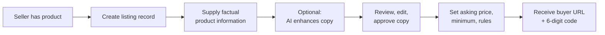
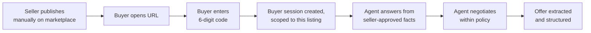
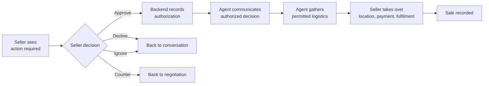

# Master Product Specification

**Status:** Canonical · **Version:** 1.0 · **Date:** 2026-09-02
**Authority:** This document is the source of truth for product scope. Where any other
document disagrees, this one wins, except for `ai/POLICY_AND_AUTHORIZATION.md`, which
is canonical for AI authority, and `security/PUBLIC_ACCESS_SECURITY.md`, which is
canonical for the public buyer surface.

---

## 1. Executive summary

Resellers on Facebook Marketplace, eBay, Kijiji and similar platforms lose most of
their time to conversation, not to sourcing or fulfilment. They answer the same
questions dozens of times, field lowball offers, lose track of who offered what, and
struggle to work out which of thirty threads actually needs them.

This product is an AI operating system for that work. The seller supplies factual
product information and their own prices and negotiation rules. AI improves the
buyer-facing copy without inventing facts. The seller publishes the listing manually on
whichever marketplace they choose and shares a link and a 6-digit code. Buyers arrive
on our platform, enter the code, and talk to an AI sales agent scoped to that one
listing. The agent answers from seller-approved information, negotiates inside
deterministic boundaries, and turns messy conversation into structured offers. The
seller sees a short list of decisions, not an inbox. Nothing is accepted without an
explicit seller action. Fulfilment stays with the seller.

**Value proposition:** *Your AI handles the buyers. You make the decisions that matter.*

## 2. Product vision

Become the operational layer resellers run their business on — the place where
listings, buyer conversations, offers, approvals and sales history live — while
external marketplaces remain the discovery and acquisition channel. The product wins on
workflow, not on any single AI feature.

## 3. Target customer

| Segment | Description | Priority |
|---|---|---|
| Side-hustle reseller | 10–40 items/month, sells evenings and weekends, high message volume relative to revenue | Primary |
| Full-time small reseller | 100–400 items/month, treats reselling as a business, tracks profit | Primary |
| Small business / estate or clearance seller | Sells varied inventory, values a durable record and a professional buyer experience | Secondary |
| Casual declutterer | A few items a year | Not targeted — will not pay |

## 4. Problem

`PROD-001` Repetitive buyer questions consume disproportionate seller time.
`PROD-002` Negotiation is emotionally taxing and inconsistently executed.
`PROD-003` Offers arrive as unstructured chat and are easy to lose or confuse.
`PROD-004` Sellers cannot tell at a glance which conversations need them.
`PROD-005` Marketplace message threads are ephemeral and per-platform, so the seller
has no durable operational record.

## 5. Solution

`PROD-010` A listing record owned by the seller, containing seller-supplied facts,
seller-chosen prices and seller-defined negotiation rules.
`PROD-011` AI enhancement of seller-written copy, strictly bounded to presentation.
`PROD-012` A listing-scoped public buyer surface reached by URL plus a 6-digit code.
`PROD-013` An AI sales agent that answers, negotiates and escalates within
deterministic policy.
`PROD-014` Structured offer extraction with full history.
`PROD-015` An action-required dashboard replacing an inbox.
`PROD-016` Explicit, versioned seller approval before any acceptance.
`PROD-017` A controlled handoff to seller-managed fulfilment.
`PROD-018` Inventory, sales history and operational analytics.

## 6. Core workflow

**Phase 1 — Preparation (seller only).**

**Phase 2 — Acquisition and conversation.**

**Phase 3 — Decision and handoff.**

The primary loop: **seller information → AI enhancement → manual marketplace listing →
buyer URL + code → AI conversation → negotiation → offer → seller approval → handoff.**

## 7. Explicitly removed features

These were considered and deliberately rejected. They are not deferred; they are out.
Reintroducing any of them requires a new decision recorded in
`decisions/DECISION_LOG.md`.

| ID | Removed feature | Reason |
|---|---|---|
| R-01 | AI pricing engine | No reliable, licensed, legally usable comparable-sales data |
| R-02 | Market-value estimation | Same; plus consumer-protection exposure for unsubstantiated value claims |
| R-03 | Market-data price recommendation | Same |
| R-04 | Automatic product identification from images | Produces unsupported factual claims about goods being sold |
| R-05 | Automatic complete listing generation from minimal input | Same; the seller must own the facts |
| R-06 | Autonomous transaction acceptance | Unacceptable financial and legal risk; approval must be human |
| R-07 | Marketplace scraping / Messenger interception | Prohibited by marketplace terms; fragile; legally exposed |
| R-08 | Authenticity verification | Not a capability we can substantiate |
| R-09 | Buyer risk / scam scoring | Unexplainable scoring on individuals; deferred, not committed |

The platform must never estimate value, tell a user what an item is "worth", produce
expected resale values, show demand estimates from unsupported data, produce quick-sale
or maximum-profit prices, fabricate comparables, scrape marketplaces for pricing, or
present LLM price guesses as market knowledge.

## 8. What the product is not

A valuation service · a resale price database · a comparable-sales engine · an
automated product identifier · an authenticity checker · an image-based fact inference
engine · an autonomous deal-closing agent · an escrow provider · a payment processor
(MVP) · a shipping provider · a marketplace scraper · a substitute for seller judgment.

## 9. Functional scope

### 9.1 Listing and content
`LIST-001` Seller creates a listing with factual fields; most are optional.
`LIST-002` Fields include name, brand, model, size, colour, condition, included items,
defects, age, usage history, specifications, title, summary, description.
`LIST-003` Seller may request AI enhancement of title, summary and description.
`LIST-004` Enhancement improves grammar, clarity, structure, tone and formatting only.
`LIST-005` Enhancement must not introduce, alter or infer a product fact.
`LIST-006` Original seller input is retained separately from enhanced output.
`LIST-007` Seller may accept, edit, reject or restore the original.
`LIST-008` Only seller-approved copy is used on the buyer surface.
`LIST-009` Images may be uploaded and displayed. Images are not a source of inferred
product facts in this scope.
`LIST-010` Platform produces copy-friendly marketplace output: title, description,
details, price, images, buyer URL and access code.

### 9.2 Prices and policy
`LIST-020` Seller sets asking price. `LIST-021` Seller sets minimum acceptable price.
`LIST-022` Seller sets negotiation rules: negotiation on/off, maximum autonomous
concession, trades, delivery, pickup, hold window, location disclosure.
`LIST-023` Policy is versioned; every agent action records the version in force.

### 9.3 Buyer access
`ACCESS-001` Each listing has a public buyer surface at an opaque public id.
`ACCESS-002` Each listing has a 6-digit access code.
`ACCESS-003` The code resolves the listing and opens a buyer session.
`ACCESS-004` Buyer sessions are isolated from one another.
`ACCESS-005` Codes can be rotated and revoked.
`ACCESS-006` A code grants access to one listing's conversation surface and nothing else.

### 9.4 Agent
`AI-001` Answers factual questions from seller-approved information only.
`AI-002` States plainly when information is unavailable and offers to ask the seller.
`AI-003` Negotiates within deterministic boundaries.
`AI-004` Extracts offers and attached conditions.
`AI-005` Escalates exceptions to the seller.
`AI-006` Never accepts, never discloses protected information, never invents facts.

### 9.5 Offers and approval
`OFFER-001` Conversation is converted into structured offers with versions.
`OFFER-002` Offer history is preserved; nothing is silently overwritten.
`AUTH-050` Seller may approve, decline, counter or ignore.
`AUTH-051` Approval binds to an exact offer version and material-terms hash.
`AUTH-052` Backend revalidates listing availability inside the acceptance transaction.
`AUTH-053` The agent communicates acceptance only after authorization succeeds.

### 9.6 Handoff, inventory, analytics
`PROD-020` Agent may collect buyer availability and non-sensitive logistics.
`PROD-021` Exact location, payment execution and fulfilment remain with the seller.
`PROD-022` Inventory lifecycle and sales history are maintained.
`PROD-023` Analytics cover operational counts and seller-entered costs only.

## 10. Non-functional requirements

| ID | Requirement |
|---|---|
| NFR-001 | Buyer surface responds in under 1s at p95 for page load, excluding model latency |
| NFR-002 | Agent reply target under 8s at p95; a holding reply is sent if exceeded |
| NFR-003 | No buyer message is ever silently dropped |
| NFR-004 | Every consequential action is auditable and reconstructable |
| NFR-005 | Buyer surface must be usable on a mobile browser with no app install and no account |
| NFR-006 | Per-seller AI cost is measured and attributable |
| NFR-007 | Tenant isolation enforced at the data layer as well as the application layer |
| NFR-008 | The system degrades to seller-handled conversation rather than failing closed |

## 11. System invariants

Three related sets exist and must not be confused:

| Set | Location | Scope |
|---|---|---|
| `AUTH-INV-01`..`11` | `ai/POLICY_AND_AUTHORIZATION.md` §2 | **Canonical.** Authorization invariants. Referenced by tests. |
| Ten product invariants | `CLAUDE.md` | The always-loaded summary for Claude Code. A restatement, not a second authority. |
| Content-provenance rules | `ai/LISTING_ENHANCEMENT.md`, `architecture/DOMAIN_MODEL.md` | The seller-is-source-of-truth rules (see also §7 R-04, R-05 and D-10). |

Where they overlap, `ai/POLICY_AND_AUTHORIZATION.md` §2 wins. All are binding on
implementation.

## 12. MVP

Committed scope. The numbering identifies scope items; it is not a build order. Build
sequence is set by `planning/MVP_ROADMAP.md`, which is canonical for sequencing:

1. Authentication and seller account
2. Listing creation with seller-supplied fields
3. Product image upload and storage
4. AI enhancement of seller copy, with original retained
5. Seller review, edit, approve, restore
6. Seller-set asking price and minimum price
7. Seller negotiation policy configuration
8. Buyer URL and 6-digit access code issuance
9. Code validation with abuse controls
10. Buyer session creation and isolation
11. Listing-scoped agent conversation
12. Seller-approved context assembly for the agent
13. Deterministic policy and guardrail engine
14. Negotiation within policy
15. Structured offer extraction and offer history
16. Action-required dashboard
17. Approve / decline / counter / ignore
18. Approval versioning and integrity
19. Agent communication of authorized decisions
20. Deal handoff
21. Notifications
22. Inventory status and sales history
23. Basic analytics
24. Audit log
25. Tenant and session isolation
26. Rate limiting and abuse protection
27. Prompt-injection defences
28. AI regression eval framework
29. Production observability

Nothing beyond this list is MVP.

## 13. Out of MVP

Price estimation · market valuation · comparable analysis · automatic product
recognition · automatic detail inference · listing generation from photographs ·
authenticity verification · cross-listing automation · marketplace scraping · Messenger
automation · automatic publishing · payments · escrow · shipping · automatic address
disclosure · autonomous acceptance · buyer risk scoring · sourcing intelligence ·
advanced CRM · multi-user enterprise features.

## 14. Future and conditional

**Marked FUTURE / CONDITIONAL / NOT CURRENTLY APPROVED. Do not architect for these.**

Authorized marketplace API integrations · cross-marketplace workflows · advanced
analytics · reseller CRM and repeat-buyer management · richer inventory accounting ·
team accounts · deeper agent personalization · public seller storefronts · listing
templates · **pricing intelligence, only if licensed and legally usable market data is
obtained** · image intelligence, only if reliable and valuable · payment integrations ·
buyer identity and reputation systems.

## 15. Success metrics

| Metric | Why it matters |
|---|---|
| Share of buyer messages resolved without seller involvement | The core value claim |
| Seller actions required per listing | Lower is better; measures noise reduction |
| Buyer code-entry completion rate | Validates the highest-risk business assumption |
| Link-sent to conversation-started rate | Same |
| Time from offer received to seller decision | Measures dashboard effectiveness |
| Offer-to-sale conversion | Business outcome |
| Guardrail denial rate and escalation rate | Agent health |
| AI cost per active listing | Unit economics |

## 16. Dependencies

External marketplaces for discovery · an LLM provider · object storage for images ·
email and push delivery · the seller's willingness to publish a link and code · the
buyer's willingness to follow it.

## 17. Assumptions

`ASM-01` Buyers will follow a link and enter a code in sufficient numbers. **Unvalidated
and highest-risk.**
`ASM-02` Target marketplaces permit a link and code in some seller-controlled surface.
**Requires verification per marketplace — see `integrations/MARKETPLACE_STRATEGY.md`.**
`ASM-03` Sellers will supply factual fields rather than expecting the system to infer them.
`ASM-04` Conversation volume per listing is high enough that automation is felt.
`ASM-05` Sellers accept an approval step rather than wanting full autonomy.

## 18. Unresolved questions

`Q-01` Technology stack — the backend baseline is recorded in D-17 (**Proposed**;
supersedes D-08 on acceptance, which is conditional on the pg-boss spike). Hosting
provider, model provider and notification providers remain undecided; see `Q-09` to
`Q-11`.
`Q-02` ~~Final buyer URL shape — Option C recommended; see `product/BUYER_ACCESS_FLOW.md`.~~
**RESOLVED** by decision D-02: Option C is accepted and is the default (`BUYER-001`);
Options A and B remain fallbacks. The Slice 0 stop branch in `planning/MVP_ROADMAP.md`
may reopen D-02, with evidence.
`Q-03` Whether to pre-fill the code from the URL, trading abuse resistance for conversion.
`Q-04` Whether buyer sessions may be resumed across devices, and how.
`Q-05` Notification channel mix and whether any buyer-facing email is ever sent.
`Q-06` Free-tier limits.
`Q-07` Jurisdictions targeted at launch, which determines the privacy and consumer
protection regime that applies.
`Q-08` ~~Whether the agent is disclosed as AI in all cases.~~ **RESOLVED** by decision
D-15: disclosure is unconditional, uses fixed non-generated text, and is a blocking test.
See `decisions/DECISION_LOG.md` D-15 and `security/DATA_AND_PRIVACY.md`.
`Q-09` Hosting provider and region — undecided. D-17 defers it; region is also a privacy
decision (`security/DATA_AND_PRIVACY.md` `DATA-324`), and selection requires a
provider-specific cost model first.
`Q-10` Model provider — undecided. D-17 keeps it behind the provider interface; the
contractual position is `security/DATA_AND_PRIVACY.md` §8 and `INT-107`.
`Q-11` Email, push and other seller-notification providers — undecided (D-17).
`Q-12` Authentication library — a separate security-reviewed implementation decision or
spike (D-17). Whatever is chosen must satisfy `AUTH-200` to `AUTH-219`.
