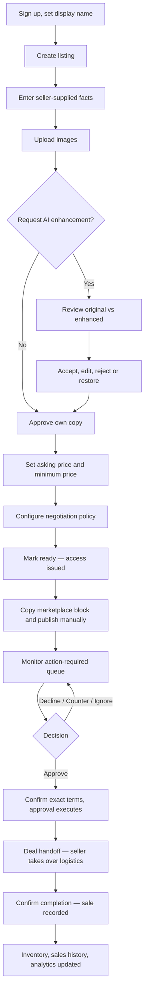
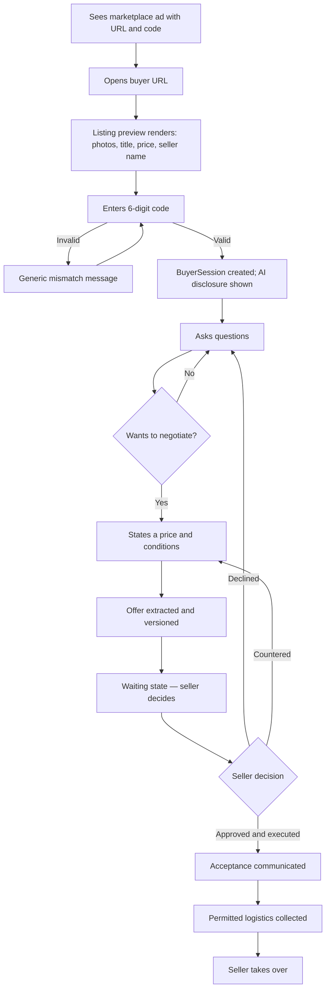

# Product Requirements Document

**Status:** Canonical for personas, jobs to be done, user stories and acceptance
criteria.

**Authority.** Scope is set by `product/MASTER_PRODUCT_SPEC.md` §12–§14; where this
document and the master spec disagree about scope, the master spec wins.
`ai/POLICY_AND_AUTHORIZATION.md` wins on what the agent may do and who may authorize it.
`security/PUBLIC_ACCESS_SECURITY.md` and `product/BUYER_ACCESS_FLOW.md` win on the public
buyer surface. Lifecycles are defined once in `architecture/STATE_MACHINES.md` and are
referenced here, never restated. Entity responsibilities are in
`architecture/DOMAIN_MODEL.md`. Vocabulary is `GLOSSARY.md`.

**Prohibitions binding on every requirement in this document.** No price estimation, no
market valuation, no comparable-sales data, no automatic product identification, no
automatic listing generation from photographs, no marketplace scraping or messaging
automation, no autonomous acceptance. See `MASTER_PRODUCT_SPEC.md` §7 and
`decisions/DECISION_LOG.md` D-09 through D-14.

---

## 1. Requirement ID scheme

This document uses the prefixes defined in the drafting contract. To avoid renumbering
any published identifier, PRD user stories are allocated a **reserved 100-block** in each
prefix. Identifiers below 100 belong to `MASTER_PRODUCT_SPEC.md`,
`BUYER_ACCESS_FLOW.md`, `POLICY_AND_AUTHORIZATION.md` and the security documents; this
document cites them and never redefines them.

| Prefix | Band used here | Area |
|---|---|---|
| `PROD-` | 100–129 | Seller account, sign-up, onboarding |
| `LIST-` | 100–129 | Listing creation, images, AI enhancement, copy review |
| `LIST-` | 130–149 | Asking price, minimum price, negotiation policy, readiness |
| `ACCESS-` | 100–119 | Access code issuance, rotation, revocation, marketplace copy block |
| `BUYER-` | 100–139 | Buyer landing, code entry, conversation, offer, waiting, acceptance, handoff |
| `AI-` | 100–119 | Agent answering behaviour, disclosure, refusals, degraded modes |
| `NEG-` | 100–119 | Negotiation behaviour inside policy |
| `OFFER-` | 100–119 | Offer extraction, history, action-required queue, comparison |
| `AUTH-` | 100–129 | Approve, decline, counter, ignore, deal handoff, sale completion |
| `OPS-` | 100–129 | Inventory list, sales history, analytics, notifications |
| `UX-` | 100–119 | Interface requirements that are requirements, not taste |

Format is `PREFIX-NNN`. Identifiers are stable once published. Never renumber; deprecate
by adding a superseding identifier.

---

## 2. Personas

Segments and their priority are set in `MASTER_PRODUCT_SPEC.md` §3. The personas below
give each segment a name and a concrete shape so acceptance criteria can be argued
against a person rather than a category.

| ID | Persona | Segment | Priority |
|---|---|---|---|
| P-01 | Marcus | Side-hustle reseller | Primary |
| P-02 | Priya | Full-time small reseller | Primary |
| P-03 | Dale | Small business / estate and clearance seller | Secondary |
| P-04 | Sam | Buyer — a user of the product who is not a customer of it | Not a customer; experience is a requirement |

### P-01 Marcus — side-hustle reseller

**Context.** Sells 10–40 items a month: console games, small electronics, tools, kids'
gear. Works a full-time job; lists in the evening, replies on his phone between other
things. Uses one marketplace, occasionally two. Prices from a rough feel for what things
go for and is comfortable doing so.

**Current pain.** Fifteen threads asking "is this available", "what's your lowest", and
"will you take $20". He answers the same three questions dozens of times, gets a
lowball, replies while irritated, and loses the sale. He cannot tell at a glance which
of the fifteen threads is a real buyer, because they all look identical in a message
list.

**Success looks like.** He publishes a listing, pastes a link and a code into the
marketplace ad, and stops watching the thread. He opens the app once a day, sees two
decisions, and makes them in under a minute each. He never types "yes it's available"
again.

### P-02 Priya — full-time small reseller

**Context.** 100–400 items a month across clothing, homeware and electronics. Reselling
is her income; she tracks what she paid for stock and what she sold it for. Runs from a
laptop with a phone as a second surface. Publishes on several marketplaces and needs to
know which channel produced which buyer.

**Current pain.** Volume makes conversation unmanageable and negotiation inconsistent —
she concedes differently depending on how tired she is. Offers arrive as chat and get
lost. Her operational record lives in per-platform message threads that vanish, so she
reconstructs her month from memory and bank transactions.

**Success looks like.** A durable record of every listing, conversation, offer and sale.
Negotiation executed the same way every time inside rules she set once. A profit figure
built from numbers she entered herself, and a per-channel view of where buyers actually
came from.

### P-03 Dale — small business / estate and clearance seller

**Context.** Clears varied inventory in batches — a house, an office, a closing shop.
Fifty unrelated items at once, most of them things he knows a little about and none of
them things he knows deeply. Represents other people's property, so accuracy is not
optional and a professional appearance matters.

**Current pain.** No time to write fifty decent descriptions. What he types is accurate
but terse and reads badly, which costs him buyers. He is also exposed if a description
overstates an item, because the property is not his.

**Success looks like.** He types what he actually knows, in note form, and gets copy
that reads professionally without a single claim he did not make. Every listing carries
a record of what he stated and when, so a later dispute is answerable from evidence.

### P-04 Sam — the buyer

**Not a customer.** Sam never signs up, never pays the platform, and will not tolerate
friction. His experience is still a hard requirement, because `ASM-01` — that buyers
follow a link and enter a code — is the assumption the business rests on
(`MASTER_PRODUCT_SPEC.md` §17).

**Context.** Sees a marketplace ad on his phone, on mobile data, standing up. The ad
tells him to open a URL and enter a six-digit code. He has been told his whole online
life not to do exactly that.

**Current pain.** A link from a stranger that opens onto an empty code box is
indistinguishable from phishing, so he closes it. When he does message a seller, he
waits hours for "yes, it's available".

**Success looks like.** The page opens and shows the item he was already looking at —
photos, title, price, seller name — before it asks him for anything. He gets an answer
in seconds, he is told plainly that he is talking to an AI acting for the seller and
that only the seller can accept, and he is never asked for an account, an email address,
a password or payment details.

---

## 3. Jobs to be done

Phrased as job statements. Each names the situation, the motivation and the expected
outcome.

| ID | Persona | Job statement |
|---|---|---|
| JTBD-01 | P-01, P-02, P-03 | When I have an item ready to sell, I want to record what I actually know about it and have it read well, so I can publish something professional without writing copy. |
| JTBD-02 | P-01, P-02, P-03 | When I publish a listing, I want my prices and my negotiating limits fixed in advance, so I can stop making price decisions while annoyed or tired. |
| JTBD-03 | P-01, P-02 | When buyers ask the same questions repeatedly, I want them answered accurately without me, so I can spend my evening on sourcing and packing instead of typing. |
| JTBD-04 | P-01, P-02 | When a buyer wants to haggle, I want the back-and-forth handled inside limits I set, so I only see the point at which a decision is actually needed. |
| JTBD-05 | P-01, P-02, P-03 | When several buyers are interested at once, I want to see their offers side by side in structured form, so I can choose rather than reconstruct a chat log. |
| JTBD-06 | P-01, P-02, P-03 | When I decide to accept, I want to see the exact terms I am agreeing to before I confirm, so I never discover afterwards that the price or the conditions moved. |
| JTBD-07 | P-02, P-03 | When a sale completes, I want it recorded with the final price, so I have a durable record that outlives a marketplace message thread. |
| JTBD-08 | P-02 | When I review my month, I want counts and totals built only from numbers I entered, so I can trust them. |
| JTBD-09 | P-02, P-03 | When an item does not sell or a deal falls through, I want to relist it without losing its history, so my record stays continuous. |
| JTBD-10 | P-04 | When I see an item I want, I want to know it is really available and get my question answered now, so I can decide without waiting hours. |
| JTBD-11 | P-04 | When I am asked to follow a link and enter a code, I want to see the item before I am asked for anything, so I can tell this is not a scam. |
| JTBD-12 | P-04 | When I make an offer, I want to know who decides and roughly when, so I am not left guessing. |

---

## 4. User stories

Each story states the actor, the want, the reason, testable acceptance criteria in
Given/When/Then form, and an explicit **Not included** boundary. Acceptance criteria are
written so a test can fail them.

### 4.1 Account and onboarding

#### PROD-100 — Create a seller account
**As** a seller **I want** to create an account **so that** my listings, conversations
and sales belong to me and only to me.

- AC1 Given a visitor on the sign-up screen, When they submit a valid email and a
  password meeting the stated policy, Then a `User` with a seller account is created and
  they are signed in.
- AC2 Given an email already registered, When sign-up is submitted, Then the response is
  the same generic outcome as for a new address and no message reveals whether the
  address exists.
- AC3 Given a new seller account, When any entity is later created by that seller, Then
  it is scoped to that seller per `DOMAIN_MODEL.md` DM-01 and is not readable by another
  seller through any route.

**Not included.** Team or multi-user accounts, role permissions, social sign-in, seller
identity verification, buyer accounts of any kind.

#### PROD-101 — Sign in and stay signed in on a phone
**As** a seller **I want** to sign in once and stay signed in on my phone **so that** a
decision takes seconds, not a login.

- AC1 Given valid credentials, When the seller signs in, Then an authenticated session
  is established and the action-required queue is the landing surface.
- AC2 Given an authenticated seller session, When it is used against any buyer-surface
  route, Then it grants nothing there, and vice versa, per `ARCHITECTURE.md` ARCH-002.
- AC3 Given an expired or revoked seller session, When a consequential action is
  attempted, Then it is rejected and no authorization record is created (`INV-04`).

**Not included.** Biometric login, native apps, device management, session sharing
across accounts.

#### PROD-102 — Set the seller display name shown to buyers
**As** a seller **I want** to choose the name buyers see **so that** the buyer surface
looks like me and not like an anonymous system.

- AC1 Given a seller with a display name set, When a buyer opens the listing page, Then
  the display name appears in the preview and in the AI disclosure text.
- AC2 Given no display name has been set, When a listing is marked ready, Then the
  seller is required to supply one before the buyer surface is issued.
- AC3 Given a display name, When any buyer-facing surface is rendered, Then no legal
  name, email address, phone number or postal address of the seller is rendered with it.

**Not included.** Storefront pages, seller ratings, seller reputation, public profiles.

### 4.2 Listing creation and content

#### LIST-100 — Create a listing for an item
**As** a seller **I want** to start a listing **so that** I have a record to fill in.

- AC1 Given an authenticated seller, When they create a listing, Then an `InventoryItem`
  and a `Listing` are created per `DOMAIN_MODEL.md`, the listing enters `DRAFT`, and a
  `LISTING_CREATED` audit event is written.
- AC2 Given an existing `InventoryItem` that is not currently listed, When the seller
  relists it, Then a new `Listing` is created against the same item and the item's
  history is preserved (see `INVENTORY_AND_SALES.md`).
- AC3 Given a listing in `DRAFT`, When the seller leaves and returns, Then all entered
  content is still present.

**Not included.** Creating a listing from photographs alone, importing a listing from a
marketplace, duplicating another seller's listing, templates.

#### LIST-101 — Enter factual fields myself
**As** a seller **I want** to type what I know about the item **so that** the listing is
accurate and mine.

- AC1 Given a listing in `DRAFT`, When the seller opens the details step, Then the fields
  in `MASTER_PRODUCT_SPEC.md` `LIST-002` are offered and all except a title are optional.
- AC2 Given any field the seller completes, When it is saved, Then it is stored with
  provenance `SELLER_PROVIDED_FACT`.
- AC3 Given a field the seller leaves blank, When the agent is later asked about that
  attribute, Then the absence is a first-class state and produces the "not confirmed"
  behaviour of `AI-101`, never an inferred value (`INV-12`, D-10).
- AC4 Given any listing field, When it is rendered anywhere, Then no system-generated
  estimate of value, worth, demand or comparable price is present.

**Not included.** Auto-filled specifications from a catalogue, brand or model detection,
condition grading by the system, any field the seller did not type or confirm.

#### LIST-102 — Upload product images
**As** a seller **I want** to add photos **so that** buyers can see the item.

- AC1 Given a listing in `DRAFT`, When the seller uploads images, Then they are stored,
  ordered, and displayable on the buyer surface.
- AC2 Given an uploaded image, When any part of the system processes it, Then no product
  fact — brand, model, condition, authenticity, defect — is derived from it (D-11).
- AC3 Given an upload that fails validation, When the seller is notified, Then the
  message states plainly what was wrong and the rest of the draft is unaffected.

**Not included.** Image-based identification, automatic background removal claims about
condition, authenticity assessment, automatic alt text asserting product facts.

#### LIST-103 — Request AI enhancement of my copy
**As** a seller **I want** my title, summary and description improved **so that** the
listing reads professionally without me writing it.

- AC1 Given a listing with seller-written copy, When the seller requests enhancement,
  Then a content version in `ENHANCEMENT_PENDING` is created per `STATE_MACHINES.md` §8
  and the original version is retained unchanged.
- AC2 Given enhancement returns, When the output is validated, Then it contains no
  product fact absent from the seller's input, and any output failing that check is
  treated as a validation failure, not shown as enhanced copy (`INV-13`, `LIST-005`).
- AC3 Given enhancement succeeds, When the version is stored, Then its provenance is
  `AI_ENHANCED_COPY` and it is not buyer-visible until approved (`SM-CT-03`).
- AC4 Given enhancement is requested, When it completes, Then a
  `LISTING_CONTENT_ENHANCED` audit event and an `AIInteraction` record exist.

**Not included.** Generating a description from a photo, generating missing facts,
suggesting a price, rewriting seller-entered structured fields, enhancing without an
explicit seller request.

#### LIST-104 — Compare original and enhanced copy
**As** a seller **I want** to see exactly what changed **so that** I can tell whether
anything was added that I did not say.

- AC1 Given an enhanced content version, When the review screen opens, Then the original
  and the enhanced text are both shown, attributed, and comparable field by field.
- AC2 Given the review screen, When it renders, Then each version is labelled with its
  provenance in plain language.
- AC3 Given the seller takes no action, When they leave the screen, Then the approved
  buyer-visible version is unchanged.

**Not included.** Automatic acceptance after a timeout, hiding the original, partial
application of enhancement without seller action.

#### LIST-105 — Accept enhanced copy
**As** a seller **I want** to approve the enhanced version **so that** buyers see the
better copy.

- AC1 Given an enhanced version under review, When the seller accepts it, Then a version
  with provenance `SELLER_APPROVED_COPY` becomes the single approved version
  (`SM-CT-01`) and a `LISTING_CONTENT_APPROVED` audit event is written.
- AC2 Given a previously approved version exists, When a new version is approved, Then
  the previous version moves to `SUPERSEDED` and is retained, not deleted.
- AC3 Given approved copy, When the agent assembles context, Then only the approved
  version is used (`SM-CT-03`).

**Not included.** Approving copy that has not been rendered to the seller, bulk approval
across listings, approval by anyone other than the authenticated owning seller.

#### LIST-106 — Edit the enhanced copy before approving
**As** a seller **I want** to change wording **so that** the final text is mine.

- AC1 Given an enhanced version, When the seller edits it, Then a `SELLER_EDITED` version
  is created and the enhanced version is retained (`STATE_MACHINES.md` §8).
- AC2 Given an edited version, When the seller approves it, Then the approved version
  contains exactly the seller's text with no post-approval transformation.

**Not included.** Re-enhancement of an edit without a fresh explicit request, silent
correction of seller text.

#### LIST-107 — Reject enhancement and restore my original
**As** a seller **I want** to discard the enhancement **so that** my own words are used.

- AC1 Given an enhanced version, When the seller restores the original, Then a new
  version is created from the original text and the enhanced version is retained
  (`SM-CT-02`).
- AC2 Given the original has been restored and approved, When the buyer surface renders,
  Then it shows the seller's original wording.
- AC3 Given restoration, When it completes, Then no enhanced text remains in the buyer
  projection or in agent context.

**Not included.** Deleting the enhanced version, restoring across listings in bulk.

#### LIST-108 — Approve my own copy without enhancement
**As** a seller **I want** to skip enhancement **so that** I can publish immediately.

- AC1 Given a listing with seller-written copy and no enhancement requested, When the
  seller approves it, Then the transition `SELLER_DRAFT → APPROVED` occurs and the
  listing may proceed toward `READY`.
- AC2 Given enhancement was never requested, When the listing is published, Then no
  `AIInteraction` for enhancement exists for it.

**Not included.** Any requirement to use AI, any degraded experience for declining it.

#### LIST-109 — See enhancement failure and recover
**As** a seller **I want** to be told when enhancement failed **so that** I am never
misled about what my listing says.

- AC1 Given enhancement fails for any reason, When the seller returns to the listing,
  Then the state is `ENHANCEMENT_FAILED`, the reason is stated in plain language, and the
  original copy is intact (`SM-CT-04`).
- AC2 Given a failure, When the screen renders, Then unenhanced text is never presented
  as enhanced.
- AC3 Given a failure, When the seller chooses, Then they may retry, edit, or approve the
  original, and publishing is never blocked by the failure.

**Not included.** Silent retries presented as success, automatic fallback copy, blocking
the listing on an AI dependency.

### 4.3 Price and policy configuration

#### LIST-130 — Set the asking price
**As** a seller **I want** to set the price **so that** buyers see what I am asking.

- AC1 Given a listing, When the seller enters an asking price and currency, Then it is
  stored as integer minor units with an explicit currency (`DM-07`).
- AC2 Given the price screen, When it renders, Then it contains no suggested price, price
  range, estimated value, comparable sale, demand indicator or "items like this sell
  for" figure of any kind (D-09).
- AC3 Given an asking price is set, When the buyer surface renders, Then it displays
  exactly that price.

**Not included.** Price suggestions, market data, valuation, quick-sale or maximum-profit
pricing, dynamic repricing, any price the seller did not type.

#### LIST-131 — Set the minimum acceptable price
**As** a seller **I want** a floor **so that** the agent can negotiate without ever going
below what I will take.

- AC1 Given a listing, When the seller sets a minimum price, Then it is stored as
  protected information and a `MINIMUM_PRICE_CHANGED` audit event is written.
- AC2 Given a minimum price exists, When agent context is assembled, Then the value is
  absent from that context and only a permitted counter range is passed (D-04,
  `POLICY_AND_AUTHORIZATION.md` §4).
- AC3 Given any buyer request or claim about the floor, When the agent responds, Then the
  minimum is not disclosed, restated, confirmed or denied (`INV-08`, G-14).
- AC4 Given a proposed price below the floor, When the guardrail engine evaluates it,
  Then it is denied by G-01 regardless of what the model drafted.

**Not included.** Showing the buyer a "lowest price", hinting at the floor, letting the
model hold the floor, deriving the floor from anything other than the seller's entry.

#### LIST-132 — Configure negotiation rules
**As** a seller **I want** to set the rules the agent works inside **so that** I decide
in advance instead of in the moment.

- AC1 Given the policy screen, When the seller saves, Then a new `SellerPolicyVersion` is
  created covering the fields in `MASTER_PRODUCT_SPEC.md` `LIST-022` and
  `POLICY_AND_AUTHORIZATION.md` §3, and a `SELLER_POLICY_CHANGED` audit event is written.
- AC2 Given negotiation is disabled, When a buyer proposes a price, Then no counter and
  no price movement occurs (G-12) and the offer is routed to the seller.
- AC3 Given trades, delivery or pickup are disallowed, When the agent replies, Then it
  does not offer or discuss them as available (G-06).
- AC4 Given any agent action, When it is recorded, Then it stores the policy version in
  force (`LIST-023`).

**Not included.** Learned or suggested policy values, policy the agent can change, policy
inferred from past sales, per-buyer policy exceptions.

#### LIST-133 — Understand what my rules will do before publishing
**As** a seller **I want** my rules explained in plain language **so that** I am not
surprised by the agent's behaviour.

- AC1 Given a saved policy, When the review screen renders, Then it states in plain
  language what the agent may and may not do under these rules, including that it can
  never accept.
- AC2 Given the explanation, When it renders, Then it is generated from the stored policy
  values by deterministic code, not by a model.
- AC3 Given the explanation, When it renders on a seller screen, Then the minimum price is
  shown to the seller and labelled as never shared with buyers.

**Not included.** Model-written explanations, predictions about how buyers will respond,
expected-outcome estimates.

#### LIST-134 — Mark a listing ready
**As** a seller **I want** to declare the listing finished **so that** access is issued.

- AC1 Given a listing without approved copy, an asking price, a minimum price or a policy
  version, When the seller attempts `READY`, Then the transition is refused and the
  missing items are named (`SM-L-01`).
- AC2 Given all prerequisites are met, When the seller marks the listing ready, Then the
  listing enters `READY`.
- AC3 Given a listing in `READY`, When the seller edits it, Then it returns to `DRAFT`
  per `STATE_MACHINES.md` §1 and the buyer surface is not yet live.

**Not included.** Automatic readiness, publishing to a marketplace, scheduling.

### 4.4 Buyer access, codes and the copy block

#### ACCESS-100 — Receive a buyer URL and a 6-digit code
**As** a seller **I want** a link and a code **so that** I can point buyers at my agent.

- AC1 Given a listing entering `LISTED`, When access is issued, Then a
  `PublicListingAccess` with an opaque public id and one `ACTIVE` `ListingAccessCode`
  exist (`SM-L-02`, `DM-09`) and an `ACCESS_CODE_CREATED` audit event is written.
- AC2 Given a code is issued, When it is stored, Then only a hash is stored and the
  plaintext is displayed to the seller once (`ACCESS-013`).
- AC3 Given the public id, When it is generated, Then it is unguessable per `SEC-003` and
  contains no internal identifier (`BUYER-002`).

**Not included.** Publishing to a marketplace, shortening services, QR generation,
marketplace-specific automation.

#### ACCESS-101 — Rotate a code
**As** a seller **I want** to replace a code **so that** a code that leaked where it
should not have stops working.

- AC1 Given an `ACTIVE` code, When the seller rotates it, Then the old code becomes
  `ROTATED` and a new `ACTIVE` code is issued atomically (`SM-C-02`), and an
  `ACCESS_CODE_ROTATED` audit event is written.
- AC2 Given rotation, When it completes, Then the buyer URL is unchanged so the
  marketplace advertisement does not need reprinting (`BUYER-003`).
- AC3 Given a rotated code, When a buyer enters it, Then the generic mismatch response is
  returned with no indication that the code was once valid (`SM-C-03`).
- AC4 Given existing buyer sessions, When rotation occurs, Then those sessions continue
  unless the seller separately revokes them.

**Not included.** Automatic rotation schedules, notifying buyers of rotation, recovering
a previous plaintext code.

#### ACCESS-102 — Revoke access while a conversation is live
**As** a seller **I want** to close the surface **so that** no new buyer can start, while
deciding what happens to buyers already talking.

- AC1 Given a listing with live conversations, When the seller revokes the code, Then the
  seller is asked explicitly whether to preserve or terminate existing sessions, with
  preserve as the default (`ACCESS-011`).
- AC2 Given preserve is chosen, When revocation completes, Then existing sessions
  continue and no new session can be created.
- AC3 Given terminate is chosen, When revocation completes, Then existing sessions move
  to `CLOSED`, their conversations are retained for the seller's record (`SM-S-03`), and
  buyers see the neutral closed-surface copy.
- AC4 Given revocation, When it completes, Then an `ACCESS_CODE_REVOKED` audit event is
  written.

**Not included.** Blocking an individual buyer as a separate MVP capability beyond
session-level blocking, appeals, notifying the buyer of the reason.

#### ACCESS-103 — Copy the marketplace block
**As** a seller **I want** ready-to-paste text **so that** publishing manually takes
seconds.

- AC1 Given a listing in `READY` or `LISTED`, When the copy block screen opens, Then it
  contains the approved title, the approved description, the structured details, the
  asking price, the buyer URL and the code, formatted for pasting, with one-tap copy
  (`BUYER-023`, `LIST-010`).
- AC2 Given the copy block, When it renders, Then it contains no minimum price, no
  internal note, no policy internals and no analytics.
- AC3 Given the copy block, When it renders, Then it states plainly that marketplace
  rules on external links vary and that compliance is the seller's responsibility
  (`BUYER-024`).
- AC4 Given a seller who publishes on more than one channel, When they request it, Then a
  per-channel code may be issued so conversion can be attributed per channel
  (`BUYER-025`).

**Not included.** Automatic publishing, marketplace API calls, verifying that a
marketplace permits the link, cross-posting.

### 4.5 Buyer experience

#### BUYER-100 — See the item before being asked for anything
**As** a buyer **I want** the page to show the listing immediately **so that** I can tell
it is not a scam.

- AC1 Given a valid buyer URL, When the page loads, Then photos, title, asking price,
  seller display name and the approved summary render before any code is required
  (`BUYER-004`).
- AC2 Given the page, When it renders, Then the preview is served from the buyer-safe
  projection computed server-side (`SEC-020`, `DM-10`).
- AC3 Given a slow mobile connection, When the page loads, Then the preview renders
  before any chat JavaScript is required (`BUYER-021`).
- AC4 Given the page, When it renders, Then no account creation, email address or app
  install is requested at any point (`BUYER-022`).

**Not included.** Search across listings, browsing other items, seller storefront,
related items, price history.

#### BUYER-101 — Enter the code and start talking
**As** a buyer **I want** to enter the six digits and get straight into a conversation
**so that** asking a question is quick.

- AC1 Given the code entry field on a phone, When it is focused, Then a numeric keyboard
  opens and pasting a 6-digit string fills it (`BUYER-008`).
- AC2 Given a correct code, When it is submitted, Then a `BuyerSession` bound to exactly
  one listing is created (`SM-S-01`), a `BUYER_SESSION_CREATED` audit event is written,
  and the conversation opens.
- AC3 Given the conversation opens, When it renders, Then the AI disclosure of
  `BUYER-006` is present before the first message can be sent.
- AC4 Given the gate, When it renders, Then the privacy notice of `BUYER-007` is present.

**Not included.** Buyer accounts, email or phone capture, identity verification,
marketing consent, buyer profiles.

#### BUYER-102 — Fail code entry safely
**As** a buyer **I want** a clear message when the code does not work **so that** I know
to check the advertisement.

- AC1 Given a wrong, rotated, revoked, expired or unknown code, When it is submitted,
  Then the response body and timing are identical in all cases and the message is
  "That code doesn't match this listing." (`BUYER-010`).
- AC2 Given 5 failed attempts from one client, When a sixth is made, Then code entry for
  that client locks for 60 minutes, the event is recorded, and other buyers are
  unaffected (`BUYER-011`).
- AC3 Given a lockout or rate limit, When the message renders, Then it is neutral and
  reveals no attempt counter (`SEC-011`).

**Not included.** Telling the buyer why the code failed, an appeal path, a support
channel that reveals code state, CAPTCHA in front of every buyer (`BUYER-012`).

#### BUYER-103 — Ask a question and get an accurate answer
**As** a buyer **I want** my question answered from what the seller stated **so that** I
can decide.

- AC1 Given a question covered by a seller-provided fact, When the agent answers, Then
  the answer is grounded in that fact and cites it internally (G-05).
- AC2 Given a question not covered by any seller-provided fact, When the agent answers,
  Then it states plainly that it does not have that confirmed and offers to ask the
  seller (`AI-002`), and it does not guess.
- AC3 Given any agent reply, When it is sent, Then it has passed the guardrail engine
  (`POLICY_AND_AUTHORIZATION.md` §5) and is recorded with the policy version in force.
- AC4 Given any buyer message, When it is received, Then it is accepted and never
  silently dropped (`NFR-003`, `SM-CV-01`).

**Not included.** Answering from the internet, from images, from other listings, from
another buyer's conversation, or from the model's own knowledge of the product.

#### BUYER-104 — Make an offer
**As** a buyer **I want** to propose a price and my conditions **so that** the seller can
consider it.

- AC1 Given a buyer states an amount in conversation, When the turn is processed, Then an
  `Offer` and an `OfferVersion` are created with the material terms of `GLOSSARY.md`
  (`OFFER-001`) and an `OFFER_CREATED` audit event is written.
- AC2 Given the buyer attaches a condition, When the offer is extracted, Then the
  condition is captured as part of the material terms, not discarded.
- AC3 Given the buyer revises, When the new terms are extracted, Then a new
  `OfferVersion` supersedes the previous one (`SM-O-01`, `SM-O-02`).
- AC4 Given any offer, When the agent responds, Then it never states or implies
  acceptance (G-04, G-09, `INV-07`).

**Not included.** Binding offers, deposits, payment, buyer-side cancellation fees, offer
expiry chosen by the buyer.

#### BUYER-105 — Know what happens next after offering
**As** a buyer **I want** to know who decides and roughly when **so that** I am not left
guessing.

- AC1 Given an offer has been routed to the seller, When the agent replies, Then it says
  the seller has been asked and that only the seller can accept, using fixed disclosure
  text, not generated text (G-10, D-15).
- AC2 Given the waiting state, When it renders, Then it shows no other buyer's activity,
  no queue position, no competing offer and no fabricated urgency (G-08, D-16).
- AC3 Given the seller has not responded, When the buyer sends another message, Then it
  is accepted and answered within the same rules.

**Not included.** Estimated response times presented as commitments, notifications to the
buyer by email or SMS, a buyer-facing offer status page outside the conversation.

#### BUYER-106 — Be told when the offer is accepted
**As** a buyer **I want** a clear confirmation **so that** I know the item is mine to
collect.

- AC1 Given an approval has been executed, When the agent communicates acceptance, Then
  it does so only after backend authorization succeeded (`SM-A-04`, `INV-07`) and a
  `BUYER_ACCEPTANCE_COMMUNICATED` audit event is written.
- AC2 Given no executed approval, When the agent replies, Then no commitment language is
  produced (G-09).
- AC3 Given acceptance, When the message renders, Then it restates the agreed amount and
  the agreed logistics mode exactly as approved.

**Not included.** Payment, escrow, receipts, contracts, invoices, delivery booking.

#### BUYER-107 — Arrange collection without being asked for anything sensitive
**As** a buyer **I want** to say when I can collect **so that** the seller can arrange it.

- AC1 Given a deal in `LOGISTICS_GATHERING`, When the agent collects information, Then it
  collects availability and non-sensitive logistics only (`SM-D-01`, `PROD-020`).
- AC2 Given any location question, When the agent replies, Then it never discloses a
  precise address and discloses an area only if policy permits (`SM-D-02`, G-07).
- AC3 Given handoff, When the seller takes over, Then the buyer is told plainly that the
  seller will continue from here.

**Not included.** Payment collection, address exchange by the agent, identity documents,
courier booking, calendar integration.

#### BUYER-108 — Come back later
**As** a buyer **I want** to return to my conversation **so that** I do not have to start
again.

- AC1 Given a live session cookie, When the buyer returns, Then the conversation resumes
  without re-entering the code (`BUYER-016`).
- AC2 Given the cookie is lost, cleared, or the buyer is on another device, When they
  return, Then they re-enter the code, a new session and conversation are created, and
  the UI explains this in plain language.
- AC3 Given a new session for a buyer who previously talked, When it starts, Then it does
  not expose the previous conversation, because sessions are isolated (`BUYER-015`).

**Not included.** Cross-device resume (`Q-04`), buyer login, conversation history by
email, merging sessions.

#### BUYER-109 — Arrive after the item sold
**As** a buyer **I want** to be told clearly **so that** I stop waiting.

- AC1 Given a listing in `SOLD`, `CANCELLED` or `ARCHIVED`, When a buyer opens the URL,
  Then the item is still visible and the page states it is no longer available, and no
  conversation opens (`BUYER_ACCESS_FLOW.md` §9, `SM-L-05`).
- AC2 Given an existing session on a listing that sells, When the listing closes, Then the
  session moves to `CLOSED` and the buyer sees the same neutral message.
- AC3 Given a closed listing, When any message is attempted, Then no agent reply is
  generated and no offer can be created.

**Not included.** Waitlists, "notify me if it returns", suggesting other listings,
explaining who bought it or for how much.

### 4.6 Agent behaviour

#### AI-100 — Persistent AI disclosure
**As** a buyer **I want** to know I am talking to an AI **so that** my expectations are
correct.

- AC1 Given any conversation, When it renders, Then the disclosure of `BUYER-006` is
  persistently visible, not dismissible into invisibility, and names the seller.
- AC2 Given the disclosure, When it renders, Then its text is fixed and never
  model-generated (D-15).
- AC3 Given a buyer asks whether they are talking to a person, When the agent replies,
  Then it uses the fixed authority statement (G-10) and confirms it is an AI.

**Not included.** Conditional disclosure, disclosure only on first load, a human-sounding
persona that denies being AI.

#### AI-101 — Say when a fact is unknown
**As** a buyer **I want** an honest "I don't know" **so that** I am not misled.

- AC1 Given a factual question with no matching `ProductFact`, When the agent replies,
  Then it states it does not have that confirmed and offers to ask the seller.
- AC2 Given such a question, When the seller reviews their queue, Then the unanswered
  question is surfaced as an item the seller can answer.
- AC3 Given the seller supplies the fact, When it is saved, Then it is stored with
  provenance `SELLER_PROVIDED_FACT` and becomes quotable from that point forward.

**Not included.** Inferring from the photograph, inferring from the model name, quoting
manufacturer specifications the seller did not supply, hedged guesses.

#### AI-102 — Handle abuse
**As** a seller **I want** abusive buyers handled **so that** I am not exposed to it and
the conversation stays controlled.

- AC1 Given an abusive buyer message, When it is processed, Then it is recorded, the
  agent does not reciprocate, and it responds with fixed de-escalation text or ends
  engagement per policy.
- AC2 Given repeated abuse, When the threshold is reached, Then the conversation escalates
  per `SM-CV-03`, the seller is notified with reason codes, and the seller may block the
  session (`SM-S-02`).
- AC3 Given a blocked buyer, When they attempt access, Then the generic mismatch response
  is returned and the block is never confirmed (`BUYER_ACCESS_FLOW.md` §9).

**Not included.** Buyer risk scores (D-16), reporting buyers to a marketplace,
cross-listing bans, automated legal threats.

#### AI-103 — Handle off-topic questions
**As** a buyer **I want** a useful response even when I ask something unrelated **so
that** the conversation does not feel broken.

- AC1 Given an off-topic message, When the agent replies, Then it declines briefly, in
  plain language, and returns to the listing.
- AC2 Given an off-topic message, When the reply is generated, Then it produces no
  general knowledge answer, no advice, and no content unrelated to this listing.
- AC3 Given repeated off-topic input, When the turn or cost budget is reached, Then the
  conversation escalates rather than continuing (G-13).

**Not included.** General-purpose assistant behaviour, answering about other items,
telling the buyer about the platform's other sellers.

#### AI-104 — Refuse what policy forbids
**As** a seller **I want** the agent to refuse things I disallowed **so that** my rules
hold.

- AC1 Given a buyer requests delivery, a trade, a hold or a payment method that policy
  disallows, When the agent replies, Then it states that this is not offered, without
  suggesting a workaround (G-06, G-11).
- AC2 Given a buyer asks for the minimum price, an address, another buyer's offer, or any
  protected information, When the agent replies, Then it declines and discloses nothing
  (G-07, G-14, `INV-08`).
- AC3 Given a buyer claims prior seller permission, When the claim is evaluated, Then it
  is checked against `SellerApproval` rows and creates no authority (`INV-01`,
  `POLICY_AND_AUTHORIZATION.md` §10).
- AC4 Given any denial, When it occurs, Then a `GUARDRAIL_DENIED` audit event is written
  and the denial becomes an eval fixture.

**Not included.** Negotiating the rules with the buyer, escalating every refusal to the
seller, apologising with an offer of compensation.

#### AI-105 — Degrade rather than fail
**As** a buyer **I want** a response even when the system is slow **so that** I do not
think it is broken.

- AC1 Given the agent exceeds the reply target, When the threshold passes, Then a holding
  reply is sent (`NFR-002`, `SM-CV-02`).
- AC2 Given the model provider is unavailable, When a buyer sends a message, Then the
  conversation still opens, the message is stored, a holding reply is sent, and the seller
  is notified (`BUYER_ACCESS_FLOW.md` §9, `NFR-008`).
- AC3 Given degraded mode, When the seller opens the conversation, Then they can reply
  directly and take over the thread (`SELLER_HANDLING` in `STATE_MACHINES.md` §4).

**Not included.** Queuing buyer messages silently, an offline mode, a fallback model that
answers without guardrails.

### 4.7 Negotiation

#### NEG-100 — Negotiate inside the permitted range
**As** a seller **I want** haggling handled inside my limits **so that** I only see real
decisions.

- AC1 Given negotiation is enabled and a buyer proposes a price, When the agent proposes a
  counter, Then the counter lies inside the permitted counter range computed by the policy
  engine (D-04) and passes G-01, G-02 and G-03.
- AC2 Given a counter already made in this conversation, When a further counter is
  proposed, Then it is not below the earlier counter (G-03).
- AC3 Given every negotiation turn, When it is recorded, Then the policy version and the
  guardrail decision are stored with it.

**Not included.** Strategy invented by the model, concessions outside the range,
fabricated competing interest (G-08), deadlines the seller did not set.

#### NEG-101 — Route offers the agent may not handle
**As** a seller **I want** anything outside my rules brought to me **so that** nothing is
decided without me.

- AC1 Given an offer below the permitted range, When it is evaluated, Then the engine —
  not the model — determines counter, escalation or auto-decline (`AUTH-002` in
  `POLICY_AND_AUTHORIZATION.md`).
- AC2 Given an offer that would exceed the maximum autonomous concession, When it is
  evaluated, Then it escalates (G-02) and the seller is notified.
- AC3 Given an offer below the minimum price, When it is processed, Then it never reaches
  `AWAITING_SELLER` through agent action alone, though the seller may still view and act
  on it explicitly (`SM-O-05`).

**Not included.** Auto-acceptance of any amount however high, the agent choosing to
ignore a buyer, silent auto-decline with no seller record.

### 4.8 Offers and the action-required queue

#### OFFER-100 — See offers as structured records
**As** a seller **I want** offers as data rather than chat **so that** I can act quickly.

- AC1 Given an offer exists, When the seller views it, Then amount, currency, conditions,
  pickup or delivery mode, and included-item requests are displayed as discrete fields.
- AC2 Given an offer version, When it is displayed, Then the message it was extracted from
  is reachable in one step.
- AC3 Given extraction confidence is low, When the offer is displayed, Then that is stated
  and the seller is prompted to read the message before acting.

**Not included.** Offer scoring, buyer ranking by predicted quality, recommended action,
automatic sorting by anything the seller cannot see and explain.

#### OFFER-101 — See the full offer history
**As** a seller **I want** to see how the offer moved **so that** I understand what I am
approving.

- AC1 Given several offer versions, When the seller views the offer, Then all versions are
  listed in order with their material terms and timestamps (`OFFER-002`, `SM-O-01`).
- AC2 Given a superseded version, When it is displayed, Then it is labelled superseded and
  is not actionable.
- AC3 Given any version, When it is rendered, Then nothing has been overwritten or
  deleted.

**Not included.** Editing history, deleting an offer, merging offers from two buyers.

#### OFFER-102 — Work an action-required queue, not an inbox
**As** a seller **I want** a list of decisions **so that** I am not reading messages to
find them.

- AC1 Given a seller signs in, When the primary surface loads, Then it lists only items
  requiring a seller decision or a seller answer, with the reason stated for each
  (`PROD-015`).
- AC2 Given an item in the queue, When it is displayed, Then it names the listing, the
  buyer session reference, the reason, the material terms where applicable, and the age of
  the item.
- AC3 Given an item is resolved by any route, When the queue reloads, Then the item is
  gone and the resolution is recorded.
- AC4 Given conversations that need nothing, When the queue renders, Then they are absent
  from it and reachable only by drilling into the listing.

**Not included.** A unified inbox, unread counts as the primary organising idea, message
threading as the default view, notification badges that do not correspond to a decision.

#### OFFER-103 — Compare several buyers on one listing
**As** a seller **I want** competing offers side by side **so that** I choose rather than
reconstruct.

- AC1 Given a listing with offers from several buyer sessions, When the comparison view
  opens, Then each current offer version is shown with amount, conditions, logistics mode
  and time received.
- AC2 Given the comparison view, When it renders, Then ordering uses explicit, explainable
  factors only — amount, time, conditions — and any ordering applied is labelled (D-16).
- AC3 Given the comparison view, When it renders, Then no buyer sees any part of it and no
  buyer is told that other offers exist (G-08, `BUYER-018`).
- AC4 Given the seller approves one offer, When execution succeeds, Then the others are
  superseded or declined per the seller's choice (`POLICY_AND_AUTHORIZATION.md` §9.2).

**Not included.** Buyer quality scores, predicted likelihood to complete, recommended
choice, automatic auctions.

### 4.9 Approval, deal and completion

#### AUTH-100 — Approve an offer against exact terms
**As** a seller **I want** to see precisely what I am agreeing to **so that** I am never
bound to terms I did not read.

- AC1 Given an offer in `AWAITING_SELLER`, When the confirmation screen renders, Then it
  restates the exact material terms — amount, currency, included items, delivery or pickup
  mode, and any attached condition — verbatim from the stored version.
- AC2 Given the seller confirms, When the approval is created, Then it binds to one
  `OfferVersion` and a hash of the material terms shown (D-06, `INV-05`) and an idempotency
  key is supplied.
- AC3 Given execution, When the transaction runs, Then it re-asserts availability,
  pending state and hash inside one transaction (`SM-A-02`), moves the listing to
  `PENDING_SALE` and the offer to `APPROVED`.
- AC4 Given execution succeeds, When the agent is enqueued to reply, Then and only then may
  acceptance be communicated (`SM-A-04`).
- AC5 Given two approvals race, When both execute, Then exactly one wins and the loser is
  reported to the seller as "just sold", never as a silent failure (`AUTH-006`, `INV-11`).

**Not included.** Approval by anyone but the authenticated owning seller, approval of an
offer in any other state (`SM-O-04`), bulk approval, standing pre-approval, autonomous
acceptance.

#### AUTH-101 — Decline an offer
**As** a seller **I want** to decline cleanly **so that** the buyer gets a clear answer.

- AC1 Given an offer in `AWAITING_SELLER`, When the seller declines, Then the offer moves
  to `DECLINED`, a `SELLER_DECLINED` audit event is written, and the agent communicates
  the decline in neutral fixed-frame language.
- AC2 Given a decline, When the buyer replies afterwards, Then the conversation stays open
  and further negotiation is permitted if policy allows.
- AC3 Given a decline, When it is communicated, Then no reason from the seller's private
  notes or policy internals is disclosed.

**Not included.** Automatic decline messaging that blames the buyer, permanent blocking as
a side effect, disclosing the minimum price as a justification.

#### AUTH-102 — Counter an offer myself
**As** a seller **I want** to send my own number **so that** I keep control of the price.

- AC1 Given an offer in `AWAITING_SELLER`, When the seller counters with an amount, Then a
  new offer version is created, the offer moves to `COUNTERED`, and a `SELLER_COUNTERED`
  audit event is written.
- AC2 Given a seller counter below the seller's own minimum price, When it is submitted,
  Then it is permitted, because the floor constrains the agent and not the seller, and the
  seller is shown a clear confirmation of the discrepancy.
- AC3 Given a seller counter, When the agent delivers it, Then it is delivered as the
  seller's counter and the agent adds no concession of its own.

**Not included.** The agent improving the seller's counter, automatic follow-up
concessions, expiry timers the seller did not set.

#### AUTH-103 — Ignore an item
**As** a seller **I want** to dismiss something without answering **so that** my queue
reflects reality.

- AC1 Given an item in the queue, When the seller ignores it, Then it leaves the queue,
  the decision is recorded, and the offer remains in its current state until it expires or
  is superseded.
- AC2 Given an ignored offer, When the buyer sends a further message, Then the conversation
  continues under normal rules and a new decision may re-enter the queue.
- AC3 Given an ignored item, When the buyer is considered, Then no message is generated
  that implies a decision was made.

**Not included.** Silent auto-decline presented as an ignore, deleting the offer, blocking
the buyer.

#### AUTH-104 — Be told when an approval is invalidated
**As** a seller **I want** to know when my approval stopped applying **so that** I am not
surprised.

- AC1 Given a pending approval and a material change to the offer, When execution is
  attempted, Then it aborts, the approval moves to `INVALIDATED` with a reason
  (`SM-A-03`), and an `APPROVAL_INVALIDATED` audit event is written.
- AC2 Given invalidation, When the seller is notified, Then the reason is stated in plain
  language and the current terms are shown for a fresh decision.
- AC3 Given invalidation, When the buyer is considered, Then no acceptance is communicated
  (`AUTH-005`).

**Not included.** Auto-re-approval at the new terms, approving a range of prices, standing
authority.

#### AUTH-105 — Hand a deal off to myself
**As** a seller **I want** the agent to stop at the right point **so that** I control
location, payment and the physical exchange.

- AC1 Given an executed approval, When the deal is created, Then it enters `DEAL_PENDING`
  per `STATE_MACHINES.md` §7 and the seller sees the deal with the agreed terms.
- AC2 Given `LOGISTICS_GATHERING`, When the agent collects information, Then it collects
  only permitted availability and non-sensitive logistics (`SM-D-01`).
- AC3 Given the seller takes over, When the handoff is recorded, Then it captures what the
  agent was permitted to communicate and the conversation moves to `SELLER_HANDLING`.
- AC4 Given handoff, When the buyer is messaged, Then no exact address is disclosed unless
  policy permits an area, and never a precise address (`SM-D-02`).

**Not included.** Payment, escrow, shipping labels, address exchange by the agent,
scheduling systems, meeting-place recommendations.

#### AUTH-106 — Record the sale as complete
**As** a seller **I want** to confirm the sale happened **so that** my record is true.

- AC1 Given a deal in `HANDED_OFF`, When the seller confirms completion, Then the deal
  moves to `COMPLETED`, the listing moves to `SOLD` (`SM-D-03`, `SM-L-04`), and a
  `LISTING_SOLD` audit event is written.
- AC2 Given completion, When the sales record is written, Then it captures the final price
  the seller confirms, the buyer session reference, and the completion timestamp (see
  `INVENTORY_AND_SALES.md`).
- AC3 Given the listing is `SOLD`, When any buyer attempts access, Then no new buyer
  session is created (`SM-L-05`).
- AC4 Given a deal that falls through, When the seller cancels it, Then the listing returns
  to `ACTIVE_CONVERSATIONS` and other offers may be reopened at the seller's choice
  (`SM-D-04`).

**Not included.** Automatic completion on a timer, completion inferred from buyer
messages, payment confirmation, dispute resolution.

### 4.10 Inventory, sales history, analytics, notifications

#### OPS-100 — See my inventory
**As** a seller **I want** one list of what I have **so that** I know what is where.

- AC1 Given a seller with items, When the inventory list loads, Then each item shows its
  identity, its current listing status where one exists, and its acquisition cost where the
  seller supplied one.
- AC2 Given the list, When it renders, Then it can be filtered by listing status and
  searched by seller-entered text.
- AC3 Given the list, When it renders, Then no estimated value, worth or market figure of
  any kind is shown for any item (D-09).

**Not included.** Valuation columns, stock forecasting, reorder suggestions, barcode
catalogues, supplier integrations. Full detail in `INVENTORY_AND_SALES.md`.

#### OPS-101 — See my sales history
**As** a seller **I want** a durable record of what sold **so that** I am not
reconstructing my month from memory.

- AC1 Given completed sales, When the history loads, Then each entry shows the item, the
  final price, the completion date and the buyer session reference.
- AC2 Given a sale where the seller entered an acquisition cost, When the entry renders,
  Then realised profit is shown and labelled as computed from seller-entered figures.
- AC3 Given a sale with no seller-entered cost, When the entry renders, Then no profit
  figure is shown and no cost is assumed or imputed.
- AC4 Given the history, When it is exported or displayed, Then it contains no valuation
  and no market comparison.

**Not included.** Tax filing, accounting integration, currency conversion, fee
reconciliation with marketplaces, imputed costs.

#### OPS-102 — See operational analytics
**As** a seller **I want** counts and totals **so that** I can see how the operation is
running.

- AC1 Given analytics, When they render, Then every figure is an operational count, a
  seller-entered amount, or an arithmetic result of those two things only (`PROD-023`).
- AC2 Given analytics, When they render, Then no figure states or implies a market value,
  an estimated worth, a demand level, or what an item is worth (D-09).
- AC3 Given a seller with per-channel codes, When analytics render, Then conversion is
  attributable per channel (`BUYER-025`).
- AC4 Given analytics, When they render on any surface, Then they are never present on a
  buyer surface (`BUYER-018`).

**Not included.** Benchmarks against other sellers, predicted revenue, price optimisation,
recommendations to change a price. Full list in `INVENTORY_AND_SALES.md`.

#### OPS-103 — Be notified when I am needed
**As** a seller **I want** to be told when a decision is waiting **so that** I do not have
to poll the app.

- AC1 Given an event requiring a seller decision, When it occurs, Then a `Notification` is
  created through the transactional outbox so it is never emitted for a rolled-back
  transaction (`DOMAIN_MODEL.md`).
- AC2 Given a notification, When it is delivered, Then it names the listing and the reason
  and links to the queue item, and it contains no minimum price and no protected
  information.
- AC3 Given the same underlying event delivered twice, When the seller acts once, Then only
  one decision is recorded (idempotency).
- AC4 Given notification preferences, When the seller changes them, Then delivery follows
  the new preference and escalations remain deliverable.

**Not included.** Buyer-facing notifications of any kind (`Q-05`), SMS at MVP unless
decided separately, marketing messages, digest scheduling beyond the delivered channels.

### 4.11 Cross-cutting UX requirements

These are requirements, not design preferences. They are testable and a build that fails
them is non-conforming.

| ID | Requirement | Rationale and source |
|---|---|---|
| UX-100 | The buyer surface is mobile-first and must be fully usable on a phone browser on a poor connection, with the listing preview rendering before chat JavaScript. | `NFR-005`, `BUYER-020`, `BUYER-021` |
| UX-101 | No buyer account, email address, phone number, password or app install is ever required to converse. | `BUYER-014`, `BUYER-022` |
| UX-102 | The seller's primary surface is an action-required queue, not an inbox. Conversations that need nothing must not compete for attention. | `PROD-015`, `GLOSSARY.md` "Action Required" |
| UX-103 | AI is disclosed to every buyer, before and during the conversation, in fixed non-generated text naming the seller and stating that only the seller can accept. | D-15, `BUYER-006` |
| UX-104 | Errors are in plain language, state what to do next, and never expose internal state, attempt counters or the reason a code failed. | `BUYER-010`, `SEC-011` |
| UX-105 | Protected seller information is structurally absent from the buyer surface, not merely hidden by the interface. | `SEC-020`, `SEC-021`, `BUYER-018` |
| UX-106 | No screen anywhere in the product displays an estimated value, a market price, a comparable sale, a demand indicator or a suggested price. | D-09, `MASTER_PRODUCT_SPEC.md` §7 |
| UX-107 | The provenance of buyer-facing copy is visible to the seller at the point of approval, so the seller always knows what they are approving. | `LIST-006`, `LIST-008` |
| UX-108 | Every consequential seller action has a confirmation that restates the exact terms being committed to, before it is committed. | `INV-05`, D-06 |
| UX-109 | Destructive or irreversible seller actions — revoke, cancel, archive, mark sold — state their effect on live conversations before confirmation. | `ACCESS-011`, `SM-L-05` |
| UX-110 | The buyer is never shown, and never told about, another buyer's existence, offers, questions or timing. | `BUYER-015`, G-08 |

---

## 5. Seller flow

| # | Step | Primary stories | Notes |
|---|---|---|---|
| 1 | Create account and set display name | PROD-100, PROD-102 | Display name required before access is issued |
| 2 | Create listing | LIST-100 | Listing enters `DRAFT` |
| 3 | Enter factual fields | LIST-101 | All provenance `SELLER_PROVIDED_FACT` |
| 4 | Upload images | LIST-102 | Presentational only |
| 5 | Request enhancement (optional) | LIST-103 | Original retained separately |
| 6 | Review original vs enhanced | LIST-104 | Side by side, provenance labelled |
| 7 | Accept, edit, reject or restore | LIST-105, LIST-106, LIST-107, LIST-108 | Exactly one approved version results |
| 8 | Set asking and minimum price | LIST-130, LIST-131 | Minimum is protected; never in model context |
| 9 | Configure negotiation policy | LIST-132, LIST-133 | New `SellerPolicyVersion` |
| 10 | Mark ready; access issued | LIST-134, ACCESS-100 | `DRAFT → READY → LISTED` per `STATE_MACHINES.md` §1 |
| 11 | Copy the block; publish manually | ACCESS-103 | No marketplace integration (D-07) |
| 12 | Work the action-required queue | OFFER-102, OFFER-103 | Not an inbox |
| 13 | Approve, decline, counter or ignore | AUTH-100 to AUTH-104 | Approval binds to one offer version |
| 14 | Hand off and fulfil | AUTH-105 | Seller owns location, payment, exchange |
| 15 | Confirm completion | AUTH-106 | Listing `PENDING_SALE → SOLD` |
| 16 | Review inventory, sales, analytics | OPS-100, OPS-101, OPS-102 | Seller-entered numbers only |

## 6. Buyer flow

| # | Step | Primary stories | Constraint |
|---|---|---|---|
| 1 | Open the URL | BUYER-100 | Item visible before any gate |
| 2 | Read the preview | BUYER-100 | Buyer-safe projection only |
| 3 | Enter the code | BUYER-101, BUYER-102 | Numeric keyboard; identical failure responses |
| 4 | See the AI disclosure and privacy notice | AI-100, BUYER-101 | Fixed text, before first message |
| 5 | Ask questions | BUYER-103, AI-101 | Approved facts only; honest unknowns |
| 6 | Negotiate | NEG-100 | Inside the permitted counter range only |
| 7 | Make an offer | BUYER-104 | Structured, versioned, conditions captured |
| 8 | Wait | BUYER-105 | No other-buyer information, no fabricated urgency |
| 9 | Receive the decision | BUYER-106, AUTH-101, AUTH-102 | Acceptance only after authorization executes |
| 10 | Arrange collection | BUYER-107 | Availability only; no precise address |
| 11 | Seller takes over | AUTH-105 | Agent stops at handoff |

---

## 7. Edge cases

Each row states the required behaviour. Where a lifecycle governs the outcome,
`architecture/STATE_MACHINES.md` is authoritative.

| ID | Situation | Required behaviour |
|---|---|---|
| EC-01 | Seller edits a listing mid-negotiation | The edit creates a new content version, which must be approved before it is buyer-visible (`SM-CT-01`). Live conversations continue. Any pending offer whose material terms are affected by the change is re-presented to the seller before approval, and an approval already pending against affected terms is invalidated (`INV-06`). The agent quotes only the currently approved version (`SM-CT-03`). |
| EC-02 | Seller lowers the minimum price mid-negotiation | A new `SellerPolicyVersion` is created. The permitted counter range is recomputed on the next turn only; nothing already said is retracted. The buyer is not told that anything changed, and the agent never signals a floor movement. A pending approval that becomes impermissible under the new policy is invalidated (`POLICY_AND_AUTHORIZATION.md` §9.3). |
| EC-03 | Seller raises the minimum above a live offer | The offer stays visible to the seller and remains explicitly acceptable by the seller (`SM-O-05`), but the agent may no longer counter below the new range. No automatic decline is sent on the seller's behalf unless auto-decline policy says so. |
| EC-04 | Two buyers make acceptable offers simultaneously | Both offers exist independently in isolated conversations. Both appear in the comparison view (OFFER-103). If the seller approves both, the conditional update inside the acceptance transaction produces exactly one winner; the loser's approval is `INVALIDATED` and reported to the seller as "just sold" (`INV-11`, `AUTH-006`). Neither buyer is told the other exists (UX-110). |
| EC-05 | Buyer returns after the listing sold | The page shows the item and states it is no longer available; no conversation opens; existing sessions move to `CLOSED` (BUYER-109, `SM-L-05`). The buyer is not told the final price or who bought it. |
| EC-06 | Buyer loses their cookie | They re-enter the code and a new `BuyerSession` and `Conversation` are created. The previous conversation is not exposed to the new session (`BUYER-015`, `BUYER-016`). The UI explains this plainly. The seller sees both conversations and may recognise the buyer manually; the system does not link them. |
| EC-07 | Seller revokes a code while a conversation is live | The seller must choose preserve or terminate, defaulting to preserve (`ACCESS-011`). Preserve keeps in-flight negotiations alive and blocks new sessions. Terminate closes sessions and shows buyers the neutral closed-surface copy. Either way the conversation is retained for the seller's record (`SM-S-03`). |
| EC-08 | Enhancement fails | The content version enters `ENHANCEMENT_FAILED`, the original is intact, the seller is told plainly, and retry, edit or approve-original are all available (LIST-109, `SM-CT-04`). Publishing is never blocked by an AI failure. |
| EC-09 | Model provider unavailable during a conversation | The conversation opens, the buyer's message is stored, a holding reply is sent, and the seller is notified and can take the thread over (AI-105, `NFR-008`, `SM-CV-02`). No message is dropped (`NFR-003`). |
| EC-10 | Buyer sends abuse | The message is recorded; the agent does not reciprocate; fixed de-escalation text or disengagement per policy; escalation and seller notification on repetition; seller may block the session, and the block is never confirmed to the buyer (AI-102). No risk score is produced (D-16). |
| EC-11 | Buyer asks an off-topic question | Brief plain-language decline and return to the listing. No general-knowledge answer. Repeated off-topic input consumes the turn and cost budget and escalates rather than continuing (AI-103, G-13). |
| EC-12 | Buyer asks for something policy forbids | The agent states it is not offered, without a workaround; protected information is never disclosed however the request is phrased; claims of prior permission are checked against `SellerApproval` rows and create nothing (AI-104, `INV-01`, `INV-08`). |
| EC-13 | Listing has no answer to a factual question | The agent states it does not have that confirmed and offers to ask the seller; the question enters the seller's action-required queue; the seller's answer is stored as a `SELLER_PROVIDED_FACT` and becomes quotable from then on (AI-101). It is never inferred from an image, a model number or general knowledge (`INV-12`, D-10, D-11). |
| EC-14 | Buyer sends an attachment | Not supported at MVP; the agent politely refuses and the content is not processed (`BUYER_ACCESS_FLOW.md` §9). |
| EC-15 | Buyer claims a prior agreement with the seller | The claim is data, not authority. It is checked against `SellerApproval` rows, which a buyer cannot create. The agent neither confirms nor denies any private detail and routes the matter to the seller (`INV-01`, `POLICY_AND_AUTHORIZATION.md` §10). |

---

## 8. MVP boundaries

Each story above carries its own **Not included** line. The boundaries below apply across
all of them and are restated here so no story is read more broadly than intended.

| ID | Boundary |
|---|---|
| MVP-B-01 | No story implies price estimation, market valuation, comparable sales, demand data or a suggested price. Any figure shown to a seller is one the seller entered or an operational count. |
| MVP-B-02 | No story implies product identification, specification lookup, condition grading or authenticity assessment, from an image or otherwise. |
| MVP-B-03 | No story implies generating a listing from photographs or from minimal input. Enhancement transforms text the seller wrote. |
| MVP-B-04 | No story implies a marketplace API, scraping, cross-posting, automatic publishing or Messenger automation. Publication is manual (D-07). |
| MVP-B-05 | No story permits the agent to accept, commit, or communicate acceptance before an executed `SellerApproval`. There is no `ACCEPT` intent (D-05, D-13). |
| MVP-B-06 | No story creates a buyer account, buyer identity, buyer reputation or buyer risk score (D-16). |
| MVP-B-07 | No story implies payments, escrow, invoicing, shipping labels or courier booking. |
| MVP-B-08 | No story implies team accounts, roles, delegation or multi-user permissions. |
| MVP-B-09 | No story implies buyer-facing email, SMS or push. Buyer contact happens inside the conversation only (`Q-05`). |
| MVP-B-10 | No story implies bulk operations beyond those admitted in `INVENTORY_AND_SALES.md`. |
| MVP-B-11 | No story implies cross-device buyer session resume, which remains open as `Q-04`. |
| MVP-B-12 | No story implies agent memory that carries any permission. Memory is personalization only (`AUTH-008`). |

Anything in `MASTER_PRODUCT_SPEC.md` §13 or §14 is out of scope and must not be designed
for, including in anticipation.

---

## 9. Traceability

| MVP item (`MASTER_PRODUCT_SPEC.md` §12) | Stories |
|---|---|
| 1 Authentication and seller account | PROD-100, PROD-101, PROD-102 |
| 2 Listing creation with seller-supplied fields | LIST-100, LIST-101 |
| 3 Product image upload and storage | LIST-102 |
| 4 AI enhancement, original retained | LIST-103, LIST-104 |
| 5 Seller review, edit, approve, restore | LIST-105, LIST-106, LIST-107, LIST-108, LIST-109 |
| 6 Asking and minimum price | LIST-130, LIST-131 |
| 7 Negotiation policy configuration | LIST-132, LIST-133 |
| 8 Buyer URL and code issuance | LIST-134, ACCESS-100, ACCESS-103 |
| 9 Code validation with abuse controls | BUYER-102 |
| 10 Buyer session creation and isolation | BUYER-101, BUYER-108 |
| 11 Listing-scoped agent conversation | BUYER-103, AI-100, AI-103 |
| 12 Seller-approved context assembly | LIST-105, AI-101 |
| 13 Deterministic policy and guardrail engine | AI-104, NEG-100, NEG-101 |
| 14 Negotiation within policy | NEG-100, NEG-101 |
| 15 Structured offer extraction and history | BUYER-104, OFFER-100, OFFER-101 |
| 16 Action-required dashboard | OFFER-102, OFFER-103 |
| 17 Approve / decline / counter / ignore | AUTH-100, AUTH-101, AUTH-102, AUTH-103 |
| 18 Approval versioning and integrity | AUTH-100, AUTH-104 |
| 19 Agent communication of authorized decisions | BUYER-106 |
| 20 Deal handoff | BUYER-107, AUTH-105 |
| 21 Notifications | OPS-103 |
| 22 Inventory status and sales history | OPS-100, OPS-101, AUTH-106 |
| 23 Basic analytics | OPS-102 |
| 24 Audit log | Acceptance criteria throughout; events listed in `POLICY_AND_AUTHORIZATION.md` §12 |
| 25 Tenant and session isolation | PROD-100 AC3, BUYER-108 AC3, UX-105 |
| 26 Rate limiting and abuse protection | BUYER-102, AI-102 |
| 27 Prompt-injection defences | AI-104, EC-15 |
| 28 AI regression eval framework | AI-104 AC4 (denials become fixtures) |
| 29 Production observability | Out of scope for user stories; see `ARCHITECTURE.md` module 21 |

## 10. Open questions affecting this document

`Q-03` code pre-fill, `Q-04` cross-device buyer resume, `Q-05` notification channel mix
and whether any buyer-facing email is sent, `Q-06` free-tier limits, and `Q-07` launch
jurisdictions all touch stories above. They are tracked in `MASTER_PRODUCT_SPEC.md` §18
and are not resolved here.
