# UX Flows

**Status:** Canonical for screen-by-screen flow, screen composition and user-facing copy
patterns.

**Authority.** Scope comes from `product/MASTER_PRODUCT_SPEC.md`. Requirements and
acceptance criteria come from `product/PRD.md`. The buyer surface is governed by
`product/BUYER_ACCESS_FLOW.md` and `security/PUBLIC_ACCESS_SECURITY.md`, which win where
they touch this document. Lifecycles are defined in `architecture/STATE_MACHINES.md` and
are referenced, never restated. Agent authority is defined in
`ai/POLICY_AND_AUTHORIZATION.md`.

**Not a visual design.** This document specifies what each screen must contain, what it
must not contain, and the order of steps. It specifies no technology, no framework and no
component library (D-08).

---

## 1. Screen index

| ID | Screen | Actor | Primary stories |
|---|---|---|---|
| S-01 | Sign-up and onboarding | Seller | PROD-100, PROD-102 |
| S-02 | Create listing — 11-step flow | Seller | LIST-100 to LIST-134 |
| S-03 | Enhancement review | Seller | LIST-104 to LIST-109 |
| S-04 | Policy configuration | Seller | LIST-131, LIST-132, LIST-133 |
| S-05 | Ready to publish — marketplace copy block | Seller | ACCESS-100, ACCESS-103 |
| S-06 | Dashboard — action-required queue | Seller | OFFER-102 |
| S-07 | Offers comparison for one listing | Seller | OFFER-103 |
| S-08 | Approval confirmation | Seller | AUTH-100 |
| S-09 | Conversation drill-down | Seller | OFFER-100, OFFER-101, AI-105 |
| S-10 | Sales history | Seller | OPS-101 |
| B-01 | Buyer landing with preview above the gate | Buyer | BUYER-100 |
| B-02 | Code entry | Buyer | BUYER-101, BUYER-102 |
| B-03 | Conversation | Buyer | BUYER-103, AI-100 |
| B-04 | Offer in conversation | Buyer | BUYER-104 |
| B-05 | Waiting state | Buyer | BUYER-105 |
| B-06 | Acceptance | Buyer | BUYER-106 |
| B-07 | Handoff | Buyer | BUYER-107 |
| B-08 | Closed surface | Buyer | BUYER-109 |

---

## 2. S-01 Sign-up and onboarding

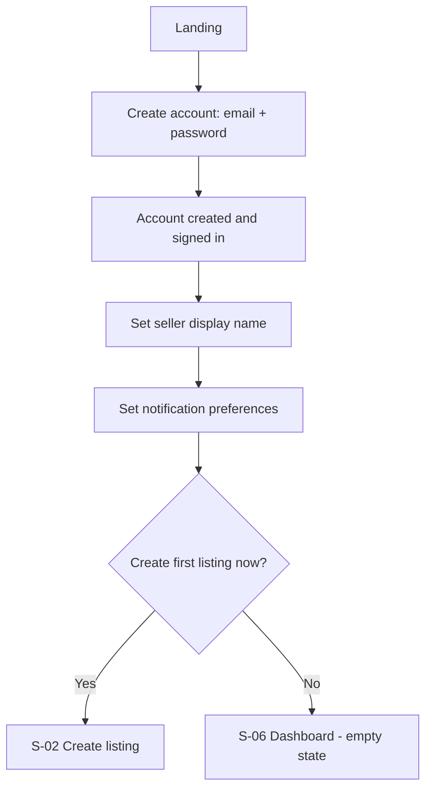

| # | Step | Screen contains | Must not contain |
|---|---|---|---|
| 1 | Create account | Email, password, password policy stated inline, terms and privacy links | Any claim that the product values items or suggests prices |
| 2 | Set display name | The name buyers will see, with a live example of the buyer disclosure line using it | Legal name, address, phone as buyer-visible fields |
| 3 | Notification preferences | Channels available, what each is used for, escalation always deliverable | Buyer-facing notification options |
| 4 | Orientation | One short statement of the model: seller supplies facts, AI handles buyer conversation, seller approves every decision, seller fulfils | Marketing claims about earnings, valuations or speed of sale |
| 5 | First listing prompt | Direct entry into S-02, skippable | A mandatory tutorial |

**Empty state for a seller with no listings.** The dashboard shows the create-listing
action and a one-line statement of what will appear here: decisions that need the seller.
It does not show sample data, projected figures or placeholder analytics.

---

## 3. S-02 Create listing — the 11-step flow

The eleven steps below are the listing creation flow of `MASTER_PRODUCT_SPEC.md` §6
expanded across §9.1 (`LIST-001` to `LIST-010`), §9.2 (`LIST-020` to `LIST-023`) and §9.3
(`ACCESS-001` to `ACCESS-003`). Steps are resumable; the listing stays in `DRAFT` until
step 11 completes (`STATE_MACHINES.md` §1).

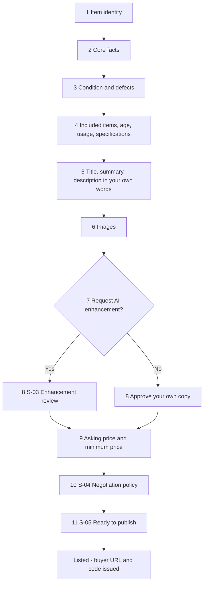

| # | Step | Seller does | System does | Notes |
|---|---|---|---|---|
| 1 | Item identity | Names the item, or selects an existing `InventoryItem` to relist | Creates `InventoryItem` and `Listing` in `DRAFT`; writes `LISTING_CREATED` | Relisting reuses the item and keeps its history — see `INVENTORY_AND_SALES.md` |
| 2 | Core facts | Enters name, brand, model, size, colour | Stores each as `SELLER_PROVIDED_FACT` | All optional except a title; blank means unknown, not inferred |
| 3 | Condition and defects | Describes condition and states defects | Stores as facts | No condition grade is computed or suggested |
| 4 | Included items, age, usage, specifications | Enters what is in the box, age, usage history, specifications | Stores as facts | Specifications are not looked up from a catalogue |
| 5 | Own words | Writes title, summary, description | Stores as the original content version | This is the source text enhancement will transform |
| 6 | Images | Uploads and orders photos | Stores, generates derivatives, keeps ordering | No fact is derived from an image (D-11) |
| 7 | Enhancement decision | Chooses to request enhancement or to skip | Creates `ENHANCEMENT_PENDING`, or moves straight to approval | Skipping is a first-class path with no degraded outcome |
| 8 | Copy approval | Accepts, edits, rejects, restores, or approves the original | Creates the single `APPROVED` content version | See S-03 |
| 9 | Prices | Enters asking price and minimum price | Stores as integer minor units with currency; writes `MINIMUM_PRICE_CHANGED` | No suggested price appears anywhere on this screen |
| 10 | Policy | Sets negotiation rules | Creates a `SellerPolicyVersion`; writes `SELLER_POLICY_CHANGED` | See S-04 |
| 11 | Ready to publish | Confirms readiness | Validates `SM-L-01`, moves to `READY` then `LISTED`, issues `PublicListingAccess` and an `ACTIVE` code | See S-05 |

**Progress and validation.** Steps 2 to 6 may be completed in any order and left
incomplete. Steps 8, 9, 10 and 11 are gates: step 11 is refused with the missing items
named if approved copy, an asking price, a minimum price or a policy version is absent
(`SM-L-01`).

**Price step composition.**

| Element | Present | Explicitly absent |
|---|---|---|
| Asking price field with currency | Yes | Suggested price, price range, "similar items sold for" |
| Minimum price field, labelled as never shared with buyers | Yes | Any market comparison or confidence indicator |
| Optional target price | Yes | Estimated value, expected sale price, demand indicator |
| Plain statement that the minimum is never sent to the AI and never shown to a buyer | Yes | Any figure the seller did not type |

---

## 4. S-03 Enhancement review

The screen exists to answer one question for the seller: *did the AI add anything I did
not say?* Everything on it serves that.

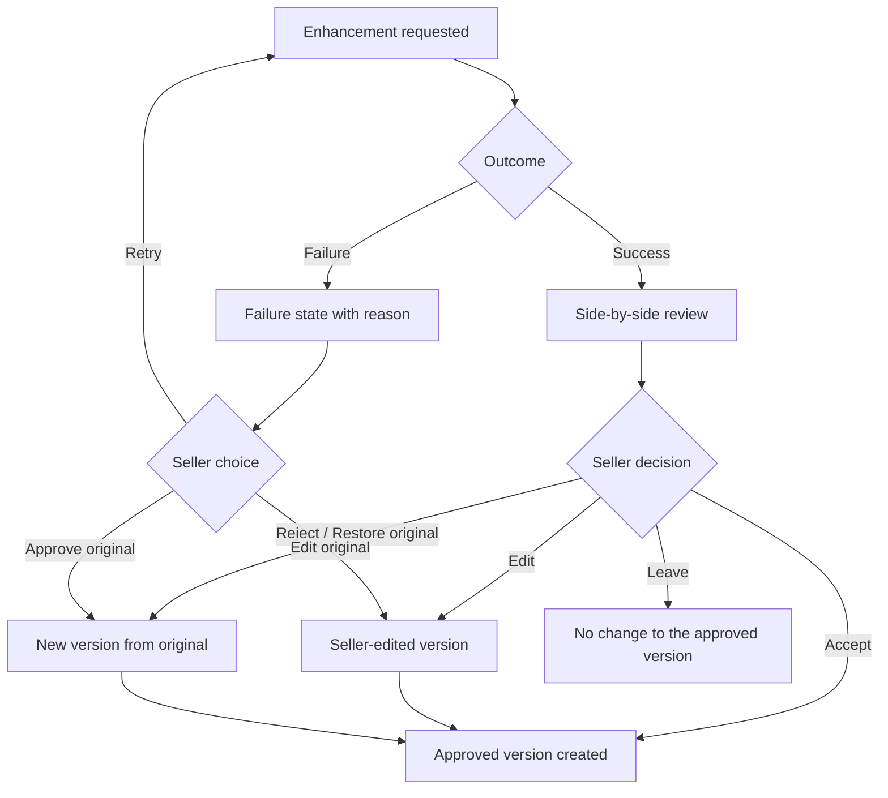

### 4.1 Layout requirements

| Region | Requirement |
|---|---|
| Two panes | Original on the left, enhanced on the right, on desktop. Stacked with the original first on a phone. |
| Field alignment | Title, summary and description are compared field by field, not as one blob. |
| Provenance labels | Left pane labelled "Your words". Right pane labelled "AI-enhanced version of your words". Labels are fixed text. |
| Change visibility | Differences within a field are marked so added and removed text is identifiable without reading both versions in full. |
| Structured facts | The structured detail fields entered in steps 2 to 4 are shown beneath both panes, read-only, with a statement that enhancement does not change them. |
| Actions | Accept, Edit, Reject and restore original. All four are always available. |
| Default | No action. Leaving the screen changes nothing (PRD LIST-104 AC3). |

### 4.2 Step table

| # | Step | Result |
|---|---|---|
| 1 | Seller opens the review | Both versions render with provenance labels |
| 2 | Seller reads the differences | Field-level differences are marked |
| 3a | Seller accepts | `SELLER_APPROVED_COPY` version created; previous approved version `SUPERSEDED`; `LISTING_CONTENT_APPROVED` written |
| 3b | Seller edits | `SELLER_EDITED` version created; the enhanced version is retained; approval applies to the edited text exactly |
| 3c | Seller rejects and restores the original | New version created from the original; the enhanced version is retained, not deleted (`SM-CT-02`) |
| 3d | Seller leaves | The currently approved version is unchanged |
| 4 | Any of 3a–3c | Exactly one `APPROVED` version exists for the listing (`SM-CT-01`) |

### 4.3 Failure state

Enhancement failure is visible and recoverable, never silent (`SM-CT-04`). The screen
shows the original copy intact, a plain-language reason, and three actions: retry, edit
the original, approve the original.

---

## 5. S-04 Policy configuration

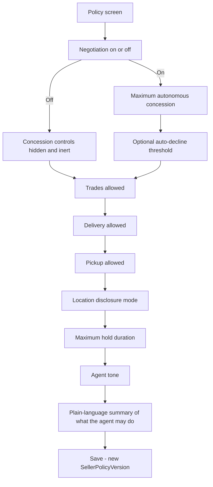

| Control | Screen behaviour | Constraint |
|---|---|---|
| Negotiation enabled | Master switch. When off, all concession controls are hidden and have no effect | G-12 |
| Maximum autonomous concession | Amount, in the listing currency | Bounds the counter range; the agent never exceeds it (G-02) |
| Auto-decline threshold | Optional amount | Engine-evaluated, not model-evaluated |
| Trades / delivery / pickup | Independent switches | When off, the agent must not offer or discuss them (G-06) |
| Location disclosure | `SELLER_ONLY` / `AREA_ONLY` / `AGENT_MAY_SHARE_AREA` | A precise address is never disclosable at any setting (`SM-D-02`, G-07) |
| Maximum hold duration | Interval | Governs offer expiry from `AWAITING_SELLER` |
| Agent tone | Enum | Presentational only; never affects what may be said |

**The summary block.** Below the controls, a plain-language summary is generated by
deterministic code from the saved values (PRD LIST-133). It always ends with the fixed
line:

> This assistant can answer questions and discuss price inside these rules. It can never
> accept an offer. Every acceptance is yours.

**What this screen must not contain.** Recommended values, values learned from previous
sales, predicted outcomes for a given setting, any market comparison, any statement about
what price the item will achieve.

---

## 6. S-05 Ready to publish — the marketplace copy block

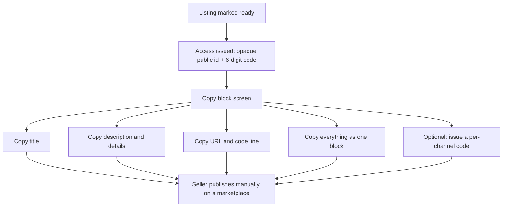

| # | Step | Detail |
|---|---|---|
| 1 | Access is issued | One `ACTIVE` code per listing (`DM-09`); plaintext shown once (`ACCESS-013`) |
| 2 | Block renders | Approved title, approved description, structured details, asking price, buyer URL, code |
| 3 | Copy controls | One-tap copy per element and one for the whole block (`BUYER-023`) |
| 4 | Marketplace responsibility notice | Fixed text stating that link rules vary by marketplace and compliance is the seller's (`BUYER-024`) |
| 5 | Optional per-channel code | A separate code per marketplace, giving per-channel conversion measurement (`BUYER-025`) |
| 6 | Rotation entry point | Rotate the code without changing the URL (`BUYER-003`) |

**Copy block example.** Bracketed values are substituted; the surrounding text is fixed.

```
[Approved title]

[Approved description]

Details:
[Structured detail fields, one per line, seller-entered only]

Price: [asking price] [currency]

Questions? Open [https://ourplatform.example/l/<opaque-public-id>]
and enter code [######]. You will be talking to an AI assistant acting
for me. I make every final decision.
```

**Marketplace responsibility notice — fixed copy.**

> Marketplaces set their own rules about external links, and those rules change. Check
> what the marketplace you are posting on allows before you publish. You are responsible
> for complying with it.

**Must not appear in the copy block.** Minimum price, target price, internal notes,
policy settings, analytics, other listings, any estimated value or market comparison.

---

## 7. S-06 Dashboard — the action-required queue

The dashboard is a queue of decisions, not an inbox (`PROD-015`, UX-102). A conversation
that needs nothing does not appear.

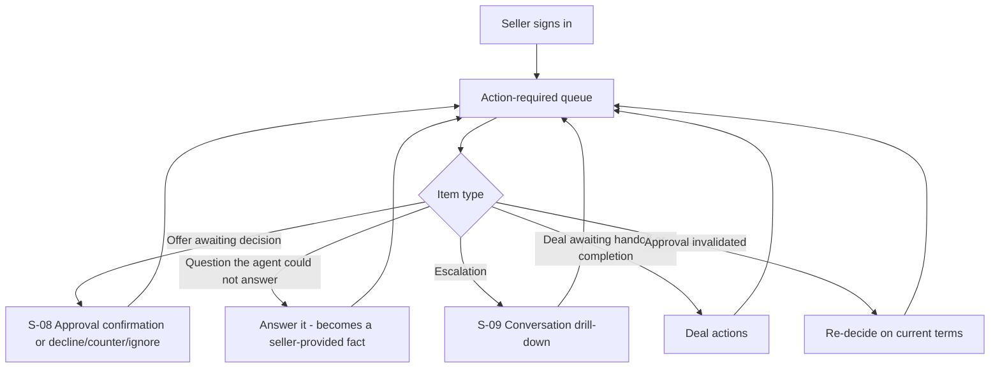

### 7.1 Item composition

Every queue item states, without the seller opening anything:

| Element | Example content |
|---|---|
| Listing | The approved title and thumbnail |
| Reason | Why this needs the seller, in plain language |
| Material terms | Amount, currency, conditions, logistics mode — where the item is an offer |
| Buyer reference | The pseudonymous buyer session reference, or a buyer-supplied display name |
| Age | How long the item has been waiting |
| Actions | The decisions available on this item |

### 7.2 Worked example

A seller has 14 live listings and 31 open conversations. The queue shows four items.

| # | Listing | Reason | Terms | Age | Actions |
|---|---|---|---|---|---|
| 1 | Dewalt drill set | Offer awaiting your decision | 165 CAD, pickup, buyer asks to include the spare battery | 40 min | Approve · Decline · Counter · Ignore |
| 2 | Dewalt drill set | Second offer awaiting your decision | 172 CAD, pickup, no conditions | 12 min | Compare offers · Approve · Decline · Counter · Ignore |
| 3 | Vintage road bike | Buyer asked something you have not stated: frame size | — | 3 h | Answer · Ignore |
| 4 | Sony camera body | Escalated: buyer requested delivery, which your rules do not allow | — | 25 min | Open conversation · Change policy · Ignore |

The remaining 27 conversations are being handled by the agent and are absent from this
screen. They are reachable from the listing, not from here.

Item 1 and item 2 are the same listing, so the queue offers **Compare offers**, which
opens S-07. Approving item 2 supersedes or declines item 1 according to the seller's
choice at approval time (`POLICY_AND_AUTHORIZATION.md` §9.2).

### 7.3 Queue rules

| Rule | Statement |
|---|---|
| Q-R-01 | An item appears only when a seller decision or a seller answer is required. |
| Q-R-02 | Resolution by any route removes the item and records the resolution. |
| Q-R-03 | Ordering is by explicit factors the seller can see — age, amount, listing — and the applied ordering is labelled. |
| Q-R-04 | No item is ordered or highlighted by a score about a buyer (D-16). |
| Q-R-05 | Unread message counts are not the organising idea and are not shown as a primary metric. |
| Q-R-06 | The queue never fabricates urgency. Age is a fact; "act now" is not. |

---

## 8. S-07 Offers comparison for one listing

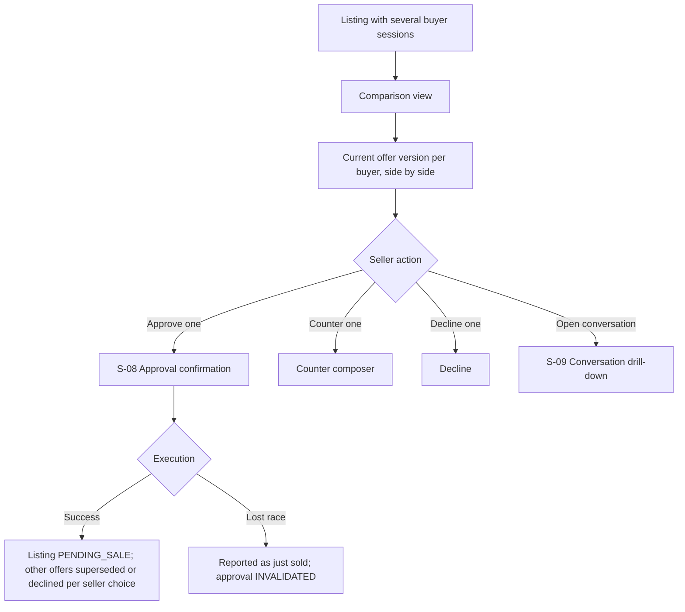

| Column | Content | Source |
|---|---|---|
| Buyer | Pseudonymous session reference or buyer-supplied display name | `BuyerSession` |
| Amount | Amount and currency of the current offer version | `OfferVersion` |
| Conditions | Every attached condition, in full | `OfferVersion` material terms |
| Logistics | Pickup or delivery as requested | `OfferVersion` material terms |
| Received | Timestamp of the current version | `OfferVersion` |
| Versions | Count of prior versions, expandable to the full history | `OFFER-002`, `SM-O-01` |
| Extraction confidence | Shown when low, with a prompt to read the message | PRD OFFER-100 AC3 |
| Actions | Approve, Counter, Decline, Open conversation | — |

**Requirements.**

| ID | Requirement |
|---|---|
| C-R-01 | Ordering uses amount, time received or conditions only, and the applied ordering is stated on screen. |
| C-R-02 | No buyer score, no predicted completion likelihood, no recommended choice. |
| C-R-03 | No buyer ever sees this screen or learns that another offer exists (UX-110, G-08). |
| C-R-04 | Approving one offer requires the seller to choose what happens to the others before execution. |
| C-R-05 | If two approvals race, exactly one wins and the loser is shown the "just sold" outcome, never a silent failure (`INV-11`). |

---

## 9. S-08 Approval confirmation

This screen exists to make `INV-05` visible: approval binds to one exact offer version and
its material terms. The seller must see the terms before they are committed to them.

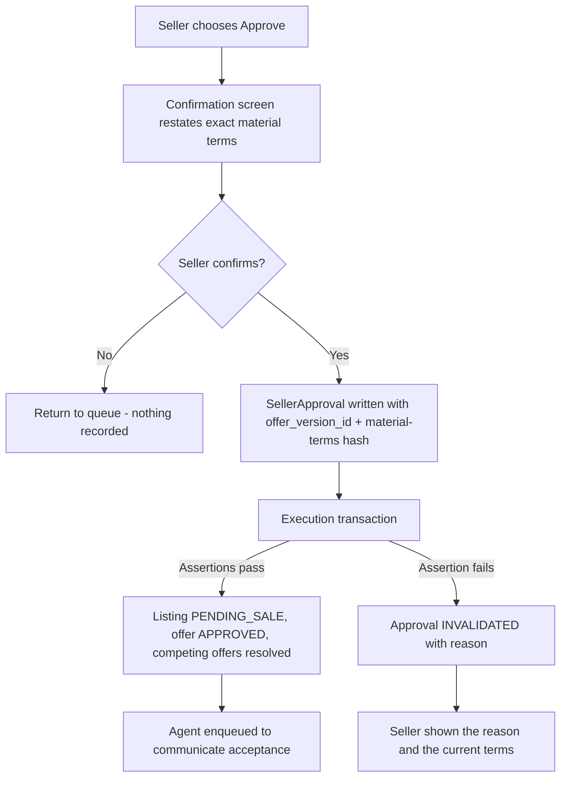

### 9.1 Required content

The confirmation restates, verbatim from the stored `OfferVersion`, every material term:

| Field | Shown as |
|---|---|
| Amount and currency | The exact figure, in the listing currency |
| Included items | Everything the buyer asked to be included, listed in full |
| Delivery or pickup mode | Exactly as agreed in the offer |
| Attached conditions | Every condition, in full, none summarised away |
| Listing | Title and thumbnail |
| Buyer | Session reference or buyer-supplied display name |
| Offer version | Version identifier and time received |

Beneath the terms, fixed text:

> Approving commits you to these exact terms with this buyer. If anything changes, this
> approval stops applying and you will be asked again.

### 9.2 Step table

| # | Step | System behaviour |
|---|---|---|
| 1 | Seller opens confirmation | Terms read from the stored version; hash computed over what is displayed |
| 2 | Seller confirms | `SellerApproval` written with offer version id, hash, decision, policy version, idempotency key; audit event in the same transaction |
| 3 | Execution runs | Row-locked re-read; assert availability, pending state, unchanged hash (`SM-A-02`) |
| 4a | Assertions pass | Listing to `PENDING_SALE`, offer to `APPROVED`, competing offers resolved, acceptance enqueued through the outbox |
| 4b | Any assertion fails | Approval to `INVALIDATED` with a reason; seller told; nothing communicated to the buyer (`AUTH-005`) |
| 5 | Retry of the same request | Idempotent on the client key; returns the original outcome (`SM-A-05`) |

### 9.3 Decline, counter and ignore

| Action | Screen behaviour |
|---|---|
| Decline | Confirms the offer being declined, states that the conversation stays open, records `SELLER_DECLINED` |
| Counter | Composer showing the current offer and the seller's counter amount; if the counter is below the seller's own minimum, the discrepancy is stated plainly and confirmation is still permitted (PRD AUTH-102 AC2) |
| Ignore | States that no message will be sent, that the offer remains in its current state, and that the item will leave the queue |

---

## 10. S-09 Conversation drill-down

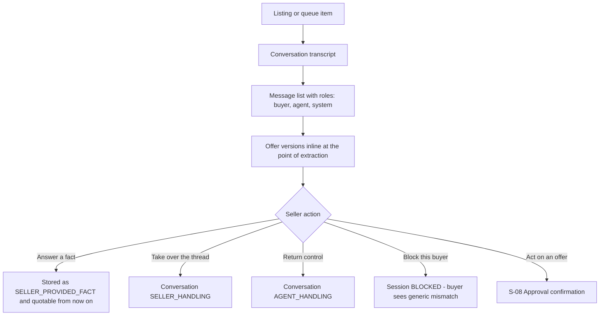

| Element | Requirement |
|---|---|
| Roles | Buyer, agent and system messages are visually distinct and labelled |
| Grounding | Each agent answer can be expanded to show which seller-provided facts it was grounded in |
| Guardrail record | Escalations and denials appear inline with their reason codes |
| Offers | Every offer version appears at the point in the transcript where it was extracted |
| Policy version | The policy version in force is shown for each agent turn |
| Buyer content | Rendered as escaped text; buyer HTML is never rendered (`T-12`) |
| Takeover | The seller can take the thread and return it, per `STATE_MACHINES.md` §4 |
| Isolation | Only this buyer's conversation is present; no other conversation is reachable from here |

---

## 11. S-10 Sales history

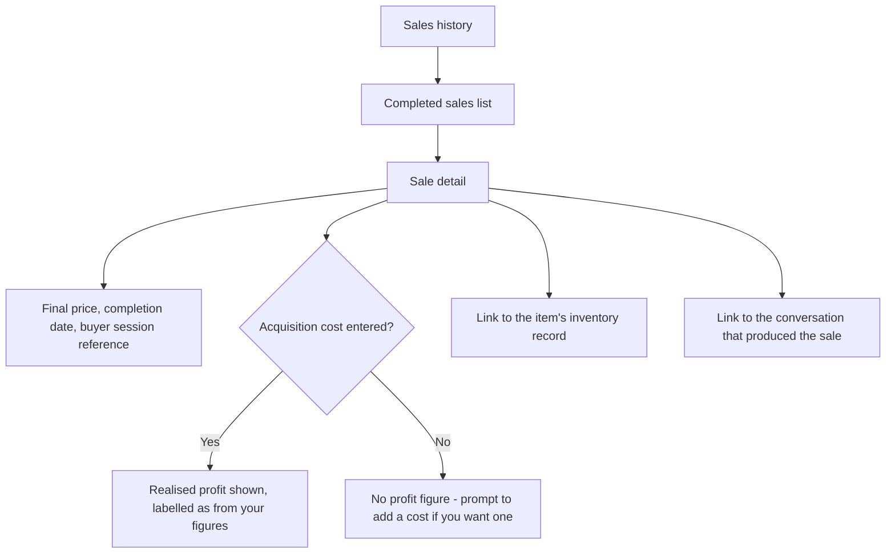

| Column | Content | Constraint |
|---|---|---|
| Item | Item name and thumbnail | From the `InventoryItem` |
| Final price | The price the seller confirmed at completion | Seller-confirmed only |
| Completion date | When the seller confirmed the sale | `SM-D-03` |
| Buyer | Buyer session reference | Pseudonymous; no buyer identity is stored |
| Acquisition cost | Seller-entered, may be blank | Never imputed |
| Realised profit | Shown only where an acquisition cost exists | Labelled as computed from seller-entered figures |

Full specification of the sales record and analytics is in
`product/INVENTORY_AND_SALES.md`. No column in this screen may display an estimated value,
a market price or a comparison to other sales.

---

## 12. Buyer surface

The buyer surface is a separate route tree with a separate middleware stack
(`ARCH-002`). It is mobile-first and assumes a phone on a poor connection
(`BUYER-020`).

### 12.1 B-01 Landing page — preview above the gate

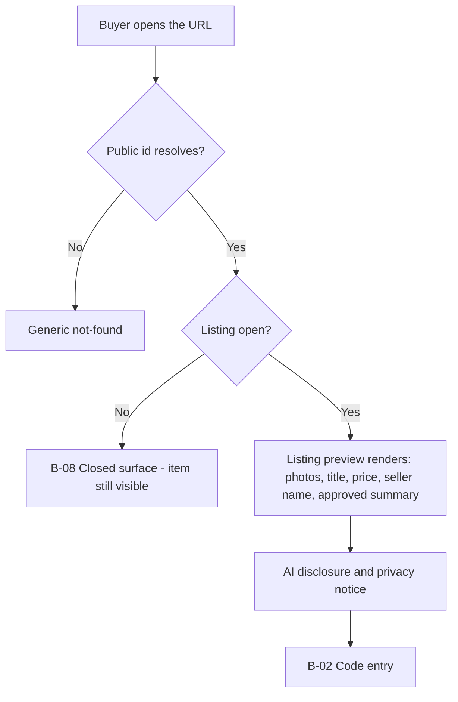

| # | Step | Requirement |
|---|---|---|
| 1 | Page loads | The preview renders before any code is requested (`BUYER-004`) |
| 2 | Preview content | Photos, approved title, asking price, seller display name, approved summary — from the server-computed buyer-safe projection (`SEC-020`) |
| 3 | Render order | The preview does not depend on chat JavaScript (`BUYER-021`) |
| 4 | Disclosure | The AI disclosure banner is visible on this screen, above the gate (`BUYER-006`) |
| 5 | Privacy notice | Short notice at the gate: who operates the service, that an AI conducts the conversation, what is stored, for how long, that the seller can read it, how to request deletion (`BUYER-007`) |
| 6 | Indexing | The page is `noindex` and disallowed in `robots.txt`; there is no search or browse (`T-02`) |

### 12.2 B-02 Code entry

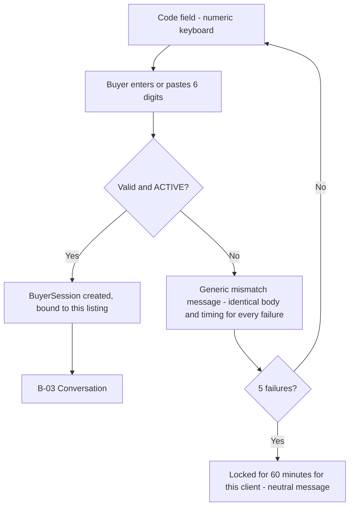

| # | Step | Requirement |
|---|---|---|
| 1 | Field focus | Numeric keyboard opens on mobile; paste of a 6-digit string fills the field (`BUYER-008`) |
| 2 | Optional pre-fill | If the seller shared a pre-filled link, the field is populated and the buyer confirms (`BUYER-009`, open as `Q-03`) |
| 3 | Failure | Identical body and timing for wrong, rotated, revoked, expired and unknown (`BUYER-010`, `SM-C-03`) |
| 4 | Lockout | 5 failures locks that client for 60 minutes; other buyers unaffected (`BUYER-011`) |
| 5 | Bot controls | Silent scoring first; an interactive challenge only after suspicious signals (`BUYER-012`) |
| 6 | Success | Session cookie is httpOnly, Secure, SameSite=Lax; the token never appears in the URL (`BUYER-013`, `SEC-041`) |

### 12.3 B-03 Conversation

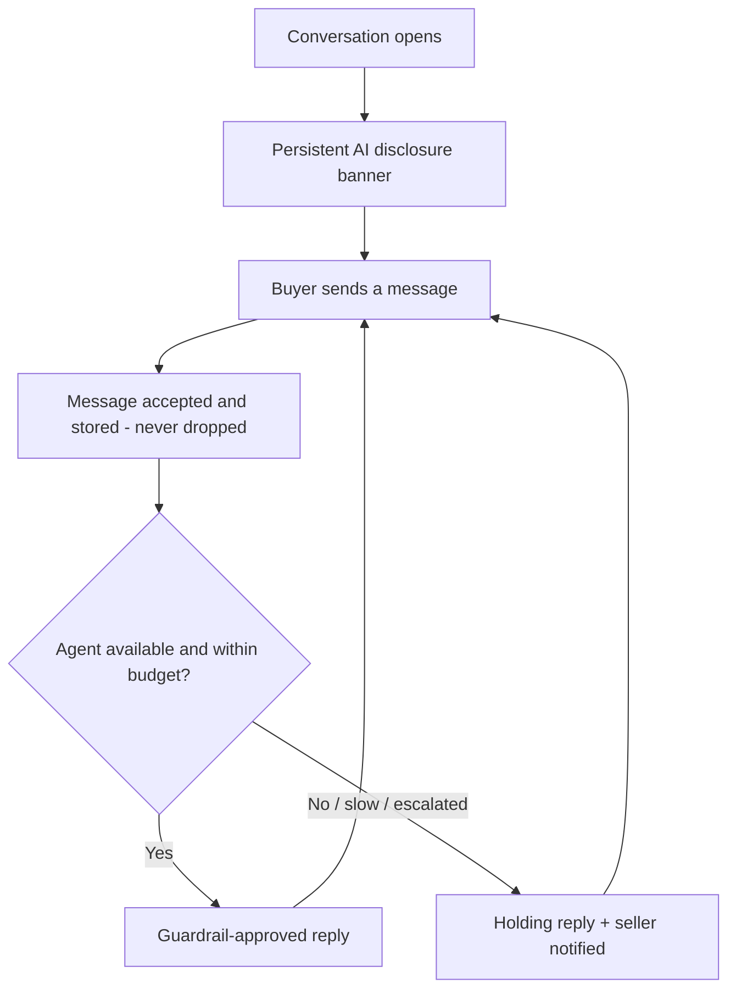

| Element | Requirement |
|---|---|
| Disclosure banner | Persistent, fixed text, names the seller, states that only the seller can accept (`BUYER-006`, D-15) |
| Message acceptance | Every buyer message is accepted in any non-`CLOSED` state and is never silently dropped (`SM-CV-01`, `NFR-003`) |
| Unknown facts | The agent states plainly that it does not have that confirmed and offers to ask the seller (`AI-002`) |
| Refusals | Stated plainly, with no workaround offered and no protected information disclosed (G-06, G-07, G-14) |
| Attachments | Not supported at MVP; politely refused |
| Latency | A holding reply is sent if the reply target is exceeded (`NFR-002`, `SM-CV-02`) |
| Composition | Single input, send control, transcript. No account prompt, no email capture, no upsell |

### 12.4 B-04 Offer in conversation

There is no separate offer form at MVP. The buyer states terms in conversation and the
system extracts them (`OFFER-001`).

| # | Step | Requirement |
|---|---|---|
| 1 | Buyer states an amount and any conditions | Extracted into an `Offer` and `OfferVersion` |
| 2 | Agent confirms understanding | It restates the extracted terms so the buyer can correct them |
| 3 | Agent responds | Counter inside the permitted range, or routing to the seller — never acceptance (G-04, G-09) |
| 4 | Buyer revises | A new `OfferVersion` supersedes the previous one (`SM-O-02`) |
| 5 | Screen state | The buyer sees their own terms only; no other buyer's activity is visible (UX-110) |

### 12.5 B-05 Waiting state

| Element | Requirement |
|---|---|
| Status line | States that the seller has been asked and that only the seller can accept — fixed text (G-10) |
| Continued conversation | The buyer may keep messaging; messages are answered under the same rules |
| Absent | Queue position, other offers, other buyers, countdown timers the seller did not set, fabricated urgency (G-08) |
| Absent | Any estimate of when the seller will respond presented as a commitment |

### 12.6 B-06 Acceptance

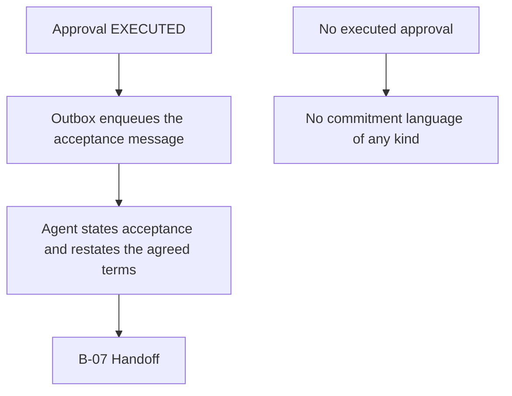

| Requirement | Detail |
|---|---|
| Gate | Acceptance is communicated only after the approval reaches `EXECUTED` (`SM-A-04`, `INV-07`) |
| Content | Restates the approved amount and the agreed logistics mode exactly |
| Prohibited before approval | "Deal", "sold", "it's yours", "I'll hold it" (G-09) |
| Audit | `BUYER_ACCEPTANCE_COMMUNICATED` is written |

### 12.7 B-07 Handoff

| # | Step | Requirement |
|---|---|---|
| 1 | Deal enters `LOGISTICS_GATHERING` | The agent asks for availability and non-sensitive logistics only (`SM-D-01`) |
| 2 | Location | Never a precise address; an area only if policy permits (`SM-D-02`, G-07) |
| 3 | Payment | Not handled; payment terms come from policy text only (G-11) |
| 4 | Transition | The buyer is told plainly that the seller continues from here |
| 5 | After handoff | The conversation remains open for the seller; the agent does not resume unless the seller returns control |

### 12.8 B-08 Closed surface

Shown when the listing is `SOLD`, `CANCELLED`, `ARCHIVED`, `EXPIRED` or paused, or when
the buyer's session is closed.

| Requirement | Detail |
|---|---|
| Item remains visible | The buyer sees what they came for; the page is not a bare error |
| Message | States that it is no longer available; no conversation opens |
| Absent | Final price, who bought it, why it closed, other listings, a waitlist |

---

## 13. Copy examples

All copy below is **fixed text**. It is never model-generated (D-15, G-10). Bracketed
values are substituted server-side.

### 13.1 AI disclosure banner

Primary, above the conversation and persistent within it (`BUYER-006`):

> Questions here are answered by an AI assistant acting for **[seller display name]**. It
> can answer questions and discuss price. Only **[seller display name]** can accept an
> offer.

Compact form, for the persistent header on a small screen:

> AI assistant for [seller display name]. Only [seller display name] can accept an offer.

Response when a buyer asks whether they are talking to a person (fixed, substituted by
G-10):

> I am an AI assistant working for [seller display name]. I can answer questions about
> this item and discuss price. I cannot accept an offer — [seller display name] decides
> that.

### 13.2 Holding reply

Sent when the reply target is exceeded, when the agent escalates, or when the model
provider is unavailable (`NFR-002`, `SM-CV-02`, `AUTH-004`):

> Thanks — I have your message. I am checking this with [seller display name] and will
> come back to you here. You do not need to do anything.

Variant when the conversation has escalated for a decision:

> Thanks — that one needs [seller display name] to decide. I have passed it on and the
> answer will appear here.

Variant when the agent is unavailable:

> Thanks — I have your message and it is saved. There is a short delay on replies right
> now. [seller display name] can see this conversation and the answer will appear here.

### 13.3 Buyer error messages

| Situation | Copy | Rule |
|---|---|---|
| Wrong, rotated, revoked or expired code; unknown listing | "That code doesn't match this listing. Check the code in the advertisement and try again." | Identical body and timing in every case (`BUYER-010`, `SM-C-03`) |
| Locked out after 5 failures | "Too many attempts. Try again later." | No counter, no remaining attempts, no explanation (`BUYER-011`, `SEC-011`) |
| Rate limited | "Too many requests right now. Try again in a moment." | Neutral; reveals no limit values |
| Listing sold | "This item has been sold. [Seller display name] is no longer taking questions on it." | Item stays visible; no price, no buyer |
| Listing paused | "This listing is paused right now, so questions are closed." | No reason given |
| Listing deleted or bad URL | "We couldn't find that listing." | Indistinguishable from a bad id (`T-02`) |
| Buyer blocked | "That code doesn't match this listing." | Never confirm a block |
| Attachment sent | "I can't open attachments here. If you can describe it, I'll do my best." | No file is processed |
| Message failed to send | "That didn't send. Tap to try again — your message hasn't been lost." | Never claim a message was delivered when it was not |
| Session expired | "This conversation has timed out. Enter the code again to start a new one." | New session; prior conversation not exposed |

### 13.4 Seller error and confirmation messages

| Situation | Copy |
|---|---|
| Enhancement failed | "We couldn't enhance this copy. Your original text is unchanged. You can try again, edit it yourself, or publish it as it is." |
| Ready blocked by missing prerequisites | "This listing isn't ready yet. Still needed: [approved copy] [asking price] [minimum price] [negotiation rules]." |
| Approval invalidated — terms changed | "The buyer changed their offer before this went through, so your approval no longer applies. Here are the current terms." |
| Approval invalidated — already sold | "This listing just sold to another buyer, so this approval didn't go through. Nothing was sent to this buyer." |
| Concurrent approval lost the race | "Another approval on this listing completed first. This one was not applied and no message was sent." |
| Counter below own minimum | "This counter is below the minimum you set for this listing. That's allowed — the minimum only limits the assistant, not you. Confirm to send it." |
| Code revocation with live conversations | "[N] buyers are mid-conversation on this listing. Keep their conversations open, or close them too? New buyers will be blocked either way." |
| Code rotated | "New code issued. The old code stops working now. Your listing URL has not changed, so you don't need to edit your advertisement — just the code." |

### 13.5 Copy rules

| ID | Rule |
|---|---|
| CP-01 | Disclosure, authority statements and holding replies are fixed text, substituted with values, never generated. |
| CP-02 | Errors say what happened and what to do next, in plain language, with no internal state, error code, attempt counter or stack detail. |
| CP-03 | No buyer-facing copy asserts a product fact the seller did not supply. |
| CP-04 | No copy anywhere states or implies what an item is worth, what it would sell for, or how it compares to other sales. |
| CP-05 | No copy creates urgency the seller did not create: no invented scarcity, no other-buyer claims, no deadlines that do not exist in policy (G-08). |
| CP-06 | No buyer-facing copy uses commitment language without an executed approval (G-09). |
| CP-07 | Copy addressing the buyer never blames the buyer, and never confirms a block, a rate limit reason or a code's history. |

---

## 14. What must never appear on any buyer screen

Structurally absent, not merely hidden. The buyer surface serves a computed projection,
so these values cannot be requested even by a malformed or crafted request
(`SEC-020`, `SEC-021`, `DM-10`, `BUYER-019`).

| Category | Specifically |
|---|---|
| Prices the seller protects | Minimum acceptable price, target price, auto-decline threshold, maximum autonomous concession, the permitted counter range itself |
| Policy internals | Any policy field, policy version, guardrail reason codes, escalation reasons, agent tone configuration |
| Other buyers | Any other buyer's existence, messages, offers, conditions, timing, count, or identity; any queue position |
| Seller private data | Legal name, email address, phone number, exact address or postal code, internal notes, account or plan data, notification settings |
| Operational data | Analytics, counts, conversion figures, sales history, other listings, inventory, acquisition cost, realised profit |
| System internals | Audit logs, internal ids, database ids, session tokens in URLs, model names, prompt content, token counts, cost |
| Valuation of any kind | Estimated value, market price, comparable sales, demand indicators, "worth", "typically sells for", suggested price, price confidence |
| Manufactured pressure | Claims of other interest, scarcity, countdowns or deadlines not present in seller policy |
| Commitment without authority | Any statement of acceptance, holding, reservation or agreement without an executed `SellerApproval` |
| Anything requiring an account | Sign-up prompts, email capture, password fields, payment fields, identity documents |

The full prohibition list is `BUYER-018`; this table is the screen-level reading of it and
does not narrow it.

---

## 15. Cross-screen requirements

| ID | Requirement | Source |
|---|---|---|
| FX-01 | Every seller screen that commits a consequential action restates the exact terms before committing. | UX-108 |
| FX-02 | Every destructive seller action states its effect on live buyer conversations before confirmation. | UX-109 |
| FX-03 | Provenance of buyer-facing copy is visible wherever the seller approves it. | UX-107 |
| FX-04 | The buyer surface renders its preview without depending on chat JavaScript. | UX-100, `BUYER-021` |
| FX-05 | No screen in the product displays a valuation, an estimate of worth or a suggested price. | UX-106, D-09 |
| FX-06 | Buyer-supplied text is escaped on every seller screen and never rendered as markup. | `T-12` |
| FX-07 | Every screen showing an agent action can reveal the policy version and guardrail decision behind it. | `LIST-023`, `INV-09` |
