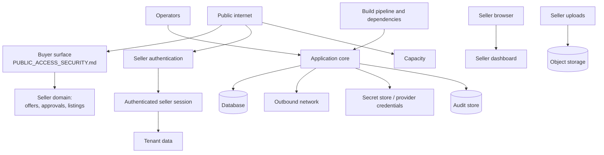

# Application Threat Model

**Status:** Canonical for application-wide threats outside the public buyer surface.

**Scope boundary.** The public buyer surface — the opaque public id, the 6-digit access
code, code brute force, enumeration, scraping of our own surface, buyer session token
theft, conversation-cost abuse and phishing impersonation of the buyer page — is modelled
in `security/PUBLIC_ACCESS_SECURITY.md`, which is canonical for it. Those threats
(`T-01` to `T-14`) are referenced here and are **not** repeated. AI-specific threats are
in `security/AI_THREAT_MODEL.md`. This document covers everything else.

**Authority.** `ai/POLICY_AND_AUTHORIZATION.md` wins on authorization semantics.
`engineering/SYSTEM_REQUIREMENTS.md` states the requirements that implement the controls
named here. `architecture/ARCHITECTURE.md` §6 defines the trust boundaries.

**Requirement IDs.** This document uses the `SEC-` prefix in a reserved **300-block**
for controls it introduces. `SEC-001` to `SEC-043` belong to
`security/PUBLIC_ACCESS_SECURITY.md`, `SEC-100` to `SEC-199` to
`engineering/SYSTEM_REQUIREMENTS.md`, and `SEC-500` to `SEC-599` to
`security/AI_THREAT_MODEL.md`. Threat rows are numbered `TM-nn` in one continuous
sequence; they do not collide with the `T-nn` rows of the public-access model.

**Risk scale.** Residual risk is stated as Low, Medium or High **after** the named
controls are in place, on the MVP scale of `ARCHITECTURE.md` §10. It is an assertion to
be argued with, not a score.

**Business-level risk** — adoption, unit economics, marketplace policy, legal exposure —
is registered in `business/RISK_REGISTER.md`. Where a row here has a business
counterpart there, both are true at different altitudes and neither restates the other.

---

## 1. Trust boundaries

| Boundary | From | To | Modelled in |
|---|---|---|---|
| TB-1 | Public internet | Public buyer surface | `security/PUBLIC_ACCESS_SECURITY.md` — not repeated here |
| TB-2 | Public internet | Seller authentication | §2 |
| TB-3 | Authenticated session | Seller application | §3 |
| TB-4 | Seller session | Tenant data | §4 |
| TB-5 | Buyer surface | Seller domain: offers, approvals, listing state | §5 |
| TB-6 | Application | Database, under concurrency | §6 |
| TB-7 | Seller browser | Seller dashboard | §7 |
| TB-8 | Application | Outbound network | §8 |
| TB-9 | Seller uploads | Storage and processing | §9 |
| TB-10 | Application | Secret store and AI provider credentials | §10 |
| TB-11 | Application | Audit store | §11 |
| TB-12 | Operators and support | Everything | §12 |
| TB-13 | Build pipeline and dependencies | The deployed artefact | §13 |
| TB-14 | Public internet | Capacity | §14 |

---

## 2. TB-2 — Authentication and account takeover

The seller account is the only thing in the system that can create authorization
(`AUTH-INV-04`). Taking it over is equivalent to becoming the seller: approving offers,
reading every conversation, changing the minimum price and closing deals.

| ID | Threat | Attack example | Impact | Preventive control | Detective control | Residual | Required test |
|---|---|---|---|---|---|---|---|
| TM-01 | Credential stuffing | Attacker replays a breach corpus against the sign-in endpoint | Full account takeover; ability to approve offers | Per-account and per-client rate limiting with progressive delay (`AUTH-204`); memory-hard password hashing (`AUTH-201`); server-side policy (`AUTH-202`); second factor at GA (`AUTH-213`) | `signin_failures` per account and per client (`OPS-562`); alert on distributed low-rate attempts against many accounts | Medium until `AUTH-213` ships; Low after | Integration: threshold reached then recovery; distributed-attempt simulation |
| TM-02 | Password brute force on one account | Sustained guessing against a known seller email | Account takeover | Progressive delay that cannot permanently lock the legitimate owner out (`AUTH-204`) | Per-account failure counter with alert | Low | Integration: lockout applies, owner still recovers |
| TM-03 | Account enumeration | Sign-in, reset or sign-up responses differ for known and unknown addresses | Target list for TM-01; privacy harm | Identical generic responses and indistinguishable timing on sign-in and reset (`AUTH-203`, `AUTH-210`) | Alert on high-volume reset requests | Low | Integration: byte comparison and timing distribution over n samples |
| TM-04 | Password reset token abuse | Token guessed, replayed, or read from a forwarded email and reused | Account takeover without the password | Single-use, short-lived, hashed at rest, invalidated on use and on any password change (`AUTH-210`) | Alert on reset-token reuse attempts | Low | Integration: replay after use fails; replay after password change fails |
| TM-05 | Account recovery social engineering | Attacker contacts support claiming to be the seller and asks for a reset | Account takeover through the human path | No support-initiated credential change exists; recovery is self-service only; no impersonation capability (`AUTH-228`) | Every recovery event is audited (`AUTH-217`) | Medium — the human path is the weakest and this is a two-person team | Manual: the documented refusal is rehearsed; build: no support reset route exists |
| TM-06 | Email-change hijack | Attacker with a live session changes the account email, then resets the password | Persistent takeover, owner locked out | Email change requires re-authentication and confirmation at both addresses (`AUTH-211`, `AUTH-214`); change notifies the old address and invalidates other sessions (`AUTH-209`) | Alert on email change followed by reset within a short window | Low after `AUTH-211` | Integration: change without old-address confirmation fails |
| TM-07 | Credentials in a support channel | A seller pastes their password into a support message, which is then logged | Credential exposure in a store never designed for it | Never log request bodies (`OPS-573`); forbidden-pattern scan of the log corpus (`OPS-571`) | Pattern scan alerts on credential-shaped strings | Low | Build: log corpus scan |

## 3. TB-3 — Session management

| ID | Threat | Attack example | Impact | Preventive control | Detective control | Residual | Required test |
|---|---|---|---|---|---|---|---|
| TM-08 | Seller session token theft | Token read from a log, a URL, an analytics payload or a shared screenshot | Impersonation of the seller, including approval | Opaque high-entropy token, httpOnly, Secure, SameSite, stored hashed, never in a URL, log or analytics payload (`AUTH-205`, `SEC-041`) | Log corpus scan (`OPS-571`); concurrent-use anomaly (`SEC-119` pattern applied to seller sessions) | Medium — a stolen live cookie is indistinguishable from the owner | Integration: log scrape; captured token replayed after sign-out fails (`AUTH-219`) |
| TM-09 | Session fixation | Attacker sets a known session identifier before the victim authenticates | Takeover without ever knowing the password | New identifier issued on authentication and on privilege change (`AUTH-206`) | Audit of identifier rotation | Low | Integration: pre-auth identifier is not honoured post-auth |
| TM-10 | Indefinite session | A token from a lost device stays valid for months | Delayed takeover from an abandoned device | Idle and absolute lifetimes enforced server-side (`AUTH-207`); seller-visible session list with revocation (`AUTH-208`) | Alert on sessions older than the absolute lifetime existing at all | Low | Integration: expiry authoritative on the server, not the cookie |
| TM-11 | Sign-out that does not sign out | Cookie cleared client-side, token still valid | False sense of security on a shared device | Server-side invalidation on sign-out (`AUTH-219`) | — | Low | Integration: replay after sign-out |
| TM-12 | Session confusion across surfaces | A buyer session token presented to a seller route, or the reverse | Privilege escalation from a public session | Separate route trees with separate middleware; the two session types are distinct and non-convertible (`ARCH-002`, `AUTH-212`, `AUTH-216`, `SEC-114`) | Authorization-failure metric by route (`OPS-561`) | Low — this is prevented by construction, not by a check | Integration: full cross-presentation matrix |

## 4. TB-4 — Authorization, IDOR and tenant isolation

| ID | Threat | Attack example | Impact | Preventive control | Detective control | Residual | Required test |
|---|---|---|---|---|---|---|---|
| TM-13 | IDOR on a seller object | Authenticated seller B requests `/listings/{A's id}`, or an offer, conversation, image or audit id belonging to A | Cross-tenant data disclosure | Ownership derived from the session, never from a parameter (`AUTH-220`); another tenant's id returns the not-found response (`AUTH-221`) | Authorization-failure metric with alert on probing patterns (`AUTH-227`, `OPS-561`) | Low | Integration: cross-tenant probe over the full route inventory |
| TM-14 | Mass assignment | A request body carries `seller_id`, `plan`, `minimum_price` or `status` and the handler binds it | Tenant crossing, policy change, or an illegal state transition | No client-supplied tenant, role or entitlement is trusted (`AUTH-223`); state transitions rejected at the data layer (`OPS-707`) | Audit of policy and state changes with actor | Low | Integration: parameter-tampering matrix per endpoint |
| TM-15 | Missing authorization on a new route | A route ships without an authorization declaration | Silent full exposure of a resource class | Deny-by-default; an undeclared route fails closed and fails the build (`AUTH-222`) | — | Low | Build: route inventory versus declaration inventory |
| TM-16 | Tenant predicate forgotten in a query | A hand-written query omits the seller predicate | Bulk cross-tenant disclosure — the worst non-AI outcome in this system | Data-layer enforcement: an unpredicated query fails rather than returning rows (`SEC-100`, `NFR-007`) | Any occurrence pages (`OPS-594`) | Low, and the depth of defence is deliberate | Integration: unpredicated query errors for every seller-owned table |
| TM-17 | Background job without tenant context | A scheduled job iterates all rows and emails a digest to the wrong seller | Cross-tenant disclosure through a path nobody thinks of as a route | Every job carries a tenant context; a contextless job cannot touch tenant tables (`SEC-102`) | Job-level authorization failures alert | Low | Integration: injected contextless job fails |
| TM-18 | Cache poisoning across tenants | A response cached for seller A is served to seller B | Cross-tenant disclosure with no failing query | Tenant id in every cache key (`SEC-105`) | — | Low | Integration: warm as A, read as B |
| TM-19 | Analytics leakage | A benchmark or "sellers like you" figure reaches a seller surface | Cross-tenant inference, and a step toward the valuation features that are out of scope (`D-09`) | Analytics computed per tenant; no cross-tenant aggregate on a seller surface (`SEC-103`); no derived valuation anywhere (`OPS-725`) | Release review against the forbidden-name list | Low | Build: analytics query shape; schema scan |
| TM-20 | Export scope creep | A data export includes joined rows from another tenant | Bulk disclosure in a file the seller then shares | Export asserted by identifier set and row count, not inspection (`SEC-106`) | — | Low | Integration: export composition asserted |

## 5. TB-5 — The seller/buyer boundary, offers and approvals

This is the boundary the product exists to hold. `ai/POLICY_AND_AUTHORIZATION.md` is
canonical for its semantics; the threats below are the ways an implementation could
breach it.

| ID | Threat | Attack example | Impact | Preventive control | Detective control | Residual | Required test |
|---|---|---|---|---|---|---|---|
| TM-21 | Buyer reaches a seller capability | A buyer session calls the approval endpoint, or a seller route is exposed on the public tree | Unauthorized acceptance; catastrophic breach of `AUTH-INV-04` | Separate route trees and middleware (`ARCH-002`, `SEC-032`); approval reachable only by an authenticated owning seller (`AUTH-224`); buyer session cannot carry seller identity (`AUTH-216`) | Authorization-failure metric; any hit on a seller route from a buyer session alerts | Low — prevented by construction | Integration: every seller route exercised with a buyer session (`SEC-114`) |
| TM-22 | Unauthorized offer acceptance through the agent | Model is persuaded to emit an acceptance, or a bug routes `ACCEPT_PENDING` to execution | A sale the seller never agreed to | No `ACCEPT` intent exists in the schema (`AI-206`); `G-04`; acceptance message gated on `EXECUTED` (`AUTH-252`); guardrail evaluation between model and effect (`AI-203`) | Assertion that no commitment language precedes an executed approval (`AUTH-253`) | Low | Eval `AP-01` negative assertion (`OPS-015`); integration |
| TM-23 | Commitment language before authorization | The agent says "it's yours" or "I'll hold it" with no approval | The buyer reasonably believes a contract exists; dispute exposure | `G-09`; global `must_not_match` commitment set on every conversation case (`OPS-004`); `AUTH-253` | Egress scan and post-hoc transcript sampling | Low | Eval: commitment regex on every conversation case |
| TM-24 | Stale approval executed | Seller approves, buyer changes the amount or a condition, execution proceeds on the old terms | The seller is bound to terms they did not see | Approval binds to `offer_version_id` plus a material-terms hash (`AUTH-240`, `D-06`); execution re-asserts the hash inside the transaction (`AUTH-244`) | `APPROVAL_INVALIDATED` audit events with reason distribution | Low | Eval `AP-02`, `AP-03`, `AP-05` |
| TM-25 | Replayed approval | The approval request is captured and resubmitted, or retried after the offer moved | Two authorizations, or an authorization applied to different terms | Idempotency key returns the original outcome (`OPS-731`); hash and state re-asserted at execution (`AUTH-244`); approvals expire (`AUTH-254`) | Duplicate-key metric | Low | Eval `AP-04`, `AP-08`; integration: replay after supersession |
| TM-26 | Hash covers the wrong fields | A condition is treated as non-material, so changing it does not invalidate | A material change slips through the exact control designed to catch it | Hash coverage defined exactly as `Material Terms` in `GLOSSARY.md` and asserted field by field (`AUTH-241`, `NEG-017`) | — | Low | Unit: hash coverage matrix over every offer field |
| TM-27 | Render/hash divergence | The seller is shown one rendering while the hash is computed from a re-read row | The seller approves what they saw; the system executes something else | The hash is computed from the same rendering that was displayed (`AUTH-242`) | Mismatch rate metric | Low | Integration: mutation interposed between render and submit is detected |
| TM-28 | Approval on a closed listing | Approval executes against a listing already sold, cancelled or archived | Double-sell, or a sale of an item that is gone | Availability revalidated inside the transaction by conditional update (`AUTH-244`, `AUTH-250`, `AUTH-INV-10`) | Reconciliation job (`OPS-728`) with page (`OPS-595`) | Low | Eval `AP-06`; integration: sold between approve and execute |
| TM-29 | Buyer-supplied scope widening | Buyer sends a conversation or offer id belonging to another buyer | Cross-buyer disclosure; interference in another negotiation | Scope re-derived server-side from the session token; no client-supplied id trusted (`AUTH-225`, `SEC-113`) | Authorization-failure metric | Low | Integration; eval `PA-11` |
| TM-30 | Protected value leaks into a buyer payload | Minimum price appears in an API response, an error, or a rendered field | Direct breach of `AUTH-INV-08`; the seller's floor becomes the buyer's target | Buyer-safe projection is a constructed type that cannot hold a protected field (`OPS-724`, `SEC-020`, `SEC-021`); every public handler is restricted to it (`SEC-138`) | Post-hoc scan of buyer-facing payloads; any detection is an incident (`OPS-797`) | Low | Contract: projection type; integration: payload diff |
| TM-31 | Seller misconfiguration leaks a protected value | The seller types their minimum price into the public description | The floor is published by the seller's own hand | Validation warning when a listing field contains a value matching the minimum price (`T-13`); seller education copy | Content scanning at approval time | Medium — the seller can always override a warning | Integration: warning raised on match |

## 6. TB-6 — Concurrency, double-sell and idempotency

| ID | Threat | Attack example | Impact | Preventive control | Detective control | Residual | Required test |
|---|---|---|---|---|---|---|---|
| TM-32 | Double-sell through concurrent approvals | Seller approves two buyers in adjacent clicks, or a retry races the original | One item, two committed buyers; direct financial and reputational harm | Conditional update inside the transaction, not a prior check (`AUTH-250`, `ARCH-007`); at most one `APPROVED` offer per listing as a constraint (`AUTH-249`) | Any second `APPROVED` offer pages (`OPS-596`) | Low | Eval `AP-07`; integration under sustained contention |
| TM-33 | Lost update on policy or listing | Two edits overwrite each other; the minimum price reverts | The agent negotiates under a policy the seller believes they changed | Optimistic concurrency with a version predicate (`OPS-738`); policy versions are immutable and appended (`OPS-706`) | `SELLER_POLICY_CHANGED` audit sequence | Low | Integration: interleaved writers, one fails |
| TM-34 | Interleaved turns in one conversation | Buyer sends two messages in quick succession, producing two concurrent model calls | Contradictory replies, two counters, a broken monotonic-concession guarantee (`G-03`) | Per-conversation lock serialises turns (`OPS-735`) | Out-of-order sequence detection | Low | Integration: concurrent submission produces ordered single-threaded turns |
| TM-35 | Idempotency key omitted or mis-scoped | A consequential endpoint accepts a request with no key, or a key collides across sellers | Duplicate authorization; duplicate acceptance message | Key required on every consequential action (`OPS-730`); stored with the outcome (`OPS-731`); reuse with a different payload is an error (`OPS-732`) | Duplicate and conflict metrics | Low | Integration: full consequential-route inventory |
| TM-36 | Duplicate outbound acceptance | Outbox redelivery sends the acceptance message twice | The buyer sees two acceptances and may believe two commitments exist | At-least-once delivery with a dedupe key (`OPS-739`) | Duplicate-delivery counter | Low | Integration: forced redelivery produces one visible message |
| TM-37 | Partial failure leaves an inconsistent deal | Crash between listing transition and approval status event write | A listing in `PENDING_SALE` with no executed approval — the stuck deal of `OPERATIONS.md` §9.6 | One transaction for the assertions and transitions (`AUTH-244`); approval header written before execution (`AUTH-243`) | Reconciliation job (`OPS-728`) with page (`OPS-595`) | Low | Integration: crash injected between write and execute |
| TM-38 | Duplicate inbound buyer message | Client retry or network duplication creates two messages | Doubled cost, confused conversation state, duplicated offer extraction | Idempotency key plus unique per-conversation sequence makes it a no-op (`OPS-734`, `OPS-708`) | Duplicate-inbound counter | Low | Integration |

## 7. TB-7 — Browser to seller dashboard: CSRF and XSS

| ID | Threat | Attack example | Impact | Preventive control | Detective control | Residual | Required test |
|---|---|---|---|---|---|---|---|
| TM-39 | CSRF on approval | A page the seller visits submits a cross-site POST to the approval endpoint using their cookie | An offer approved without the seller's intent — an `AUTH-INV-04` breach through the browser | `SameSite` cookies (`AUTH-205`); per-session anti-forgery token on every state-changing request (`SEC-310`); `Origin`/`Referer` validation on state-changing requests (`SEC-311`); consequential actions require an idempotency key the attacker cannot predict (`OPS-730`) | Approval events whose request lacks the expected origin are logged and alert (`SEC-312`) | Low | Integration: cross-origin POST to every state-changing route is refused |
| TM-40 | CSRF on account change | Cross-site request changes the account email or password | Account takeover | Re-authentication on consequential account changes (`AUTH-214`); the controls of TM-39 | Audited account-change events (`AUTH-217`) | Low | Integration |
| TM-41 | Login CSRF | Victim is silently signed into the attacker's account, then enters data into it | Data written into an attacker-controlled account | Anti-forgery token on the sign-in form; new session identifier on authentication (`AUTH-206`) | — | Low | Integration |
| TM-42 | Stored XSS from buyer text | A buyer sends `` or a crafted markdown link; the seller dashboard renders it | Script execution in the seller's authenticated origin: read the dashboard, approve an offer, exfiltrate a session — the highest-impact web threat in this system | Buyer text is data, never markup (`ARCH-003`); contextual output encoding on every render path (`SEC-320`); no `innerHTML`-equivalent sink for buyer content (`SEC-321`); strict CSP with no inline script and no `unsafe-eval` on the dashboard (`SEC-322`); buyer text is never rendered as HTML or markdown (`SEC-323`, `T-12`) | CSP violation reports collected and alerted (`SEC-324`) | Low | Integration: an XSS payload corpus is sent as buyer text and asserted inert in every dashboard render path |
| TM-43 | XSS through a seller-supplied field | Seller writes markup in a listing description; it renders on the buyer surface or in their own dashboard | Self-inflicted, but a stored payload that reaches a buyer's browser from our domain damages the platform | Same encoding and CSP rules apply to seller content (`SEC-320`, `SEC-322`) | CSP reports | Low | Integration: payload corpus in seller fields |
| TM-44 | XSS through an agent reply | A model reflects buyer markup into its draft and it is rendered | Injection laundered through the model | Egress redaction (`AI-212`); the same encoding rules apply to agent text as to buyer text; agent output is never trusted markup | CSP reports; egress scan | Low | Integration; eval: markup in a buyer turn is not reflected as markup |
| TM-45 | Clickjacking of the approval control | The dashboard is framed and an approval click is captured | An approval the seller did not intend | Frame-denying headers on the dashboard (`SEC-325`); the same on buyer pages (`SEC-132`) | — | Low | Integration: header assertion |
| TM-46 | Dangerous link rendering | Buyer sends a `javascript:` or `data:` URL that is rendered as a clickable link | Script execution or credential phishing from our origin | Buyer text is rendered as plain text with no autolinking (`SEC-323`); if autolinking is ever added, scheme allowlisting and `rel="noopener noreferrer"` (`SEC-326`) | — | Low | Integration: scheme corpus asserted non-clickable |
| TM-47 | Exfiltration through a permissive CSP | A narrow XSS is amplified by permissive `connect-src` or `img-src` | Data leaves the origin even when script execution is contained | CSP restricts `default-src`, `connect-src`, `img-src`, `frame-ancestors` and `form-action` to known origins (`SEC-322`) | CSP violation reports | Low | Integration: header assertion and a negative exfiltration test |

## 8. TB-8 — SSRF and the outbound network

The system fetches very little by design, which is the primary control. The threats are
about what happens if that changes.

| ID | Threat | Attack example | Impact | Preventive control | Detective control | Residual | Required test |
|---|---|---|---|---|---|---|---|
| TM-48 | SSRF through a user-supplied URL | A field accepts a URL — an image by link, a webhook, a marketplace link check — pointed at an internal address or a cloud metadata endpoint | Credential theft from an instance metadata service; internal service access; the most damaging class of server-side bug | No endpoint accepts a URL to fetch from a buyer (`SEC-133`) or from a seller at MVP (`SEC-330`); outbound HTTP restricted to a host allowlist (`INT-104`); if a fetch is ever introduced: resolve then pin the address, reject private, loopback, link-local and metadata ranges before and after DNS resolution, and forbid redirects to a non-allowlisted host (`SEC-331`) | Outbound requests to off-allowlist hosts are logged and alert (`SEC-332`) | Low at MVP because the capability does not exist; Medium the day it is introduced | Build: route inventory carries no URL-fetch parameter; integration: off-allowlist fetch refused |
| TM-49 | SSRF through a redirect chain | An allowlisted host redirects to an internal address | Same as TM-48, past a naive allowlist | Redirects are followed only within the allowlist, with a bounded hop count and re-validation at each hop (`SEC-331`) | — | Low | Integration: redirect to a private address refused |
| TM-50 | DNS rebinding | An allowlisted name resolves to a public address at validation and a private one at connect | Bypass of an address check that ran too early | Resolve, validate, then connect to the validated address (`SEC-331`) | — | Low | Integration: rebinding harness |
| TM-51 | Metadata service credential theft | A single successful SSRF reads instance credentials | Full infrastructure compromise from one bug | Workload credentials are short-lived and least-privileged (`SEC-350`); metadata access is blocked or requires a header the application never sends (`SEC-333`); backup credentials are separate and cannot delete backups (`OPS-697`) | Alert on any use of a workload credential from an unexpected source (`SEC-351`) | Medium — this control depends on the hosting choice, which D-17 leaves open (`Q-09`) | Manual: recorded configuration review at hosting selection |
| TM-52 | Egress used for exfiltration | A compromised process posts data to an attacker host | Bulk data loss after any other compromise | Default-deny egress with an allowlist (`INT-104`) | Volume and destination anomaly on egress (`SEC-332`) | Medium | Integration: unlisted destination refused |

## 9. TB-9 — File and image uploads

Only sellers upload, and only images (`LIST-009`, `BUYER_ACCESS_FLOW.md` §9). That
narrows this boundary considerably and is worth preserving.

| ID | Threat | Attack example | Impact | Preventive control | Detective control | Residual | Required test |
|---|---|---|---|---|---|---|---|
| TM-53 | Malicious file disguised as an image | A polyglot or a script with an image extension is uploaded | Stored content that executes somewhere downstream | Content-type determined by inspecting bytes, not by extension or client header (`SEC-340`); allowlist of image formats (`SEC-341`); files re-encoded into a normalised derivative, and only derivatives are served (`SEC-342`) | Upload rejection rate by reason | Low | Integration: polyglot corpus rejected |
| TM-54 | Decompression bomb or malicious decoder input | A crafted image exhausts memory or exploits the decoder | Worker crash or remote code execution in an image library | Dimension, pixel-count and byte-size limits enforced before decoding (`SEC-343`); decoding in the worker pool with a memory and time limit, never in a request handler (`SEC-344`) | Worker OOM and timeout metrics | Medium — image decoders are a recurring source of vulnerabilities | Integration: bomb corpus rejected within limits |
| TM-55 | Stored XSS through SVG or HTML-bearing image | An SVG containing script is uploaded and served inline | Script execution on our origin | SVG is not an accepted format (`SEC-341`); images served with a fixed content type and `nosniff`, from derivatives only (`SEC-342`, `SEC-345`) | CSP reports | Low | Integration: SVG rejected; content-type asserted on serve |
| TM-56 | Metadata leakage from EXIF | A seller photo carries GPS coordinates; the image is served to a buyer | The seller's home address disclosed to strangers — the exact failure `D-14` exists to prevent | All metadata is stripped during derivative generation, and originals are never served (`SEC-346`) | Automated check that served derivatives carry no metadata | Low, and this control is load-bearing | Integration: an image with GPS EXIF is served with none |
| TM-57 | Path traversal or key injection through a filename | A filename containing `../` or a null byte influences the storage key | Overwriting another tenant's object | Storage keys are generated, never derived from a client filename (`SEC-347`); keys are unguessable and access-checked per tenant (`SEC-104`) | — | Low | Integration: hostile filename corpus |
| TM-58 | Unbounded upload as a cost or capacity attack | A seller uploads thousands of large files | Storage cost, worker saturation | Per-listing and per-seller upload count and byte limits (`SEC-348`); derivative generation is queued and rate-limited (`SEC-344`) | `storage_bytes` growth alert (`OPS-553`) | Low | Integration: limits enforced |
| TM-59 | Malware stored and later distributed | A file that is a valid image and also carries a payload for another consumer | Our storage becomes a distribution point | Re-encoding to a normalised derivative destroys most payloads (`SEC-342`); originals are private and never served (`OPS-718`) | — | Low | Integration: originals unreachable without a signed URL |

## 10. TB-10 — Secrets and AI provider credentials

| ID | Threat | Attack example | Impact | Preventive control | Detective control | Residual | Required test |
|---|---|---|---|---|---|---|---|
| TM-60 | Provider key committed to source | An API key is pasted into a config file and pushed | Unbounded model spend on our account; potential access to prompts sent with that key | Secrets read from a secret store at runtime, never in source or images (`INT-106`, `OPS-729`); secret scanning in CI and on push (`SEC-352`) | Provider-side spend anomaly (`OPS-597`); scanner alerts | Medium — this is the most common real-world credential failure | Build: secret scan fails the build on a match |
| TM-61 | Provider key exfiltrated at runtime | A compromised process reads the key from memory or environment | Spend theft and prompt exposure | Least-privilege, per-environment keys with their own budget (`OPS-501`); rotation without a code change (`INT-106`) | Spend anomaly per environment; unexpected source-region use | Medium | Manual: rotation exercise |
| TM-62 | Key with excessive scope | One key used for production, staging and evals | Blast radius of any leak covers everything | One key per environment and per purpose (`OPS-501`) | Per-key spend attribution (`OPS-548`) | Low | Build: key inventory asserted |
| TM-63 | Secret in a log or error | A configuration dump or exception includes credentials | Credential exposure in a long-lived store | Never log request bodies or environment dumps (`OPS-567`, `OPS-573`); log corpus scan (`OPS-571`) | Scanner alert | Low | Build: log corpus scan |
| TM-64 | Missing rotation | A key stays valid for years and survives every staff and infrastructure change | A stale credential outlives the trust that justified it | Rotation is a documented, exercised procedure with no code change (`INT-106`) | Key age metric with a ticket at a stated age | Medium | Manual: quarterly rotation exercise |
| TM-65 | Backup credentials reused by the application | The application role can delete backups | An attacker who owns the application destroys the recovery path | Backup credentials are separate and cannot delete backups (`OPS-697`) | — | Low | Build: privilege assertion |

## 11. TB-11 — Audit integrity

The audit trail is what answers a disputed approval (`OPERATIONS.md` §9.5). If it can be
altered, the product's central claim cannot be substantiated.

| ID | Threat | Attack example | Impact | Preventive control | Detective control | Residual | Required test |
|---|---|---|---|---|---|---|---|
| TM-66 | Audit tampering | An attacker or an operator alters or deletes an event to hide an action | The dispute record becomes worthless | Append-only in application code and in the granted database role (`OPS-782`, `OPS-705`) | Sequence-gap detection per subject (`SEC-360`) | Medium — an attacker with full database control can still alter storage | Integration: update and delete attempts fail |
| TM-67 | Audit gap | A consequential action ships without an audit event | An action nobody can reconstruct | Coverage matrix over the event list and the consequential-route inventory (`OPS-781`); audit write failure aborts its transaction (`OPS-787`) | Event-type volume anomaly | Low | Integration: coverage matrix |
| TM-68 | Audit poisoning | Attacker-controlled text is written into an audit payload and later rendered | Log injection, forged-looking entries, or XSS in an audit view | Payloads are structured fields, not free text; forbidden-pattern scan on every event type (`OPS-783`); rendering follows §7 encoding rules | — | Low | Integration: payload scan; render test |
| TM-69 | Secrets in audit payloads | An access code or token is written into an event and retained for years | A long-lived store of exactly the values that must not persist | No secrets in audit payloads (`OPS-783`, `SEC-040`) | Pattern scan per event type | Low | Integration |
| TM-70 | Audit tied to a mutable identity | Events reference a name that later changes, so history becomes unreadable | Reconstruction fails at the moment it matters | Events reference stable identifiers plus the policy version in force (`OPS-784`) | — | Low | Integration: reconstruction after a display-name change |
| TM-71 | Clock manipulation reorders history | Host clock skew makes events appear out of order | A reconstruction that says the wrong thing happened first | Ordering by sequence and database assignment, never by wall clock (`OPS-741`, `OPS-708`) | Skew monitoring | Low | Unit; integration |

## 12. TB-12 — Insider and support access

| ID | Threat | Attack example | Impact | Preventive control | Detective control | Residual | Required test |
|---|---|---|---|---|---|---|---|
| TM-72 | Operator reads a seller's conversations out of curiosity | Direct database query against the transcript store | Privacy breach with no external attacker involved | Production access through short-lived, audited, individual credentials (`OPS-504`); no shared accounts | Access to transcript and audit stores is itself audited (`OPS-788`, `SEC-370`) | Medium — two people with database access is the shape of this company, and no control removes that | Manual: access review each quarter |
| TM-73 | Support impersonation used to approve | An operator uses a support tool to act as a seller and approves an offer | An authorization created by someone who is not the seller — an `AUTH-INV-04` breach from the inside | No impersonation exists at MVP; if introduced it must be consented, time-boxed, audited, visible to the seller, and structurally incapable of creating a `SellerApproval` (`AUTH-228`) | Impersonation sessions alert on any approval attempt | Low at MVP | Build: no impersonation route; contract if introduced |
| TM-74 | Operator changes a protected value | The minimum price is edited directly in the database to unblock a seller | The negotiation record no longer explains itself; policy versioning is bypassed | Policy changes only through the versioned path (`OPS-706`); direct writes are visible as a version gap (`SEC-371`) | `MINIMUM_PRICE_CHANGED` audit with actor; version-sequence gap detection | Medium | Integration: out-of-band write detected by the reconciliation job |
| TM-75 | Departure without revocation | A former operator retains credentials | Full access after the trust ends | Individual credentials, revocable in one place; a documented offboarding checklist (`SEC-372`) | Quarterly access review | Medium | Manual: offboarding rehearsed |
| TM-76 | Debug tooling in production | A console or admin endpoint left enabled | Unaudited full access behind an obscure URL | No production console or debug endpoint exists; the build fails if one is present (`SEC-373`) | Route inventory diff per release | Low | Build: route inventory |
| TM-77 | Data exported for convenience | An operator downloads a database extract to a laptop for analysis | An uncontrolled copy of every seller's data | Analysis runs against the system, not against extracts; extracts require a recorded reason and are time-limited (`SEC-374`) | Export operations audited | Medium | Manual: policy rehearsed; audit review |

## 13. TB-13 — Supply chain

| ID | Threat | Attack example | Impact | Preventive control | Detective control | Residual | Required test |
|---|---|---|---|---|---|---|---|
| TM-78 | Malicious or compromised dependency | A transitive package publishes a version that exfiltrates environment variables | Full compromise, including provider keys, through a routine update | Lockfiles committed and builds installed from the lockfile only (`SEC-380`); dependency additions reviewed by the second person (`SEC-381`); no automatic version drift in the build | Dependency-diff review per release; vulnerability scanning in CI (`SEC-382`) | Medium — this is the hardest boundary for two people | Build: reproducible install from lockfile; CI scan |
| TM-79 | Typosquat or dependency confusion | A package name close to a real one, or an internal name resolvable from a public registry | Arbitrary code in the build | Explicit registry configuration and scoped internal names (`SEC-383`); new dependencies justified in review | — | Medium | Build: registry configuration asserted |
| TM-80 | Compromised build pipeline | CI credentials are used to inject a step or publish an artefact | Everything downstream is untrustworthy | CI credentials are least-privileged and separate from production write credentials (`SEC-384`); the deployed artefact is built only from the default branch (`OPS-511`) | Deploy annotations reconciled against merges (`OPS-516`) | Medium | Manual: credential scope review |
| TM-81 | Unpinned base image or runtime | A base image tag moves and brings in a vulnerable or malicious layer | Silent change to the deployed environment | Base images and runtimes pinned by digest (`SEC-385`) | Image digest recorded per release (`OPS-519`) | Low | Build: digest pinning asserted |
| TM-82 | Vulnerable dependency left in place | A known vulnerability sits unpatched because nobody owns patching | Exploitable known defect | A stated patch window by severity, tracked as a ticket (`SEC-386`) | CI scan alerts | Medium — realistic for a two-person team, and stated rather than pretended away | Build: scan; manual: window honoured |
| TM-83 | Model provider SDK trust | A provider SDK is a dependency with network access and credential access | The SSRF and supply-chain boundaries merge | Provider access is behind one internal interface (`INT-105`), so the SDK's blast radius is one module; egress allowlist applies to it (`INT-104`) | Egress anomaly | Medium | Build: single integration point |

## 14. TB-14 — Denial of service

Public-surface volumetric abuse is covered by `T-03`, `T-04` and `T-11` in
`security/PUBLIC_ACCESS_SECURITY.md`. The rows below are the application-level
amplifications that document does not cover.

| ID | Threat | Attack example | Impact | Preventive control | Detective control | Residual | Required test |
|---|---|---|---|---|---|---|---|
| TM-84 | Expensive query amplification | A list endpoint is called with a huge page size, or a filter that forces a scan | One request consumes the database | Hard maximum page size, server-side query timeouts and indexed hot paths (`OPS-721`, `OPS-756`) | Slow-query metric | Low | Integration: oversized request clamped; query plans asserted |
| TM-85 | Worker pool exhaustion | Many concurrent expensive turns starve the queue | Every buyer waits; holding replies everywhere | Per-session, per-listing and per-seller limits (`SEC-010`); bounded concurrency; the preview path is independent of the worker pool (`OPS-770`) | Queue depth and `holding_reply_rate` (`OPS-543`) | Medium | Load: saturation test |
| TM-86 | Model-spend exhaustion as denial of wallet | An adversary drives conversations purely to burn budget | Financial loss, then platform-wide degradation | Layered budgets and the circuit breaker (`OPS-661` to `OPS-669`, `T-04`) | `cost_per_conversation`, per-listing outliers (`OPS-602`), global breaker (`OPS-597`) | Medium | Integration: breaker engages before the ceiling |
| TM-87 | Storage exhaustion | Bulk uploads consume storage | Cost, and eventually failed uploads for everyone | Per-seller and per-listing upload limits (`SEC-348`) | `storage_bytes` growth (`OPS-553`) | Low | Integration |
| TM-88 | Notification amplification | An attacker drives events that generate seller notifications | Seller alert fatigue; delivery cost; a seller who stops reading notifications misses a real decision | Notifications are aggregated per action item, not per message (`AI-018`, `NEG-011`); rate-limited per seller (`SEC-390`) | Notification volume per seller | Medium | Integration: repeated low offers produce one action item |
| TM-89 | Lockout as denial of service against a listing | An attacker deliberately triggers code lockout | The listing's buyers are blocked | Lockout is per client, not per listing; the listing is unaffected for other buyers (`BUYER-011`) | `lockouts` per listing (`OPS-557`) | Low | Integration: second client unaffected during a first client's lockout |
| TM-90 | Log and telemetry flooding | A crafted request pattern generates unbounded log lines | Observability cost, and the haystack that hides a real incident | Per-request log budget with a truncation record (`OPS-576`); sampling (`OPS-574`) | `log_bytes_per_day` (`OPS-554`) | Low | Integration: log-line count per request class |

---

## 15. Controls introduced by this document

These are the controls named above that no other canonical document states. They are
requirements, and `engineering/SYSTEM_REQUIREMENTS.md` verification conventions apply.

| ID | Control |
|---|---|
| SEC-310 | Every state-changing request carries a per-session anti-forgery token, validated server-side. |
| SEC-311 | Every state-changing request validates `Origin` or `Referer` against the expected origin and is refused when neither is present and trustworthy. |
| SEC-312 | A state-changing request that fails an anti-forgery or origin check is logged with the route and alerts when it targets an approval or account endpoint. |
| SEC-320 | Output encoding is contextual and applied at render time on every path that emits buyer-, seller- or agent-supplied text. |
| SEC-321 | No render path passes buyer, seller or agent text to a raw-HTML sink. The build fails if such a sink appears with untrusted input. |
| SEC-322 | The seller dashboard and the buyer surface send a strict content-security policy with no inline script and no `unsafe-eval`, restricting `default-src`, `connect-src`, `img-src`, `frame-ancestors` and `form-action` to known origins. |
| SEC-323 | Buyer-supplied text is rendered as plain text. It is never rendered as HTML or markdown, and is not autolinked. |
| SEC-324 | CSP violation reports are collected, retained under `OPS-577`, and alert on a sustained rise. |
| SEC-325 | The seller dashboard denies framing. |
| SEC-326 | If autolinking is ever introduced, schemes are allowlisted to `http` and `https` and external links carry `rel="noopener noreferrer"`. |
| SEC-330 | No endpoint accepts a URL for the server to fetch, from a buyer or a seller, at MVP. |
| SEC-331 | If a server-side fetch is introduced: resolve, validate the resolved address against a deny list of private, loopback, link-local, multicast and metadata ranges, connect to the validated address, follow redirects only within the allowlist with a bounded hop count and re-validation at each hop. |
| SEC-332 | Outbound requests to hosts outside the allowlist are refused, logged and alerted, and egress volume by destination is monitored. |
| SEC-333 | The instance metadata service, if one exists in the chosen infrastructure, is unreachable from the application process or requires a header the application never sends. Confirmed at hosting selection (`Q-09`; D-17 defers hosting). |
| SEC-340 | Uploaded content type is determined by inspecting the bytes, never by extension or client-supplied header. |
| SEC-341 | Accepted image formats are an explicit allowlist. SVG is not on it. |
| SEC-342 | Every uploaded image is re-encoded into a normalised derivative. Only derivatives are served; originals stay private. |
| SEC-343 | Byte size, pixel count and dimension limits are enforced before any decode is attempted. |
| SEC-344 | Decoding and derivative generation run in the worker pool under memory and time limits, never in a request handler. |
| SEC-345 | Images are served with a fixed content type and `X-Content-Type-Options: nosniff`. |
| SEC-346 | All metadata, including EXIF location, is stripped during derivative generation. An image with GPS data is served with none. |
| SEC-347 | Storage keys are generated by the system. No client-supplied filename influences a key or a path. |
| SEC-348 | Upload count and total bytes are limited per listing and per seller. |
| SEC-350 | Workload credentials are least-privileged and short-lived. |
| SEC-351 | Use of a workload credential from an unexpected source or region alerts. |
| SEC-352 | Secret scanning runs in CI and on push, and a match fails the build. |
| SEC-360 | Audit sequence gaps per subject entity are detected and alert. |
| SEC-370 | Access to the transcript store and the audit store by a person is itself audited. |
| SEC-371 | A policy or content change that did not go through the versioned path is detectable as a version-sequence gap and alerts. |
| SEC-372 | Operator credentials are individual and revocable in one place, with a documented offboarding checklist. |
| SEC-373 | No production console, debug endpoint or administrative back door exists. The build fails if one is present. |
| SEC-374 | Bulk data extracts require a recorded reason, are time-limited, and are audited. |
| SEC-380 | Builds install from a committed lockfile only. No version drift at build time. |
| SEC-381 | A new dependency is reviewed by the second person before it enters the lockfile. |
| SEC-382 | Dependency vulnerability scanning runs in CI. |
| SEC-383 | Registries are explicitly configured and internal package names are scoped, so a public name cannot shadow an internal one. |
| SEC-384 | CI credentials are least-privileged and cannot write to production data stores. |
| SEC-385 | Base images and runtimes are pinned by digest. |
| SEC-386 | Known vulnerabilities are patched within a stated window by severity, tracked as a ticket. |
| SEC-390 | Seller notifications are rate-limited and aggregated per action item. |

---

## 16. Prioritised control roadmap

Three gates. Each gate is a list of controls that must exist and have passed their test
before the event named. A control listed at a later gate may be built earlier; none may
be built later.

### 16.1 Before the first buyer conversation

The first buyer conversation happens against our own listings, in shadow mode
(`OPS-028`, `AI-221`). Even so, a real stranger is on the other end and real seller data
is in the system.

| Area | Controls |
|---|---|
| The boundary that defines the product | `AUTH-224` approval reachable only by an owning seller · `AI-206` no `ACCEPT` intent · `AI-203` deterministic evaluation between model and effect · `AUTH-252`, `AUTH-253` acceptance gated on `EXECUTED` |
| Protected data | `OPS-724`, `SEC-138` buyer-safe projection as a constructed type · `AI-200`, `AI-201` minimum price structurally absent from context · `AI-212` egress redaction |
| Isolation | `SEC-100` data-layer tenant isolation · `SEC-110` to `SEC-118` buyer session isolation · `AUTH-212`, `TM-12` separate route trees |
| Web | `SEC-320` to `SEC-323` encoding and CSP · `SEC-310`, `SEC-311` CSRF · `SEC-325` frame denial |
| Uploads | `SEC-340` to `SEC-347` type inspection, allowlist, re-encoding, limits, metadata stripping, generated keys |
| Authentication | `AUTH-201` to `AUTH-207`, `AUTH-210`, `AUTH-219` — everything except the second factor and the session list |
| Integrity | `AUTH-240` to `AUTH-251` approval binding, revalidation and concurrency · `OPS-730` to `OPS-735` idempotency and locking |
| Audit | `OPS-780` to `OPS-787` — the dispute runbook is unanswerable without them |
| Secrets | `INT-106`, `OPS-729`, `SEC-352` secret store and scanning |
| Egress | `INT-104`, `SEC-330` no URL-fetch capability, allowlisted egress |
| Observability | `OPS-790` logging prohibitions and `OPS-571` the log-corpus scan that enforces them · the metrics of `OPERATIONS.md` §4 · the pages of `OPERATIONS.md` §7.1 |
| Cost | `OPS-661` to `OPS-669` budgets and circuit breaker — a stranger can drive spend from the first conversation |
| Kill switches | `AI-222`, both switches, exercised at least once |

### 16.2 Before the first real seller

A seller who is not us is now trusting the system with their inventory, their prices and
their buyers, and can be harmed by our mistakes in ways we cannot compensate.

| Area | Controls |
|---|---|
| Everything in §16.1 | Plus their tests passing in CI, not just once by hand |
| Account safety | `AUTH-209` change notification and session invalidation · `AUTH-211` email-change confirmation · `AUTH-214` re-authentication on consequential changes · `TM-05` the documented refusal of support-initiated credential change |
| Cross-tenant | `SEC-102` job tenant context · `SEC-103` per-tenant analytics · `SEC-105` cache keys · `AUTH-229` cross-tenant probe suite over the full route inventory |
| Data handling | `security/DATA_AND_PRIVACY.md` classification in force · `DATA-100` to `DATA-106` retention enforced by a job · `OPS-699` a restore that has actually been performed |
| Legal posture | `INT-107` the model provider engaged as a processor with no independent training or use rights · the jurisdiction questions of `Q-07` raised with counsel |
| Insider | `OPS-504` individual audited production access · `SEC-370` access to transcripts audited · `SEC-373` no debug endpoints · `SEC-372` offboarding checklist |
| Supply chain | `SEC-380` to `SEC-385` lockfile builds, review, scanning, registry configuration, digest pinning |
| Operations | `OPERATIONS.md` §9 runbooks written and each walked once · `OPS-613` every alert fired by injection |
| Reconciliation | `OPS-728` integrity job running, with its page wired (`OPS-595`, `OPS-596`) |

### 16.3 Before general availability

Sellers arrive without us knowing who they are, at a volume where an incident is not a
conversation.

| Area | Controls |
|---|---|
| Everything in §16.1 and §16.2 | Sustained, with tests in the blocking suite |
| Authentication | `AUTH-213` second factor available · `AUTH-208` session list and revocation |
| Authorization | `AUTH-226` server-side entitlement enforcement |
| Audit | `OPS-788` operator audit access audited |
| Data subject handling | `DATA-107` seller export · `DATA-108` buyer request route verified end to end · breach response rehearsed (`security/DATA_AND_PRIVACY.md` §11) |
| Detection | `SEC-119` concurrent session use · `SEC-351` credential-use anomaly · `SEC-360` audit gap detection · `SEC-371` out-of-band change detection |
| Resilience | `OPS-757` load test at the target scale · `OPS-759` release latency comparison · `OPS-772` restore objectives met in a drill, twice |
| Supply chain | `SEC-386` patch window honoured with evidence |
| Cost | `INT-111` provider reconciliation running |
| Insider | `SEC-374` extract policy in force; quarterly access review performed at least twice |

`SEC-399` A control moved to a later gate requires a superseding entry in
`decisions/DECISION_LOG.md` stating who accepted the risk and until when. Moving a
control by omission is not a decision.
